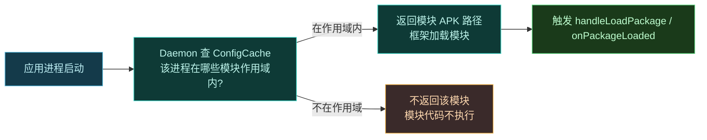
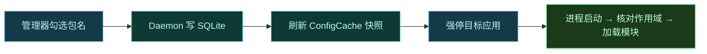

# 🎯 作用域与多进程

> 难度 ⭐⭐ · 控制模块在哪些进程生效。

## 作用域基础

模块默认**不**对任何应用生效。用户需在 Vector 管理器里为模块勾选"作用域"——即哪些应用进程允许加载该模块。详见 [guide · 模块机制](../guide/modules#作用域)。

作用域信息存在 Daemon 的 SQLite 数据库，以 `DaemonState` 不可变快照缓存。每次有进程请求模块列表时，Daemon 核对作用域，**未授权的进程拿不到模块**。

## 你的代码怎么知道在作用域内



**关键**：你的 `handleLoadPackage` / `onPackageLoaded` 收到回调，就说明该进程已在作用域内、模块已被加载——**无需自己判断权限**。

### 一个最小可运行示例

下面这个模块只在被勾选作用域后才会打印日志，无需在代码里写任何权限判断：

```kotlin
class ScopeAwareHook : IXposedHookLoadPackage {
    override fun handleLoadPackage(lpparam: XC_LoadPackage.LoadPackageParam) {
        // 走到这里 ⇒ 该进程已在作用域内
        XposedBridge.log("Vector: hooked ${lpparam.packageName} / ${lpparam.processName}")
        // …挂 Hook…
    }
}
```

::: tip 调试作用域是否生效
若模块没反应，第一步先确认 `handleLoadPackage` 是否被调用——在入口最顶部加一行 `XposedBridge.log`，然后用 `adb logcat -s LSPosed` 或 Vector 管理器的日志页查看。看不到这行 = 作用域没勾选/没保存/没重启目标应用。
:::

## 在管理器里配置作用域

作用域在 Vector 管理器的"作用域"页配置：

1. 打开管理器 → 选模块 → "作用域"。
2. 勾选要让模块生效的应用（按包名）。
3. 保存。Daemon 把变更写入 SQLite，刷新 `ConfigCache` 快照。
4. **强停并重开**目标应用（作用域检查发生在进程启动时）。



## system_server 是特殊情况

`system_server` 是独特边界。`LegacyDelegateImpl.onSystemServerLoaded` 手动把 `android` 注册进 `loadedPackagesInProcess`，构造进程名硬编码为 `system_server` 的 `LoadPackageParam`。

若你的模块需要在系统启动早期生效（如 `IXposedHookZygoteInit`），它在 Zygote 阶段就执行，早于作用域检查。

要在 `system_server` 生效，作用域里需勾选 `android`（系统框架包名）：

```kotlin
override fun handleLoadPackage(lpparam: XC_LoadPackage.LoadPackageParam) {
    if (lpparam.packageName == "android" && lpparam.processName == "system_server") {
        XposedBridge.log("Hooked system_server!")
        // 系统级 Hook 在这里
    }
}
```

> [!WARNING] system_server Hook 风险极高
> `system_server` 崩溃 = 整个系统框架重启 = 设备软重启。务必用 debug 构建先验证，避免在 Hook 里抛未捕获异常。详见 [🚀 Hook Zygote](./hook-zygote) 与 [🎯 作用域](./scope)。

## 多进程应用

一个应用可能有多个进程（主进程 + `:push`、`:remote` 等）。作用域按**包名**勾选，同包名的所有进程都会加载模块。若想区分进程：

```kotlin
override fun handleLoadPackage(lpparam: XC_LoadPackage.LoadPackageParam) {
    if (lpparam.packageName != "com.target.app") return
    when (lpparam.processName) {
        "com.target.app"        -> hookMain(lpparam)
        "com.target.app:push"   -> hookPush(lpparam)
        "com.target.app:remote" -> hookRemote(lpparam)
    }
}
```

### before / after 对照

> [!TIP] 不区分进程 vs 区分进程
> 下面两段代码等价地"只在主进程 Hook"，但后者更精确、避免了在 push 进程里白跑一遍 Hook 注册：

```kotlin
// ❌ 不精确：所有进程都跑，浪费且可能在子进程里找不到类
if (lpparam.packageName == "com.target.app") {
    XposedHelpers.findAndHookMethod(/* ... */)
}
```

```kotlin
// ✅ 精确：只在主进程注册
if (lpparam.packageName == "com.target.app"
    && lpparam.processName == "com.target.app") {
    XposedHelpers.findAndHookMethod(/* ... */)
}
```

::: warning 进程名 vs 包名
`packageName` 是应用包名，所有进程相同；`processName` 才是区分进程的 key。一个常见坑是 `manifest` 里把某组件声明在 `android:process=":remote"`，导致该组件跑在 `com.target.app:remote` 进程——此时 `handleLoadPackage` 的 `packageName` 仍是 `com.target.app`，但 `processName` 不同。两者都要核对。
:::

## 相关

- [guide · 模块机制](../guide/modules)
- [daemon · data 包（ConfigCache）](../reference/classes/daemon-data)
- [legacy · impl（onSystemServerLoaded）](../reference/classes/legacy-impl)
