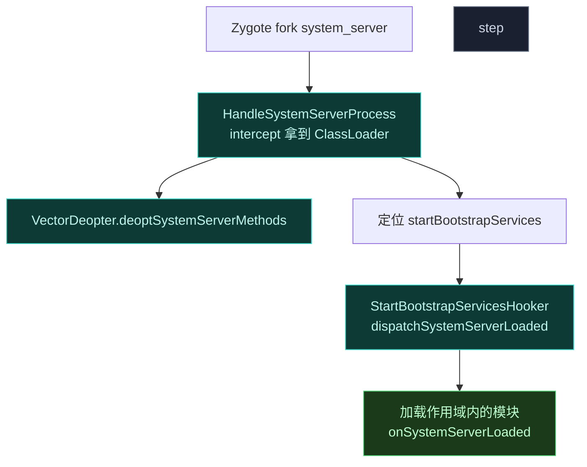

# 🛡️ 专门 Hook system_server

> 难度 ⭐⭐⭐⭐ · system_server 是系统核心，作用域、加载时机、反优化都有讲究。

## 场景

Hook `PackageManagerService`、`ActivityManagerService`、`WindowManagerService` 等系统服务的私有方法——它们只在 system_server 进程里运行。

## 作用域配置

system_server 在 Vector 里对应作用域名 **`system`**（legacy 历史命名互换：`android` ↔ `system`）。模块要 Hook system_server，必须把 `system`（或旧名 `android`）加入作用域：

```xml
<!-- AndroidManifest meta-data，旧式 -->
<meta-data android:name="xposedscope" android:value="system;com.target.app"/>
```

或用现代模块的 `META-INF/xposed/scope.list`：

```text
system
com.target.app
```

未勾选 `system` 作用域，模块代码根本不会在 system_server 进程加载。

## 加载时机与 bootstrap hook

system_server 由 Zygote fork，进程起来后执行 `SystemServer.startBootstrapServices` 等阶段。Vector 用 `HandleSystemServerProcessHooker` 拦截 system_server 的初始化：



关键点：

- `systemServerCL` 一旦赋值即幂等，`initSystemServer` 只跑一次。
- 模块在 `startBootstrapServices` 被调度的时刻收到 `onSystemServerLoaded` 回调——此时系统服务正在初始化，**多数系统服务类已加载**，可以安全 `findClass`。
- `isLate=true` 路径用于错过 bootstrap 的迟到模块，此时跳过 bootstrap hook 定位。

## 模块侧回调

```kotlin
// 经典 API：实现 IXposedHookZygoteInit，initZygote 里 startsSystemServer 为 true
class MainHook : IXposedHookZygoteInit {
    override fun initZygote(param: IXposedHookZygoteInit.StartupParam) {
        if (!param.startsSystemServer) return  // 只在 system_server 起来时
        // 此时 system_server 尚未跑 bootstrap，只能 hook 已加载的框架类
    }
}
```

```kotlin
// 现代 API：onSystemServerLoaded 回调（经 VectorLifecycleManager 派发）
override fun onSystemServerLoaded(param: SystemServerLoadedParam) {
    val pms = param.classLoader.loadClass("com.android.server.pm.PackageManagerService")
    hook(pms.getDeclaredMethod("getPackagesForUid", Int::class.javaPrimitiveType), PmsHooker::class.java)
}
```

## 反优化要点

system_server 里大量方法被 ART 内联/quickened，直接 Hook 可能不生效。`VectorDeopter.deoptSystemServerMethods` 在派发模块前对高频内联路径做反优化，确保 Hook 命中。你通常无需手动干预，但若发现 Hook 偶发失效：

1. 确认目标方法未被标记为 `fast-native`/`critical-native`。
2. 避免在 `static {}` 静态初始化阶段 Hook（此时类可能尚未完成链接）。
3. 复杂场景可显式触发反优化（依赖框架 API），但绝大多数情况交给 `VectorDeopter`。

## 陷阱

| 陷阱 | 后果 | 对策 |
| :--- | :--- | :--- |
| 未勾 `system` 作用域 | 模块在 system_server 不加载 | scope 加 `system` |
| 在 initZygote 直接 hook 系统服务类 | 类未加载，ClassNotFound | 等 `onSystemServerLoaded` |
| Hook 抛异常未捕获 | system_server 崩溃重启循环 | 回调内 try-catch |
| 改系统服务返回值破坏契约 | 系统功能异常 | 严格保留原语义 |
| 作用域名写成 `android` | 旧式互换可能命中或失效 | 统一用 `system` |

> ⚠️ system_server 崩溃会导致设备软重启，Hook 代码务必做异常隔离，见 [最佳实践](../developer/best-practices)。

## 相关

- [作用域与多进程](./scope)
- [Hook Zygote 早期阶段](./hook-zygote)
- [xposed · hookers（SystemServerHookers）](../reference/classes/xposed-core)
- [legacy · impl（onSystemServerLoaded）](../reference/classes/legacy-impl)
