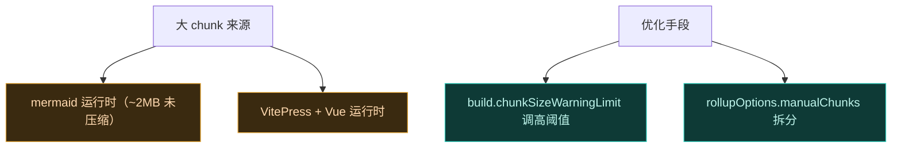

# 📦 构建产物与缓存

文档站构建的产物结构、缓存策略与体积优化。

## 产物结构

`vitepress build docs` 输出到 `docs/.vitepress/dist/`：

```
docs/.vitepress/dist/
├── index.html              # 首页
├── guide/                  # 各路径对应的 HTML
│   ├── intro.html
│   └── ...
├── architecture/
├── developer/
├── cookbook/
├── reference/
├── deployment/
├── assets/                 # JS/CSS/字体/图片
│   ├── app.[hash].js
│   ├── mermaid.[hash].js   # mermaid 运行时
│   └── ...
└── favicon.svg
```

每个 Markdown 生成一个 `.html`，按目录结构组织。`cleanUrls: true` 使 URL 无 `.html` 后缀。

## Pages Artifact

CI 用 `upload-pages-artifact@v3` 把整个 `dist/` 打包成单个 zip artifact 上传。GitHub Pages 解压发布。

## npm 缓存

```yaml
- uses: actions/setup-node@v4
  with:
    node-version: 22
    cache: npm
    cache-dependency-path: website/package-lock.json
```

`cache: npm` 会缓存 `~/.npm`，基于 `package-lock.json` 的哈希做键。lockfile 不变时，`npm ci` 走缓存秒装。

## 体积优化

VitePress 构建可能产出 >500KB 的 chunk（主要是 mermaid）。CI 日志会有 warning，可接受。若要优化：



当前文档站未做激进拆分，因 mermaid 按需加载（仅含 mermaid 块的页面才加载 mermaid JS）。

## .gitignore

```
node_modules/
docs/.vitepress/dist/
docs/.vitepress/cache/
```

`dist/` 和 `cache/` 是构建产物，不入库。

## 相关

- [本地预览](./local)
- [CI/CD](./ci-cd)
