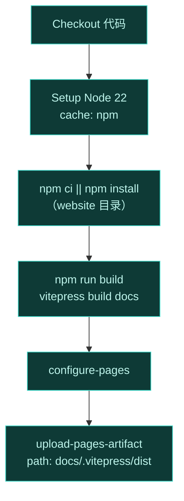

# 🔧 GitHub Actions CI/CD

文档站的自动构建流水线。配置文件：[`.github/workflows/deploy-docs.yml`](https://github.com/android-security-engineer/Vector-skills/blob/master/.github/workflows/deploy-docs.yml)。

## 触发条件

```yaml
on:
  push:
    branches: [master]
    paths:
      - 'website/**'
      - '.github/workflows/deploy-docs.yml'
  workflow_dispatch:    # 支持手动触发
```

只要 push 到 master 且改动了 `website/` 下的文件或本工作流，就触发部署。也支持在 Actions 页面手动触发。

## 权限

```yaml
permissions:
  contents: read       # 读代码
  pages: write         # 写 GitHub Pages
  id-token: write      # OIDC 部署令牌
```

## 并发控制

```yaml
concurrency:
  group: pages
  cancel-in-progress: true
```

同一分支的并发部署只保留最新的——避免旧构建覆盖新构建。

## 构建任务



关键步骤：

- **Setup Node**：用 `actions/setup-node@v4`，Node 22，`cache: npm` + `cache-dependency-path: website/package-lock.json` 加速后续构建。
- **Install**：`npm ci` 严格按 lockfile 安装，失败回退 `npm install`。
- **Build**：`npm run build` 即 `vitepress build docs`，产物在 `docs/.vitepress/dist`。
- **Upload**：`actions/upload-pages-artifact@v3` 把 dist 打包成 Pages artifact。

## 部署任务

```yaml
deploy:
  needs: build
  environment:
    name: github-pages
    url: ${{ steps.deployment.outputs.page_url }}
  steps:
    - uses: actions/deploy-pages@v4
      id: deployment
```

`deploy` 依赖 `build`，在 `github-pages` 环境用 `deploy-pages@v4` 发布。输出 `page_url` 为最终访问地址。

## 本地复现 CI 构建

```bash
cd website
npm ci
npm run build
```

与 CI 完全一致。

## 相关

- [GitHub Pages 部署](./pages)
- [构建产物与缓存](./artifacts)
- [本地预览](./local)
