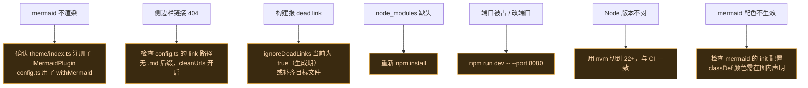

# 🖥️ 本地预览

在本地起文档站，实时预览改动。

## 前置

- Node.js 22+（与 CI 一致）
- 进入 `website/` 目录

## 安装依赖

```bash
cd website
npm install
```

依赖锁定在 `package-lock.json`。`vitepress`、`mermaid`、`vitepress-plugin-mermaid` 是核心依赖（见 `package.json`）。

::: tip 用 npm ci 还是 npm install
- **CI / 首次干净环境**：用 `npm ci`，严格按 lock 文件装，更快更可复现（工作流里 `npm ci || npm install` 即此意图）。
- **本地日常开发**：用 `npm install`，允许 lock 文件随依赖更新。
:::

## Dev Server（热更新）

```bash
npm run dev
```

启动后访问终端提示的地址（默认 `http://localhost:5173`）。修改 Markdown 即时刷新，mermaid 图也会实时渲染。

### dev 命令典型输出与端口

`npm run dev` 对应 `vitepress dev docs`，启动后终端会打印：

```
  VitePress v1.x.x  ➜  Local:   http://localhost:5173/Vector-skills/
                      ➜  Network: use --host to expose
```

| 项 | 说明 |
| :--- | :--- |
| **默认端口** | 5173（VitePress 沿用 Vite 默认端口） |
| **URL 含 base** | 本地也带 `/Vector-skills/` 前缀，与线上一致，便于复现链接路径 |
| **端口被占** | VitePress 自动切到 5174/5175…，看终端输出的实际端口 |
| **强制指定端口** | `npm run dev -- --port 8080` |
| **监听局域网** | `npm run dev -- --host`，方便手机/虚拟机访问 |

::: warning 本地 base 与线上一致
本地 dev 的 URL 是 `http://localhost:5173/Vector-skills/` 而非根路径——这是为了和线上 `base: '/Vector-skills/'` 行为一致。直接访问 `http://localhost:5173/` 会 404，务必带上 base 前缀。
:::

## 生产构建预览

```bash
npm run build      # 构建到 docs/.vitepress/dist
npm run preview    # 本地预览构建产物
```

`build` 与 CI 一致，能发现 dev 模式下被忽略的问题（如死链、构建错误）。

### 各命令对应行为

| 命令 | 实际执行 | 输出位置 / 地址 |
| :--- | :--- | :--- |
| `npm run dev` | `vitepress dev docs` | dev server，`http://localhost:5173/Vector-skills/` |
| `npm run build` | `vitepress build docs` | 静态产物写入 `website/docs/.vitepress/dist` |
| `npm run preview` | `vitepress preview docs` | 本地预览产物，默认 `http://localhost:4173` |

> [!TIP] build 后必须 preview 才能验证产物
> `dev` 用的是内存中的源码，可能掩盖死链；`build` 会真正解析所有 Markdown 相对链接。提交前跑一遍 `npm run build`，能提前发现 CI 会报的 `dead link` 错误。

## 常见问题



### 常见构建报错与处理

| 报错信息 | 原因 | 处理 |
| :--- | :--- | :--- |
| `Cannot find module 'vitepress'` | `node_modules` 缺失或未装 | 在 `website/` 下 `npm install` |
| `Error: ENOENT: no such file ... .md` (dead link) | Markdown 里链接的目标文件不存在 | 修正链接路径或补齐目标文件；生成期可暂用 `ignoreDeadLinks: true` |
| `error:0308010C:digital envelope routines::unsupported` | Node 22 与旧依赖的 OpenSSL 冲突 | 罕见，升 vitepress 至最新；勿用 Node 17- |
| `Port 5173 is in use` | 端口被占 | `npm run dev -- --port 5174` 或关闭占用进程 |
| mermaid 图显示纯文本 | MermaidPlugin 未注册 | 检查 `theme/index.ts` 调用了 `withMermaid` |
| `vitepress build` 卡很久 | 首次构建无缓存 | 正常，mermaid 预渲染耗时；后续有缓存会快 |

## 目录结构

```
website/
├── docs/                    # 文档源
│   ├── guide/ architecture/ developer/
│   ├── cookbook/ reference/ deployment/
│   ├── public/              # 静态资源
│   └── .vitepress/
│       ├── config.ts        # 站点配置
│       └── theme/           # 主题与组件
├── package.json
└── package-lock.json
```

## 相关

- [CI/CD](./ci-cd)
- [GitHub Pages 部署](./pages)
