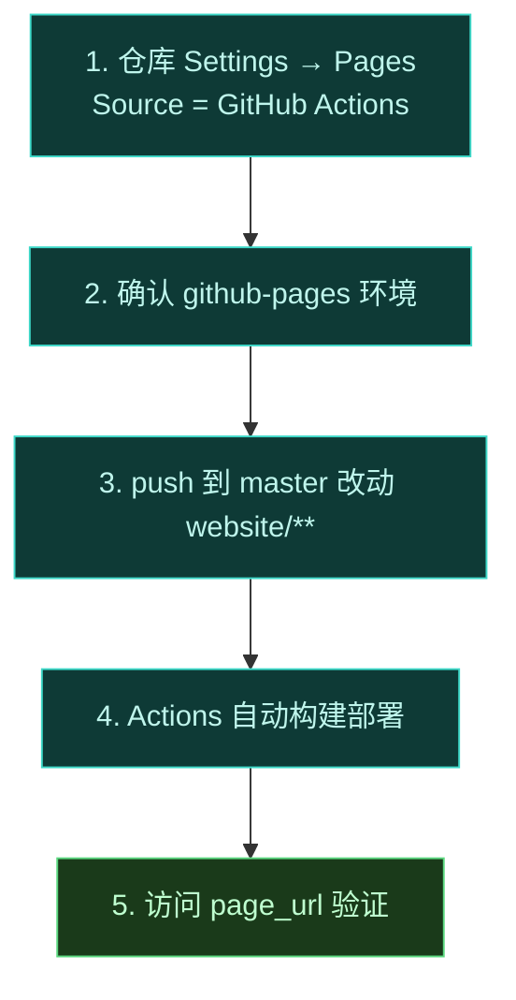

# 🌐 GitHub Pages 部署

文档站部署到 GitHub Pages 的配置要点。

## 仓库设置

1. **Settings → Pages**：Source 设为 **GitHub Actions**（不是 branch）。因为 `deploy-pages` action 直接发布 artifact，不经传统的 `gh-pages` 分支。
2. **部署环境**：CI 里 `environment.name: github-pages`，首次部署需在 Settings → Environments 确认该环境存在。
3. **仓库 Actions 权限**：Settings → Actions → General → Workflow permissions，至少允许 `Read and write`，且勾选 "Allow GitHub Actions to create and approve pull requests"（部署本身不需要后者，但 Pages 写权限依赖默认 token 权限可用）。

### 逐步开启 Pages（图文清单）

| 步骤 | 路径 | 设定值 |
| :--- | :--- | :--- |
| 1 | Settings → Pages → Build and deployment → Source | **GitHub Actions** |
| 2 | Settings → Environments → `github-pages` | 确认存在（无需加审批人） |
| 3 | Settings → Actions → General → Workflow permissions | Read and write permissions |
| 4 | push 到 `master`（改动 `website/**`） | 触发 `deploy-docs.yml` |

> [!TIP] 环境不存在不会报错？
若 `github-pages` 环境缺失，部署 job 会卡在 "Waiting for deployment to reviewed" 或直接失败。最稳妥是在首次部署前到 Settings → Environments 手动新建名为 `github-pages` 的环境。

## 子路径 base

`config.ts` 里：

```ts
base: '/Vector-skills/',
```

因仓库是 `Vector-skills`，GitHub Pages 默认挂在 `/Vector-skills/` 子路径。`base` 必须与此一致，否则静态资源 404。

### base 不匹配的典型症状

| 配置 | 现象 |
| :--- | :--- |
| `base` 缺省（`/`）但 Pages 在子路径 | 页面能开，但 CSS/JS/图片全部 404，站点是"裸 HTML" |
| `base` 写成 `/Vector-skills`（缺尾斜杠） | 部分资源相对路径错位，建议带尾斜杠 |
| `base` 正确 | 资源正常加载，侧边栏链接带 `/Vector-skills/` 前缀 |

::: tip 验证 base 是否生效
本地用 `npm run build` 后看 `docs/.vitepress/dist/index.html` 里引用的资源路径是否以 `/Vector-skills/` 开头。若不是，说明 `config.ts` 的 `base` 没读到（可能是改错文件或被覆盖）。
:::


## 自定义域名（可选）

若要绑定自定义域名：

1. 在 `website/docs/public/` 放 `CNAME` 文件，内容为你的域名（如 `docs.example.com`）。
2. `config.ts` 的 `base` 改为 `/`（根路径）。
3. DNS 配置 CNAME 指向 `<org>.github.io`。

### base 切换 before / after

> [!TIP] 自定义域名必须同步改 base
> 切到自定义域名后，站点跑在根路径，不再有 `/Vector-skills/` 前缀。`base` 必须从 `/Vector-skills/` 改回 `/`，否则所有链接会带上多余前缀导致 404。

```ts
// ❌ 仍保留子路径 base → 自定义域名下资源 404
base: '/Vector-skills/',

// ✅ 自定义域名用根路径 base
base: '/',
```

::: warning CNAME 文件位置
CNAME 必须在构建产物的根目录。本项目 VitePress 把 `docs/public/` 下的文件原样拷进 `dist/` 根，所以放在 `website/docs/public/CNAME`。放错位置 Pages 不会识别自定义域名。
:::

### DNS 配置参考

| 域名类型 | 记录 | 值 |
| :--- | :--- | :--- |
| 子域名 `docs.example.com` | CNAME | `<org>.github.io` |
| Apex `example.com` | A 记录 | GitHub Pages 提供的 IP（见 Pages 设置页） |

DNS 生效后，在 Settings → Pages → Custom domain 里填入域名并勾选 "Enforce HTTPS"。

## 部署状态

- 构建日志在仓库 **Actions** 标签页查看。
- 部署成功后，`deploy` job 的 summary 会显示 `page_url`。
- 失败时优先检查：`permissions` 是否齐全、Pages Source 是否为 GitHub Actions、`base` 是否匹配仓库名。

## 首次部署清单



## 相关

- [CI/CD](./ci-cd)
- [构建产物与缓存](./artifacts)
