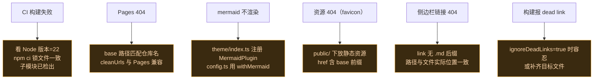

# 🐛 部署排错

文档站部署与本地预览的常见故障及解决方法。

> 📂 [`website/docs/.vitepress/config.ts`](https://github.com/android-security-engineer/Vector-skills/blob/master/website/docs/.vitepress/config.ts) · [`website/package.json`](https://github.com/android-security-engineer/Vector-skills/blob/master/website/package.json)
> 🚀 deployment 运维

## 排错速查



## CI 失败常见原因

`deploy-docs.yml` 在 `website/**` 变更时触发。常见失败：

| 症状 | 原因 | 解决 |
| :--- | :--- | :--- |
| `npm ci` 报锁文件不一致 | `package-lock.json` 与 `package.json` 不同步 | 本地 `npm install` 后提交锁文件 |
| Node 版本不符 | CI 固定 `node-version: 22` | 本地用 nvm 切到 22+ |
| 构建报模块找不到 | `node_modules` 缺失 | 确认 `cache-dependency-path: website/package-lock.json` 正确 |
| 部署步骤无权限 | 缺 `pages: write` / `id-token: write` | workflow 已声明，勿删除 |

```yaml
# deploy-docs.yml 关键权限
permissions:
  contents: read
  pages: write
  id-token: write
```

## Pages 404

部署到 `https://<user>.github.io/Vector-skills/`，站点位于子路径，必须配置 `base`：

```ts
// config.ts
base: '/Vector-skills/',
```

| 场景 | 正确值 |
| :--- | :--- |
| 部署到 `<user>.github.io/Vector-skills/` | `'/Vector-skills/'` |
| 部署到 `<user>.github.io/`（用户站） | `'/'` |
| 自定义域名根路径 | `'/'` |

`cleanUrls: true` 生成无 `.html` 后缀的 URL，GitHub Pages 默认支持。若 404 仍出现，检查 Pages 设置的 source 是否为 `GitHub Actions`（非 `deploy from branch`）。

## mermaid 不渲染

mermaid 依赖两处配置缺一不可：

1. `config.ts` 用 `withMermaid(...)` 包裹 `defineConfig`，并传 `mermaid` 配置；
2. `theme/index.ts` 的 `enhanceApp` 中 `app.use(MermaidPlugin)`。

```ts
// theme/index.ts
enhanceApp({ app }) {
  app.use(MermaidPlugin)
  app.component('InjectionDiagram', InjectionDiagram)
}
```

若图源显示为代码块而非图形，通常是 `MermaidPlugin` 未注册。若图形渲染但样式异常，检查 `mermaidConfig.theme.variables.fontFamily` 是否被站点 CSS 覆盖。

## base 错配

`base` 影响所有静态资源与路由。错配表现为：

- `base` 过短（如 `'/'`）：资源请求落到根路径 404；
- `base` 过长：路径多一段导致路由不匹配；
- `head` 中 `href` 硬编码未带 base：favicon 等丢失。

`config.ts` 中 favicon 已显式带 base：`href: '/Vector-skills/favicon.svg'`，且静态文件放 `website/docs/public/`。

## 本地复现 CI 问题

```bash
cd website
rm -rf node_modules docs/.vitepress/dist
npm ci            # 与 CI 一致
npm run build     # 暴露 dev 模式忽略的死链/构建错误
npm run preview   # 预览产物
```

`build` 能发现 dev 忽略的问题。若 `ignoreDeadLinks: true`，构建不报死链但页面会 404——分批生成期间容忍，全部完成后应移除此项恢复严格检查。

## 相关

- 本地预览见 [local](./local)
- CI/CD 流程见 [ci-cd](./ci-cd)
- Pages 部署见 [pages](./pages)
- 站点定制见 [customize](./customize)
