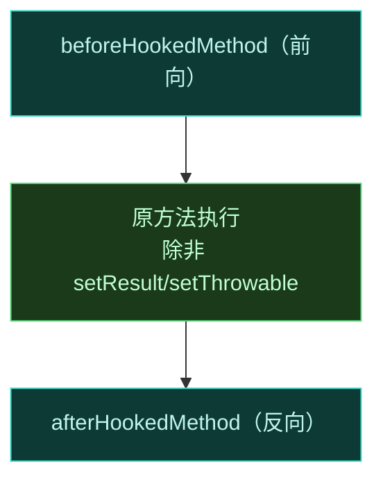
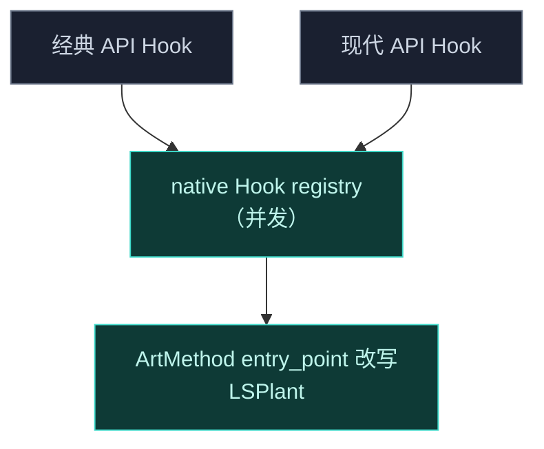
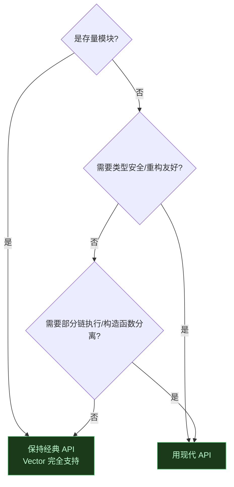

# 🆚 经典 API vs 现代 API 对照表

Vector 同时支持经典 `de.robv.android.xposed` API 与现代 libxposed API。两者底层路由到**同一个 native Hook 引擎**，差异只在表层接口。这一页逐维度对照，配代码示例，帮你选型与迁移。

## 总览

| 维度 | 经典 API | 现代 API |
| :--- | :--- | :--- |
| 命名空间 | `de.robv.android.xposed` | `org.libxposed.api` |
| 风格 | 回调式（`XC_MethodHook`） | 拦截器链（`Hooker`，OkHttp 风格） |
| 类型安全 | 弱（反射、字符串方法名） | 强（`Executable` 对象） |
| 实现模块 | `legacy` 兼容层 | `xposed` 模块 |
| 适用场景 | 存量模块、快速上手 | 新模块、需要类型安全 |

## 注册 Hook

### 经典 API

用 `XposedHelpers.findAndHookMethod`，传入类、方法名、参数类型、回调：

```kotlin
XposedHelpers.findAndHookMethod(
    targetClass,
    "methodName",
    String::class.java, Int::class.java,
    object : XC_MethodHook() {
        override fun beforeHookedMethod(param: MethodHookParam) {
            param.args[0] = "replaced-arg"
        }
        override fun afterHookedMethod(param: MethodHookParam) {
            param.result = transform(param.result)
        }
    }
)
```

### 现代 API

用 `hook(method, HookerClass)`，传入 `Executable` 与拦截器类：

```kotlin
val method = targetClass.getDeclaredMethod("methodName", String::class.javaPrimitiveType)
hook(method, MyHooker::class.java)

@XposedHooker
class MyHooker : Hooker {
    @BeforeInvocation
    fun before(ctx: BeforeHookCallback): MyHooker {
        ctx.args[0] = "replaced-arg"
        return MyHooker()
    }
    @AfterInvocation
    fun after(ctx: AfterHookCallback) {
        ctx.result = transform(ctx.result)
    }
}
```

| 注册对比 | 经典 API | 现代 API |
| :--- | :--- | :--- |
| 定位方法 | 字符串方法名 + 反射 | `Executable` 对象 |
| 回调注册 | 匿名 `XC_MethodHook` | `@XposedHooker` 标注的类 |
| 参数类型 | `Class<*>` 可变参数 | 编译期类型 |

## 回调与执行控制

### 经典 API：before/after 回调



| 操作 | 经典 API 方式 |
| :--- | :--- |
| 改参数 | `param.args[index] = newValue` |
| 改返回值 | `param.result = newValue`（before 设则跳过原方法） |
| 跳过原方法 | before 里设 `param.result` |
| 抛异常替代返回 | `param.throwable = Exception(...)` |
| 完全替换 | 用 `XC_MethodReplacement` 代替 `XC_MethodHook` |

### 现代 API：拦截器链 `proceed()`

```mermaid
graph LR
    C["调用方"]:::in --> B1["Hooker(高).before"]:::step
    B1 -->|proceed()| B2["Hooker(中).before"]:::step
    B2 -->|proceed()| B3["Hooker(低).before"]:::step
    B3 -->|proceed()| O["原方法"]:::orig
    O --> A3["Hooker(低).after"]:::step2
    A3 --> A2["Hooker(中).after"]:::step2
    A2 --> A1["Hooker(高).after"]:::step2
    classDef in fill:#1a2030,stroke:#6b7689,color:#cdd6e3
    classDef step fill:#0e3a36,stroke:#3dd8c8,color:#bff5ec
    classDef step2 fill:#143a4a,stroke:#4fb3d8,color:#bff0f5
    classDef orig fill:#1a3a1a,stroke:#5cd980,color:#bfffd0
```

现代 API 的拦截器通过 `proceed()` 显式控制是否继续向下走链，类似 OkHttp Interceptor。

| 操作 | 现代 API 方式 |
| :--- | :--- |
| 改参数 | `ctx.args[index] = newValue` |
| 改返回值 | `ctx.result = newValue` |
| 跳过原方法 | 不调 `proceed()`，直接设 `result` |
| 调用原方法 | `proceed()` |
| 执行部分链 | `Invoker.Type.Chain`（按 `maxPriority`） |

## 优先级

| 维度 | 经典 API | 现代 API |
| :--- | :--- | :--- |
| 设置方式 | `XC_MethodHook` 构造传 `priority` | `Hooker` 带 `priority` |
| 多模块同方法 | 按优先级组成链 | 按优先级组成链 |
| 执行顺序 | before 前向、after 反向 | before 前向、after 反向 |
| 显式度 | 隐式参数 | 显式字段 |

## 异常处理

| 维度 | 经典 API | 现代 API |
| :--- | :--- | :--- |
| 保护机制 | `LegacyApiSupport` 兜底 | `ExceptionMode.PROTECTIVE` |
| before 抛异常 | 影响后续 | 跳过该拦截器，不影响下游 |
| after 抛异常 | 捕获并恢复缓存结果 | 捕获并恢复缓存的下游结果 |
| 宿主保护 | ✅ 不传播到宿主 | ✅ 不传播到宿主 |

::: warning 别依赖框架兜底
两套 API 都保护宿主进程不被模块异常搞崩，但这是兜底机制。模块应自行 try-catch 处理异常，避免依赖框架。
:::

## 调用原方法

| 需求 | 经典 API | 现代 API |
| :--- | :--- | :--- |
| 调用原方法（绕过所有 Hook） | `XposedBridge.invokeOriginalMethod` | `Invoker.Type.Origin` |
| 执行部分 Hook 链 | 不直接支持 | `Invoker.Type.Chain`（按 `maxPriority`） |
| 构造函数特殊调用 | 不直接支持 | `VectorCtorInvoker`（分离分配与初始化） |

经典 API 调用原方法：

```kotlin
val original = XposedBridge.invokeOriginalMethod(method, thisObject, args)
```

现代 API 调用原方法：

```kotlin
val original = invoker.invoke(Invoker.Type.Origin, method, thisObject, args)
```

## 类型安全

| 维度 | 经典 API | 现代 API |
| :--- | :--- | :--- |
| 方法定位 | 字符串方法名，运行时反射 | `Executable` 对象，编译期检查 |
| 参数访问 | `param.args[index]` 返回 `Object`，需强转 | `ctx.args[index]` 同样需处理，但方法本身类型安全 |
| 反射缓存 | `MemberCacheKey` 结构化缓存，零分配 | 直接用 `Executable`，无需反射查找 |
| 重构友好度 | 弱（方法名改动不报错） | 强（方法签名改动编译报错） |

## 入口回调对照

| 场景 | 经典 API | 现代 API |
| :--- | :--- | :--- |
| 应用加载 | `IXposedHookLoadPackage.handleLoadPackage` | `onPackageLoaded` |
| Zygote 启动 | `IXposedHookZygoteInit.initZygote` | `onPackageLoaded`（system_server） |
| 资源初始化 | `IXposedHookInitPackageResources` | 经资源 Hook 子系统 |

## 失败稳定性

native 层 `HookBridge` 用原子操作设置备份方法 trampoline。无论哪套 API，若用户调用一个**失败 Hook** 的原方法，框架**抛 Java 异常而非 native 崩溃**——避免一个坏 Hook 直接搞崩整个进程。这一行为对两套 API 一致。

## 共存性

两套 API 底层共享同一个并发 native registry，**可以共存于同一进程**。一个模块用经典 API、另一个用现代 API，Hook 同一方法时，会按优先级混在同一链里执行。



## 如何选型



| 选经典 API | 选现代 API |
| :--- | :--- |
| 存量模块，不想改 | 新模块，重视类型安全 |
| 快速原型 | 需要部分链执行（`Type.Chain`） |
| 依赖 `XSharedPreferences` 等经典生态 | 需要构造函数分离调用（`VectorCtorInvoker`） |

## 相关链接

- [Hook API](./hook-api) — 两套 API 的详细用法
- [编写一个模块](./modules) — 两种 API 的最小示例
- [迁移指南](./migration) — 从经典迁移到现代的注意事项
- [Legacy 兼容层](../architecture/legacy) — 经典 API 实现细节
- [Xposed API 实现](../architecture/xposed) — 现代 API 实现细节
