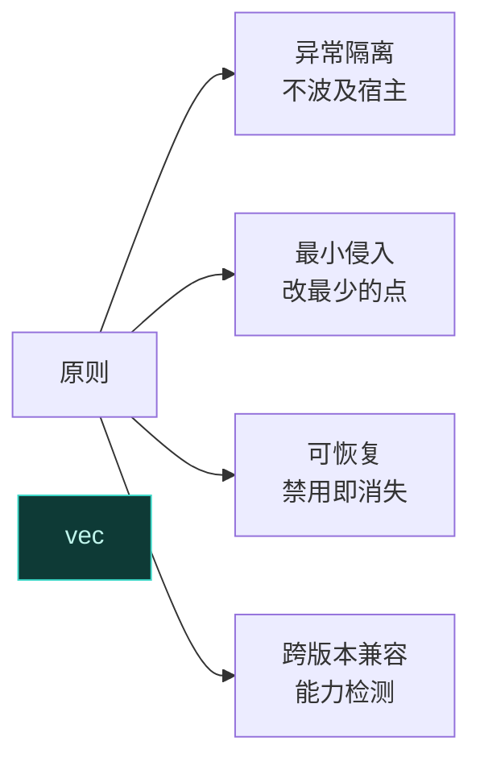
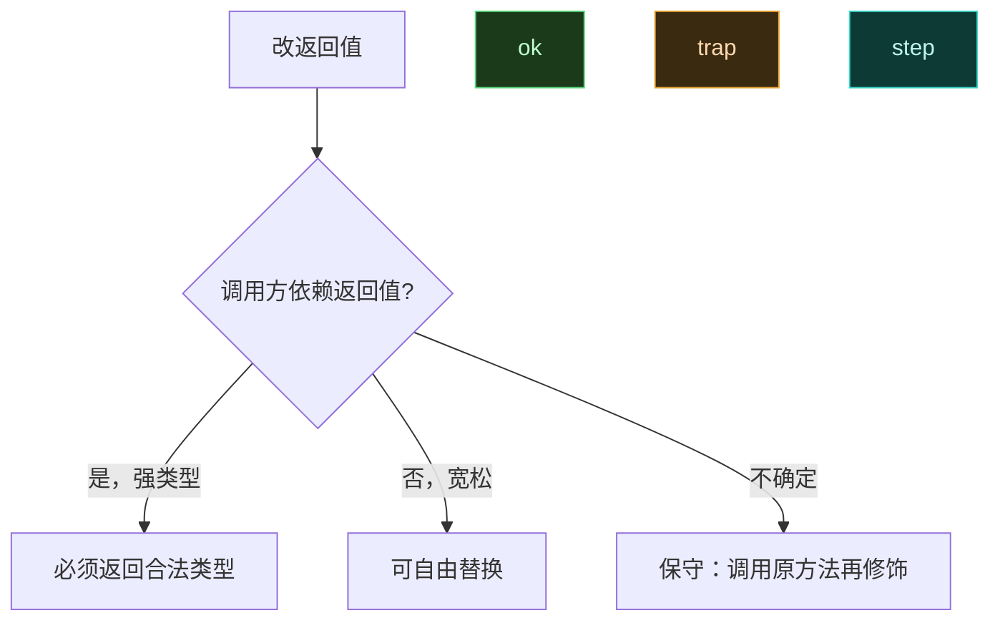

# ✨ 模块开发最佳实践

> 写出稳定、不破坏宿主、跨版本兼容的模块。原则：**隔离、克制、可恢复**。

## 核心原则



## 异常隔离

所有 Hook 回调必须 try-catch，一个 Hook 抛异常不应拖垮宿主进程：

```kotlin
XposedHelpers.findAndHookMethod(clazz, "foo", object : XC_MethodHook() {
    override fun afterHookedMethod(param: MethodHookParam) {
        try {
            doWork(param)
        } catch (t: Throwable) {
            XposedBridge.log(t)   // 记日志，不向上抛
        }
    }
})
```

> 对 system_server 尤其重要——它崩溃会导致设备软重启，甚至 boot loop。见 [专门 Hook system_server](../cookbook/system-server-hook)。

## 最小侵入

- **优先 before 改参数 / after 改返回值**，不要整体替换方法实现。
- 能改一个字段就别 hook 整个方法；能用资源替换就别改代码路径。
- 改返回值时**保留类型语义**——原方法返回 `List`，别返回 `null` 让调用方 NPE。



## 性能

| 实践 | 说明 |
| :--- | :--- |
| 缓存反射结果 | `findClass`/`findMethod` 已有框架缓存，但自定义反射结果自行缓存 |
| 避免主线程重活 | Hook 可能在 UI 线程触发，耗时操作转线程 |
| 减少日志 | 发版关 verbose 日志，debug 才开 |
| 早返回 | 不满足条件直接 return，别装 Hook |

详见 [Hook 性能优化](../cookbook/performance)。

## 跨版本兼容

Android 版本差异大，按能力分支：

```kotlin
val version = XposedBridge.getXposedVersion()   // 返回 libxposed API level
when {
    version >= 100 -> { /* 现代 API 路径 */ }
    else -> { /* 兼容路径 */ }
}
```

```kotlin
// 按 Android API level 分支
when (Build.VERSION.SDK_INT) {
    Build.VERSION_CODES.TIRAMISU -> hookTiramisu(classLoader)
    Build.VERSION_CODES.S -> hookS(classLoader)
    else -> XposedBridge.log("unsupported Android version")
}
```

| 维度 | 检测方式 |
| :--- | :--- |
| 框架 API level | `XposedBridge.getXposedVersion()` |
| Android API level | `Build.VERSION.SDK_INT` |
| 方法是否存在 | `findMethodIfExists` 返回 null 判断 |
| 字段是否存在 | `findFieldIfExists` |

## 不破坏宿主

- **不要吞掉原方法**：除非有意替换，after 里记得 `super` 链会自动执行原方法。
- **不要改系统服务返回值的契约**：比如 `PackageManager.getPackageInfo` 的返回结构被多方依赖。
- **禁用即消失**：用户禁用模块后重启进程，所有 Hook 必须随之消失——不要写持久化的全局状态污染。

## 配置与作用域

- 用 `xposedsharedprefs` + `XSharedPreferences` 读配置，见 [模块持久化配置](../cookbook/persistent-prefs)。
- 作用域精确到必要进程，不要勾选全部应用——影响性能与稳定。

## 签名与更新

- 固定 release 签名，`versionCode` 单调递增。
- `update.json` 与 APK 校验一致，见 [发布前自检清单](../cookbook/repo-publish-checklist)。

## 自检清单

| 项 | 要求 |
| :--- | :--- |
| 所有回调 try-catch | ✓ |
| 不在主线程做重活 | ✓ |
| 能力分支覆盖目标 Android 版本 | ✓ |
| 禁用模块后 Hook 消失 | ✓ |
| API 类用 compileOnly | ✓ |
| 日志 debug 可关 | ✓ |

## 相关

- [模块调试技巧](./debug-module)
- [模块 API 版本与能力检测](./version-api)
- [Hook 性能优化](../cookbook/performance)
- [发布前自检清单](../cookbook/repo-publish-checklist)
