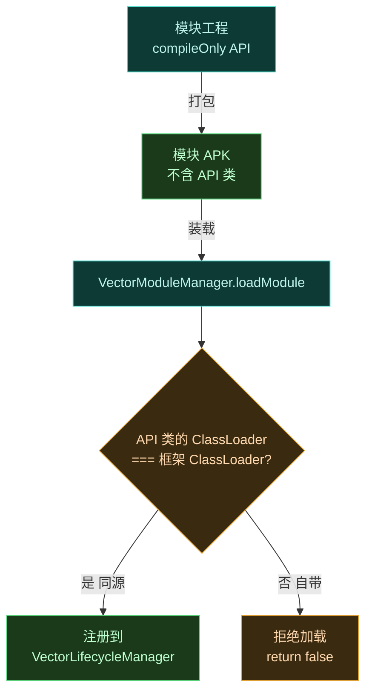
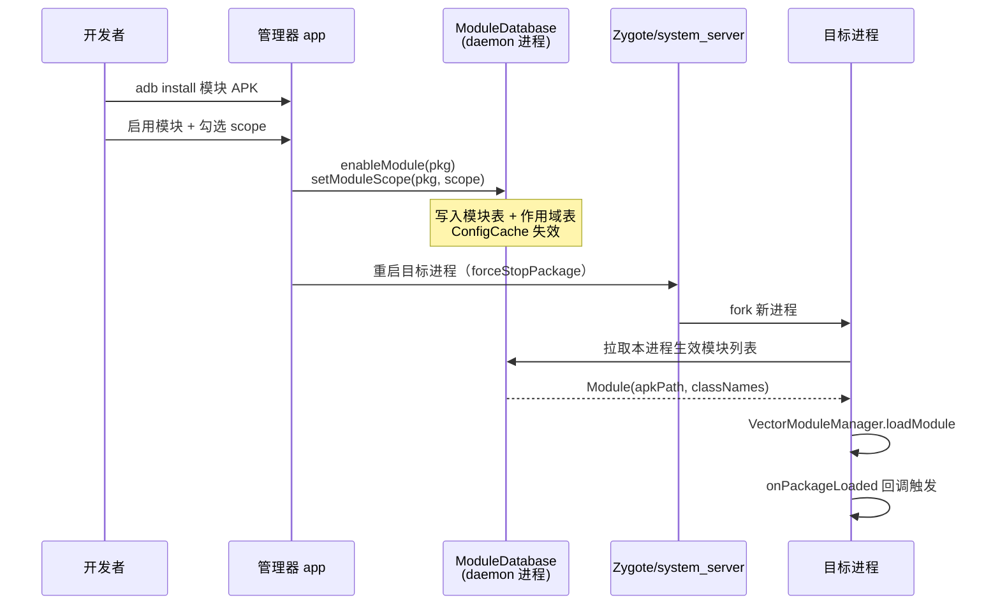

# 🛠️ 模块开发环境搭建

> 从零搭好 Android Studio 工程，配好 Xposed API 依赖，能编译出可装载的模块 APK。

## 前置

- Android Studio（Arctic Fox 或更新）
- JDK 17（Android Gradle Plugin 8+ 要求）
- Android SDK（含 Platform 34+）
- 一台已装 Vector 框架的测试机（或模拟器）

> [!TIP]
> 想用 Vector **自身**的 toolchain 版本对齐？根 [`build.gradle.kts`](https://github.com/android-security-engineer/Vector-skills/blob/master/build.gradle.kts) 锁定 `compileSdk = 36`、`minSdk = 27`、JDK 21、NDK `29.0.13113456`、AGP `8.13.1`（见 [`gradle/libs.versions.toml`](https://github.com/android-security-engineer/Vector-skills/blob/master/gradle/libs.versions.toml)）。模块工程无需照搬，但 `minSdk` 别低于 26 否则 LSPlant art runtime 兼容边界吃紧。

## 新建工程

New Project → Empty Activity 模板即可，模块不需要 Activity UI（但通常会有配置界面）。最小 SDK 与目标进程兼容性相关，建议 `minSdk 26`。

## 依赖 Xposed API

API 类**绝不能编进 APK**，必须用 `compileOnly`。两条来源：

### 经典 API（`de.robv.android.xposed`）

```kotlin
dependencies {
    compileOnly("de.robv.android.xposed:api:82")
}
```

若无仓库可用，直接引用本地 stub 源码集，或从 Vector 仓库的 `legacy/` 模块抽取 API 接口。

### 现代 API（`org.libxposed.api`）

```kotlin
dependencies {
    compileOnly("org.libxposed:api:100")
    compileOnly("org.libxposed:service:100")
}
```

### 为什么必须 `compileOnly`

API 类**绝不能编进 APK**——Vector 框架在运行时已自带 API 实现。若模块把 API 类 `implementation` 进 APK，会产生重复类，`VectorModuleManager` 会直接拒绝加载：



该校验逻辑见 [`VectorModuleManager.kt`](https://github.com/android-security-engineer/Vector-skills/blob/master/xposed/src/main/kotlin/org/matrix/vector/impl/core/VectorModuleManager.kt) 中的 `moduleClassLoader.loadClass(XposedModule::class.java.name).classLoader !== initLoader` 判定。一旦失败，模块整包被跳过。

## 入口声明

`assets/xposed_init`（无扩展名），内容是入口类全限定名：

```text
com.example.mymodule.MainHook
```

多入口每行一个。native 模块另加 `assets/native_init`。

## manifest meta-data

legacy 模块必须声明：

```xml
<application ...>
    <meta-data android:name="xposedmodule" android:value="true"/>
    <meta-data android:name="xposedminversion" android:value="93"/>
    <meta-data android:name="xposeddescription" android:value="模块描述"/>
    <meta-data android:name="xposedscope"
        android:value="system;com.target.app"/>
</application>
```

现代模块改用 `META-INF/xposed/` 下的 `module.prop` 与 `scope.list`（见 [发布前自检清单](../cookbook/repo-publish-checklist)）。

## Gradle 关键配置

```kotlin
android {
    compileSdk = 34
    defaultConfig {
        minSdk = 26
        ndk {
            abiFilters += listOf("arm64-v8a", "armeabi-v7a")
        }
    }
    buildFeatures {
        buildConfig = true   // 若用到 BuildConfig.DEBUG
    }
}

dependencies {
    compileOnly("de.robv.android.xposed:api:82")
    // 你的 UI 依赖正常 implementation
}
```

## ABI 与 native 库

打包 native 库需配 `abiFilters`，并保证 32/64 位都覆盖。详见 [打包 native 库进模块](../cookbook/native-inline-lib)。

## 构建与安装

```bash
./gradlew :app:assembleRelease
# 产出 app/build/outputs/apk/release/app-release.apk
adb install -r app-release.apk
```

之后在 Vector 管理器里启用模块、勾选作用域，重启目标进程。

### 从构建到生效的时序

把模块 APK 交给设备、到目标进程真正收到 `onPackageLoaded` 回调，中间要经过管理器持久化、daemon 跨进程下发、zygote fork 三道关：



- `enableModule` / `setModuleScope` 是 [`ILSPManagerService.aidl`](https://github.com/android-security-engineer/Vector-skills/blob/master/services/manager-service/src/main/aidl/org/lsposed/lspd/ILSPManagerService.aidl) 的 transaction 4 / 6，由管理器 UI 调用、daemon 进程的 [`ManagerService.kt`](https://github.com/android-security-engineer/Vector-skills/blob/master/daemon/src/main/kotlin/org/matrix/vector/daemon/ipc/ManagerService.kt) 实现，最终落到 `ModuleDatabase`；
- scope 变更后必须**重启目标进程**——Vector 在 zygote fork 时一次性决定注入哪些模块，热更新不支持。

## 调试开关

debug 构建可输出更多日志：

```kotlin
buildTypes {
    debug {
        buildConfigField("boolean", "DEBUG_LOG", "true")
    }
}
```

代码里用 `if (BuildConfig.DEBUG_LOG) Log.d(...)`，发版关掉。调试技巧见 [模块调试技巧](./debug-module)。

## 常见错误

| 错误 | 原因 | 解决 |
| :--- | :--- | :--- |
| 模块加载失败，提示 API 类编进 APK | 用了 `implementation` 引 API | 改 `compileOnly` |
| `findClass` 报 ClassNotFound | 作用域未勾目标进程 | 管理器勾选 scope |
| `UnsatisfiedLinkError` | .so ABI 不匹配 | 补全 32/64 位 |
| 入口类不触发 | `xposed_init` 路径/类名错 | 确认在 `assets/` 下，类名含包 |

## 下一步

- 写第一个模块见 [编写一个模块](./modules)。
- 生命周期与回调见 [模块生命周期全解](./module-lifecycle)。
- 环境就绪后看 [Hook API](./hook-api)。
