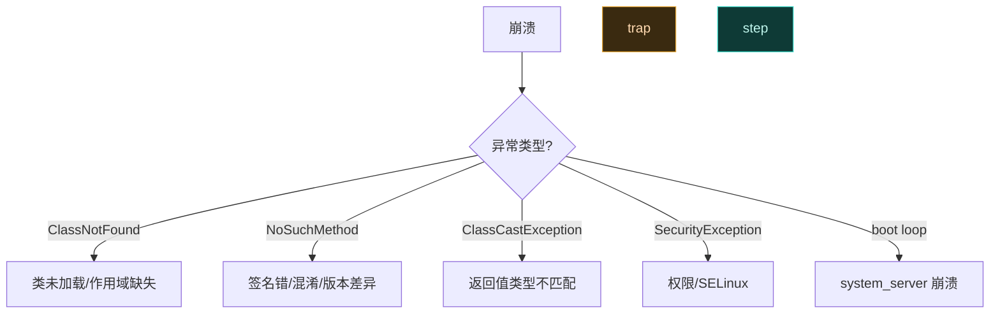

# 🐛 模块调试技巧

> 日志、attach 调试器、寄生进程定位崩溃——模块跑在别人进程里，调试方式不同寻常。

## 日志：第一道工具

```kotlin
XposedBridge.log("my tag: message")          // 写入 Xposed 日志
XposedBridge.log(throwable)                  // 记录异常栈
Log.d("MyModule", "debug: $value")           // 走 logcat
```

查看日志：

```bash
adb logcat | grep -E "VectorLegacyBridge|MyModule"
```

| 日志通道 | 用途 |
| :--- | :--- |
| `XposedBridge.log` | 框架统一日志，管理器可读 |
| `Log.d/i/w/e` | 标准 logcat |
| `BuildConfig.DEBUG` 开关 | 发版关掉 verbose |

## attach 调试器

模块代码跑在宿主进程，调试要 attach 到宿主而非独立进程：

1. 宿主进程需 **debuggable**。非 debuggable 的应用需用 Magisk/adb 改 `debuggable` 标志，或重打包。
2. Android Studio → Run → Attach Debugger to Android Process → 选宿主进程。
3. 在模块代码下断点。

```bash
# 查看可调试进程
adb shell ps -A | grep -i debug
# 或用 am set-debug-app
adb shell am set-debug-app -w com.target.app
```

## 寄生子进程调试

模块寄生在宿主，但有时宿主会 fork 子进程（如 `WebView` 渲染进程、`:remote` 服务进程）。子进程默认不继承调试等待：

```bash
# 让所有子进程也等调试器
adb shell am set-debug-app -w --persistent com.target.app
```

若子进程仍 attach 不上，在模块代码里主动等待：

```kotlin
override fun handleLoadPackage(lpparam: XC_LoadPackage.LoadPackageParam) {
    if (BuildConfig.DEBUG_WAIT) {
        android.os.Debug.waitForDebugger()   // 进程在此挂起等调试器
    }
    // ... 正常 Hook
}
```

> 用完务必关掉 `DEBUG_WAIT`，否则进程会一直挂起。

## 常见崩溃定位



| 崩溃 | 定位 | 对策 |
| :--- | :--- | :--- |
| ClassNotFound | 目标类未加载 | 推迟到 LoadedApk 后 hook |
| NoSuchMethodError | 签名/混淆/版本 | `findMethodIfExists` 判空 |
| ClassCastException | 返回值类型错 | 检查 `param.result` 类型 |
| SecurityException | SELinux 拒绝 | 走框架安全区，勿直访文件 |
| boot loop | system_server 崩 | 回调加 try-catch，禁用模块恢复 |

## module 加载失败

模块根本没被加载时，先查：

1. 作用域是否勾选目标进程。
2. `assets/xposed_init` 路径与类名是否正确。
3. 入口类是否实现 `IXposedMod` 子接口。
4. 是否把 API 类编进了 APK（`ClassLoader` 不一致检查会拒绝）。

```bash
adb logcat | grep -iE "Loading legacy module|Cannot load module|doesn't implement"
```

## 隔离验证

怀疑模块导致问题时，最小化复现：

1. 只留一个 Hook，其余注释。
2. 在纯测试 app 上验证，再迁到真实目标。
3. 用 `unhook` 临时摘除，对比行为。见 [动态取消 Hook](../cookbook/handle-unhook)。

## 日志技巧

```kotlin
// 带进程信息，便于多进程区分
val tag = "MyModule/${android.os.Process.myPid()}/${lpparam.packageName}"
Log.i(tag, "hooked foo, arg=${param.args[0]}")
```

```kotlin
// 异常完整栈
try { /* ... */ } catch (t: Throwable) {
    XposedBridge.log(Log.getStackTraceString(t))
}
```

## 相关

- [日志与调试](../cookbook/debugging)
- [模块开发最佳实践](./best-practices)
- [动态取消 Hook](../cookbook/handle-unhook)
- [Hook Zygote 早期阶段](../cookbook/hook-zygote)
