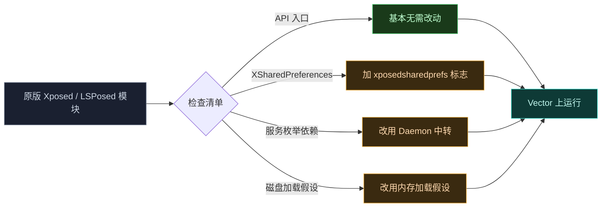
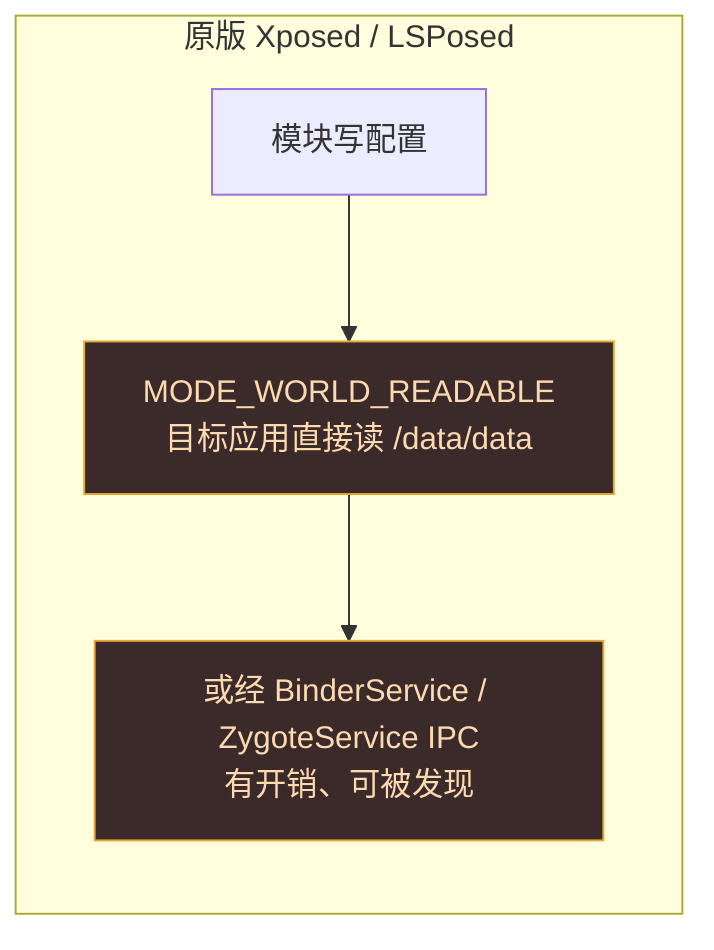
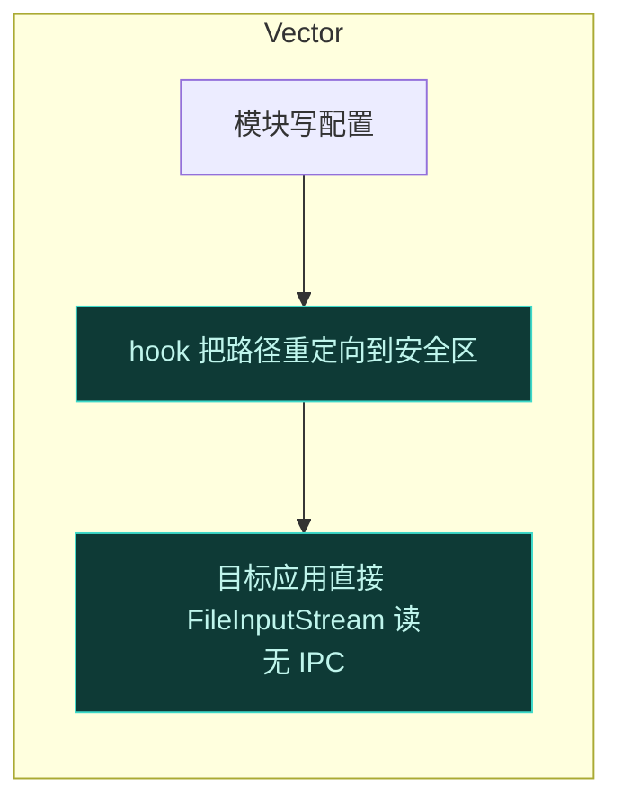
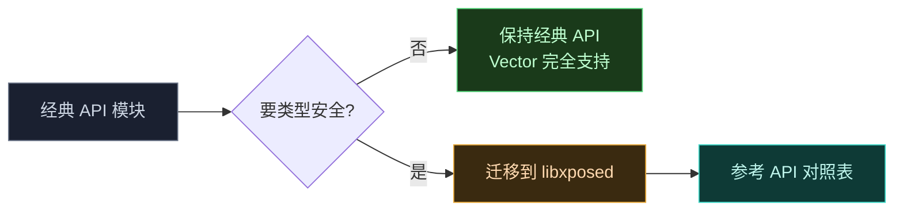

# 🔄 从 Xposed / LSPosed 迁移到 Vector

Vector 维持与原版 Xposed **API 一致**，绝大多数存量模块无需改动即可运行。但 Vector 在 IPC、配置共享、隐蔽性上做了工程化重构，少数依赖旧机制的地方需要注意。这一页给出完整的迁移检查清单。

## 迁移总览



## API 兼容性

Vector 同时支持两套 API，与原版 Xposed / LSPosed 的对应关系：

| API | 原版实现 | Vector 实现 | 兼容性 |
| :--- | :--- | :--- | :--- |
| 经典 `de.robv.android.xposed` | XposedBridge | `legacy` 兼容层 | ✅ 接口完全一致 |
| 现代 libxposed | LSPosed 的 xposed 模块 | Vector 的 `xposed` 模块 | ✅ 同一 API 规范 |

### 经典 API 入口回调

以下回调在 Vector 上行为与原版一致，无需改动：

| 回调 | 用途 | Vector 行为 |
| :--- | :--- | :--- |
| `IXposedHookLoadPackage.handleLoadPackage` | 应用加载 | 由 `LegacyDelegateImpl.onPackageLoaded` 翻译派发 |
| `IXposedHookZygoteInit.initZygote` | Zygote 启动 | 立即调用，带 `StartupParam` |
| `IXposedHookInitPackageResources` | 资源初始化 | 经 native 资源 hook 子系统触发 |

### 现代 API 入口

| 回调 | Vector 行为 |
| :--- | :--- |
| `onPackageLoaded` | 由 `VectorLifecycleManager` 派发 |
| system_server 加载 | `onPackageLoaded` 收到 system_server 参数 |

## 模块清单

模块 APK 清单文件保持不变：

| 文件 | 作用 | 迁移动作 |
| :--- | :--- | :--- |
| `AndroidManifest.xml` 声明 `xposedmodule` | 标识为 Xposed 模块 | 无需改 |
| `assets/xposed_init` | Java 入口类全限定名 | 无需改 |
| `assets/native_init` | native Hook 库文件名 | 无需改 |

## XSharedPreferences 的变化

这是迁移中**最需要关注**的差异。原版 Xposed 依赖 `MODE_WORLD_READABLE` 让目标应用直接读模块配置，Android 7.0 起此标志抛 `SecurityException`。

### 原版机制



### Vector 机制

Vector 用 Daemon 预配 `xposed_data` SELinux 安全区，目标应用直接 `FileInputStream` 读，**无 IPC 开销**：



### 迁移动作

| 场景 | 动作 |
| :--- | :--- |
| 模块用了 `XSharedPreferences` | 在清单声明 `xposedsharedprefs` meta-data，并声明 `xposedminversion` > 92 |
| 模块自己 `MODE_WORLD_READABLE` | 框架 hook `checkMode` 抑制异常，但建议声明标志以走安全区 |
| 监听配置变更 | `OnSharedPreferenceChangeListener` 仍可用，框架用 inotify 守护线程实时派发 |

声明示例（`AndroidManifest.xml` 的 `<meta-data>`）：

```xml
<meta-data android:name="xposedmodule" android:value="true" />
<meta-data android:name="xposedminversion" android:value="93" />
<meta-data android:name="xposedsharedprefs" android:value="true" />
```

::: tip 无需改业务代码
路径重定向是透明的，模块里 `XSharedPreferences` 的读写代码原样保留即可，只需补清单标志。
:::

详见 [Legacy 兼容层 → SharedPreferences 与 SELinux 边界](../architecture/legacy#sharedpreferences-与-selinux-边界)。

## 需要注意的差异

### 1. 不再有可枚举的系统服务

| 项 | 原版 / LSPosed | Vector |
| :--- | :--- | :--- |
| 服务注册 | 注册标准 AIDL 服务进 `ServiceManager` | 不注册任何服务，劫持 `execTransact` |
| 服务发现 | `service list` 可见 | 系统视角不可见 |

**影响**：模块若依赖枚举系统服务来"探测框架是否存在"，在 Vector 上会失败。应改用 `XposedBridge` 类是否存在、或 `IXposedHookLoadPackage` 是否被回调来判断。

### 2. 模块从内存加载，不留 FD

| 项 | 原版 / LSPosed | Vector |
| :--- | :--- | :--- |
| 加载方式 | 部分走磁盘 | 严格内存加载（SharedMemory） |
| ClassLoader | 可被 `getParent()` 链发现 | 挂在框架私有分支，反射链找不到 |
| `jar:` 请求 | 触发 JarFile 缓存 | 被 `VectorURLStreamHandler` 拦截 |

**影响**：模块若用反射遍历 `ClassLoader.getParent()` 查找其他模块或框架，在 Vector 上找不到。这是有意的隐蔽设计，不应绕过。

### 3. 框架类名每次开机随机化

Daemon 每次开机随机化框架类名（如 `org.matrix.vector.core.Main` → 随机名），native 经混淆映射定位。

**影响**：模块**不应硬编码**框架内部类名。只通过公开 API（`XposedBridge`、`XposedHelpers`）交互。

### 4. 管理器是寄生的

| 项 | 原版 / LSPosed | Vector |
| :--- | :--- | :--- |
| 管理器 | 独立安装的应用 | 寄生在 `com.android.shell`，经通知进入 |

**影响**：模块若与管理器交互（如请求作用域），接口不变，但不要假设管理器有固定包名或独立进程。

## 模块适配清单

迁移一个模块时，逐项核对：

| # | 检查项 | 动作 |
| :--- | :--- | :--- |
| 1 | 入口类实现 `IXposedHookLoadPackage` 等 | 无需改 |
| 2 | `assets/xposed_init` 类名正确 | 无需改 |
| 3 | 用了 `XSharedPreferences` | 加 `xposedsharedprefs` + `xposedminversion>92` |
| 4 | 枚举系统服务探测框架 | 改为判断 `XposedBridge` 类存在 |
| 5 | 反射遍历 ClassLoader 链 | 移除，改用公开 API |
| 6 | 硬编码框架内部类名 | 改用 `XposedBridge` / `XposedHelpers` |
| 7 | 假设模块从磁盘加载 | 改为内存加载假设（不应依赖文件路径） |
| 8 | native 模块（`assets/native_init`） | 无需改，经 `native_api_bridge.cpp` 提供 inline hook |
| 9 | 资源 Hook（`XResources`） | 无需改，资源子系统透明工作 |
| 10 | 与管理器交互 | 接口不变，不假设固定包名 |

## 迁移到现代 API（可选）

如果你的模块仍是经典 API，可考虑迁移到现代 libxposed API 以获得类型安全。差异见 [API 对照表](./api-comparison)。这不是必须的——经典 API 在 Vector 上完全受支持。



## 验证迁移成功

迁移后按此顺序验证：

1. 模块出现在 Vector 管理器列表。
2. 能为目标应用勾选作用域。
3. 强制停止目标应用后重开，`handleLoadPackage` / `onPackageLoaded` 被回调。
4. Hook 逻辑生效。
5. `XSharedPreferences`（若用）能读到配置、能监听变更。

任一步失败，参考[故障排查指南](../guide/troubleshooting)。

## 相关链接

- [API 对照表](./api-comparison) — 经典 vs 现代 API 全面对照
- [编写一个模块](./modules) — 从零写模块
- [Hook API](./hook-api) — 两套 API 的注册与执行控制
- [Legacy 兼容层](../architecture/legacy) — 经典 API 实现细节
- [Xposed API 实现](../architecture/xposed) — 现代 API 实现细节
