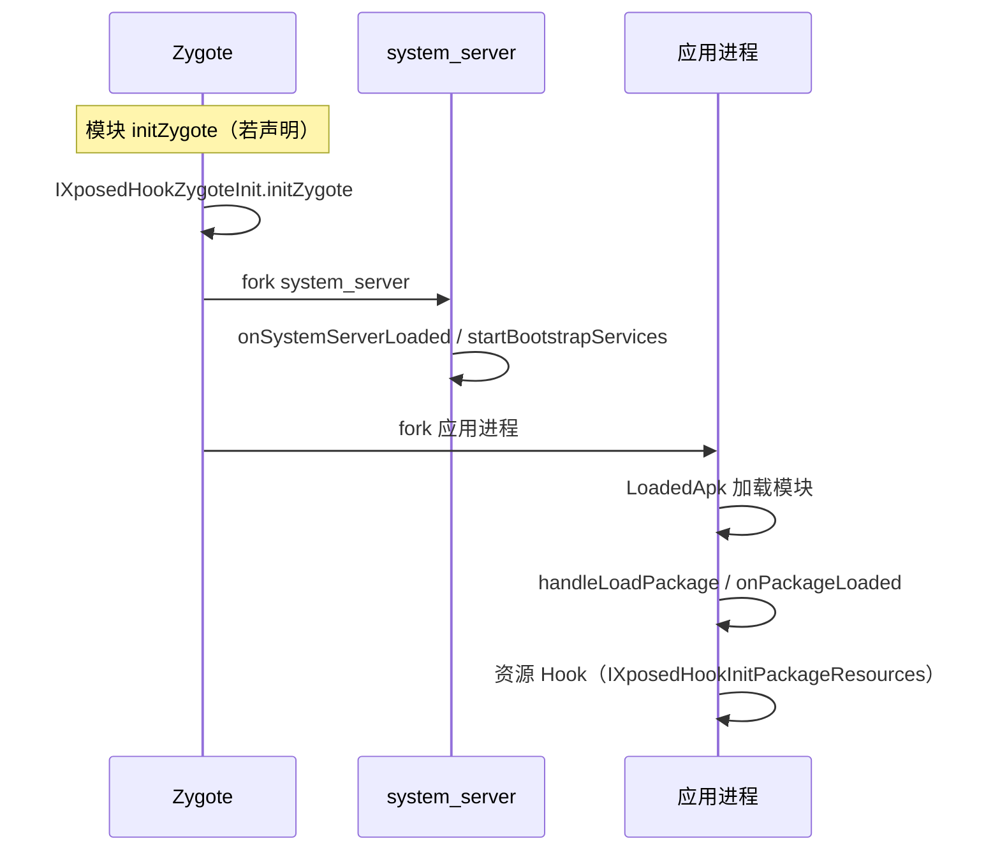
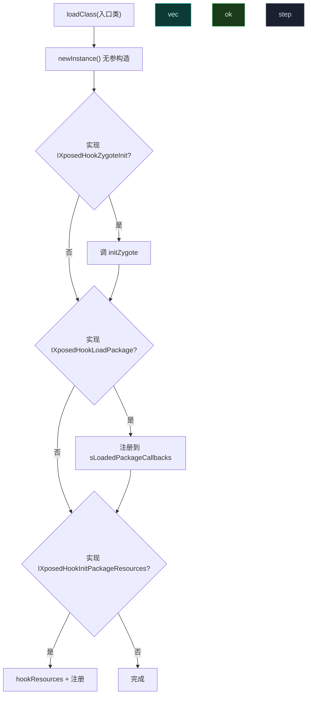

# ⏱️ 模块生命周期全解

> 模块入口回调的触发时机、顺序与条件，决定你把 Hook 放在哪个回调里。

## 生命周期总览



## 经典 API 回调

入口类实现下列接口之一或多个，框架按接口分发：

```kotlin
class MainHook : IXposedHookZygoteInit, IXposedHookLoadPackage {
    override fun initZygote(param: IXposedHookZygoteInit.StartupParam) {
        // Zygote 启动时调用，先于任何应用进程
        // param.modulePath = 模块 APK 路径
        // param.startsSystemServer = 是否将启动 system_server
    }
    override fun handleLoadPackage(lpparam: XC_LoadPackage.LoadPackageParam) {
        // 每个在作用域内的应用进程加载时调用
        // lpparam.packageName / lpparam.classLoader
    }
}
```

| 接口 | 触发时机 | 能拿到 |
| :--- | :--- | :--- |
| `IXposedHookZygoteInit` | Zygote 启动一次 | `modulePath`、`startsSystemServer` |
| `IXposedHookLoadPackage` | 每个作用域内应用加载 | `packageName`、`classLoader` |
| `IXposedHookInitPackageResources` | 资源初始化 | 资源替换入口 |
| `IXposedHookCmdInit` | 命令行初始化（少数场景） | — |

## 现代 API 回调

`XposedModule` 基类提供 `onPackageLoaded` 等覆盖：

```kotlin
class MainModule(base: XposedInterface, param: ModuleLoadedParam)
    : XposedModule(base, param) {
    override fun onPackageLoaded(param: PackageLoadedParam) {
        // 等价 handleLoadPackage
        if (param.isFirstPackage) { /* 首次加载 */ }
    }
}
```

## 构造时序

框架加载模块类的流程（`XposedInit.initModule`）：



要点：

- 入口类必须**有无参构造**，框架用 `newInstance()` 实例化。
- `initZygote` 在 Zygote 调一次，**所有 fork 出的应用进程继承其效果**（但 Hook 本身不继承，见下）。
- `handleLoadPackage` 每个应用进程独立调一次，在此进程装的 Hook 只对该进程生效。

## 回调触发条件

| 回调 | 条件 |
| :--- | :--- |
| `initZygote` | 模块声明了该接口 + Zygote 启动 |
| `handleLoadPackage` | 应用进程在模块作用域内 + LoadedApk 加载 |
| `onSystemServerLoaded` | system_server 在作用域 + bootstrap 阶段 |
| 资源回调 | 资源 Hook 子系统启用 + 应用初始化资源 |

## 进程继承的真相

> ⚠️ Zygote 里装的 Hook **不会被 fork 出的子进程继承**（`IXUnhook` 契约明确）。Zygote 的 `initZygote` 回调适合做**初始化**（注册全局回调、读配置），实际应用 Hook 仍要在 `handleLoadPackage` 里装。

## 作用域与加载

模块默认不对任何应用生效。`handleLoadPackage` 被调用，就说明该进程已在作用域内——代码里不必再判权限。作用域配置见 [作用域与多进程](../cookbook/scope)。

## 陷阱

| 陷阱 | 后果 | 对策 |
| :--- | :--- | :--- |
| 期望 Zygote Hook 被子进程继承 | 子进程无 Hook | 在 handleLoadPackage 重装 |
| 入口类无无参构造 | newInstance 失败 | 提供无参构造 |
| 在 initZygote hook 未加载的应用类 | ClassNotFound | 推迟到 handleLoadPackage |
| 多次注册同一回调 | 重复触发 | 用 `CopyOnWriteArraySet` 去重（框架已做） |

## 相关

- [编写一个模块](./modules)
- [Hook API](./hook-api)
- [作用域与多进程](../cookbook/scope)
- [Hook Zygote 早期阶段](../cookbook/hook-zygote)
