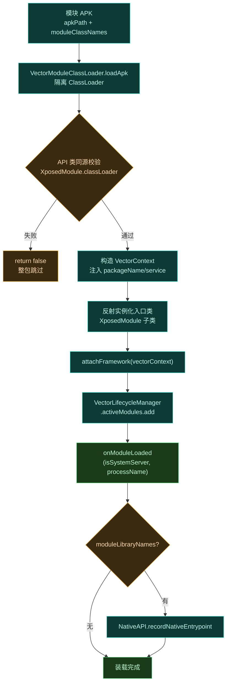
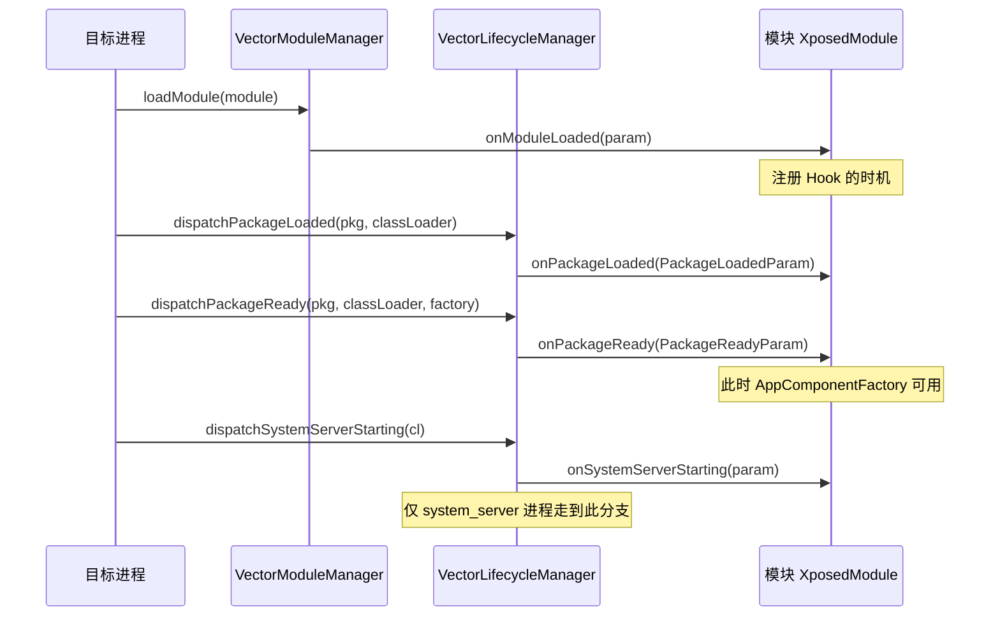

# 编写一个模块

这一节带你从零写一个能在 Vector 上运行的模块。Vector 同时支持经典 Xposed API 和现代 libxposed API，下面分别给出最小示例。

## 模块的本质

一个模块就是一个普通 APK，加上：

1. `AndroidManifest.xml` 里声明 `xposedmodule` 的 meta-data。
2. `assets/xposed_init` 文件，内容是入口类的全限定名。
3. （可选）`assets/native_init`，声明 native 库文件名。

## 模块加载链路

模块 APK 被目标进程拉起后，Vector 框架的 `VectorModuleManager` 接管整个装载过程——从读取 `module.prop`/`xposed_init` 到实例化入口类、注入框架上下文、派发首个生命周期回调。下图展示现代 API（`XposedModule`）的完整装载链路：



装载全部发生在目标进程内，核心实现见 [`VectorModuleManager.kt`](https://github.com/android-security-engineer/Vector-skills/blob/master/xposed/src/main/kotlin/org/matrix/vector/impl/core/VectorModuleManager.kt) 的 `loadModule`。关键约束：

- **ClassLoader 隔离**：每个模块用独立的 `VectorModuleClassLoader`，避免多模块间类冲突；
- **API 类同源校验**：模块的 `XposedModule` 类其 ClassLoader 必须等于框架自身的 `initLoader`，否则判定为把 API 编进了 APK 而拒绝；
- **native 入口**：`assets/native_init` 声明的 `.so` 名最终经 `NativeAPI.recordNativeEntrypoint` 注册，由 `VectorNativeHooker` 在 JNI 层接管。

## 经典 API 示例

入口类实现 `IXposedHookLoadPackage`：

```kotlin
package com.example.mymodule

import de.robv.android.xposed.IXposedHookLoadPackage
import de.robv.android.xposed.XC_MethodHook
import de.robv.android.xposed.XposedHelpers
import de.robv.android.xposed.callbacks.XC_LoadPackage

class MainHook : IXposedHookLoadPackage {
    override fun handleLoadPackage(lpparam: XC_LoadPackage.LoadPackageParam) {
        if (lpparam.packageName != "com.target.app") return

        XposedHelpers.findAndHookMethod(
            "com.target.app.Util",       // 目标类
            lpparam.classLoader,
            "getDeviceId",                // 目标方法
            object : XC_MethodHook() {
                override fun afterHookedMethod(param: MethodHookParam) {
                    // 把返回值改成假值
                    param.result = "fake-device-id"
                }
            }
        )
    }
}
```

`assets/xposed_init` 内容：

```text
com.example.mymodule.MainHook
```

## 现代 API (libxposed) 示例

现代 API 用 OkHttp 风格的拦截器链，类型安全：

```kotlin
package com.example.mymodule

import org.libxposed.api.XposedInterface
import org.libxposed.api.XposedModule
import org.libxposed.api.XposedModuleInterface.PackageLoadedParam
import org.libxposed.api.annotations.BeforeInvocation
import org.libxposed.api.annotations.XposedHooker

class MainModule(base: XposedInterface, param: ModuleLoadedParam)
    : XposedModule(base, param) {

    override fun onPackageLoaded(param: PackageLoadedParam) {
        if (param.packageName != "com.target.app") return

        val targetClass = param.classLoader.loadClass("com.target.app.Util")
        val targetMethod = targetClass.getDeclaredMethod("getDeviceId")

        hook(targetMethod, ReplaceDeviceId::class.java)
    }

    @XposedHooker
    class ReplaceDeviceId : Hooker {
        @BeforeInvocation
        static fun before(ctx: BeforeHookCallback): ReplaceDeviceId {
            ctx.result = "fake-device-id"  // 直接决定返回值
            return ReplaceDeviceId()
        }
    }
}
```

## 入口点对照

两种 API 的入口回调对照：

| 场景 | 经典 API | 现代 API |
| :--- | :--- | :--- |
| 应用加载 | `IXposedHookLoadPackage.handleLoadPackage` | `onPackageLoaded` |
| Zygote 启动 | `IXposedHookZygoteInit.initZygote` | `onPackageLoaded` (system_server) |
| 资源初始化 | `IXposedHookInitPackageResources` | 经资源 Hook 子系统 |

### 生命周期回调时序

`onModuleLoaded` 只是起点。模块注册到 `VectorLifecycleManager.activeModules` 后，框架在每个进程生命周期节点上向**所有活跃模块**派发回调。下图以一个普通应用进程为例：



派发实现见 [`VectorLifecycleManager.kt`](https://github.com/android-security-engineer/Vector-skills/blob/master/xposed/src/main/kotlin/org/matrix/vector/impl/VectorLifecycleManager.kt)：

- `activeModules` 是 `ConcurrentHashMap.newKeySet()`，多线程安全；
- 每个回调包在 `runCatching` 里，单个模块抛异常不会阻断其他模块的派发；
- `PackageReadyParamImplP` 用 `@RequiresApi(P)` 隔离，避免在 Android 8.1 上校验器崩溃——这是支持 8.1 起步的关键兼容手段。

> [!TIP]
- `onPackageLoaded` 会在**首次加载**和**后续加载**都触发，用 `PackageLoadedParam.isFirstPackage()` 区分；
- 想拦截 `AppComponentFactory`（如 `wrapApplication`）必须在 `onPackageReady` 里做，`onPackageLoaded` 阶段 factory 尚未创建。

## 作用域

模块默认不对任何应用生效。用户需在 Vector 管理器里为模块勾选作用域。你的代码里 `handleLoadPackage` / `onPackageLoaded` 收到回调，就说明该进程已在作用域内、模块已被加载——无需自己判断权限。

## 下一步

- 完整 Hook API 细节见 [Hook API](./hook-api)。
- 资源替换与跨进程偏好见 [资源与偏好](./resources)。
- native Hook 模块见 [Native 模块](./native)。
