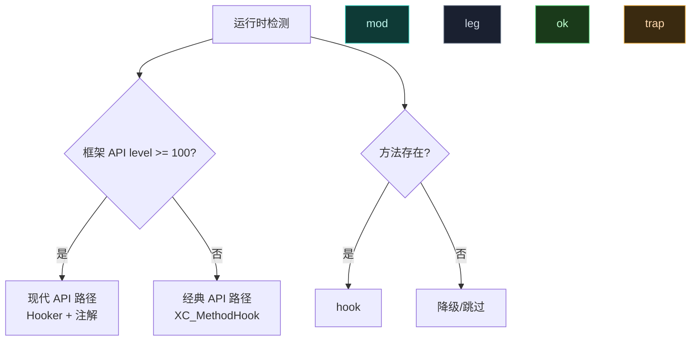

# 🔢 模块 API 版本与能力检测

> 不同 Android 版本、不同框架版本能力有差异，运行时检测再分支，避免硬编码踩雷。

## 框架 API 版本

```kotlin
val apiLevel = XposedBridge.getXposedVersion()
// 返回 libxposed API level（当前 100），即 XposedInterface.LIB_API
```

| 值 | 含义 |
| :--- | :--- |
| `>= 100` | 现代 libxposed API（OkHttp 风格拦截器链） |
| `93` | legacy `xposedminversion` 门槛（影响 XSharedPreferences 安全区路径） |
| `> 92` | 同上，触发安全区重定向 |

`getXposedVersion()` 实际返回 `XposedInterface.LIB_API`（现代常量），对经典模块兼容。

## Android API level

```kotlin
when (Build.VERSION.SDK_INT) {
    in Build.VERSION_CODES.TIRAMISU..Int.MAX_VALUE -> hookAndroid14Plus(classLoader)
    Build.VERSION_CODES.S -> hookAndroid12(classLoader)
    else -> { /* 不支持，记日志 */ }
}
```

| Android | API level | 关键差异 |
| :--- | :--- | :--- |
| 14 | 34 | 隐藏 API 清单更严 |
| 13 | 33 | `XmlUtils.readMapXml` 行为变化 |
| 12 | 31 | `AppOps` 重构 |
| 11 及以下 | ≤30 | 部分 API 不可用 |

## 方法/字段存在性

按存在性分支，最稳妥：

```kotlin
val method = XposedHelpers.findMethodIfExists(clazz, "foo", paramTypes)
if (method != null) {
    XposedBridge.hookMethod(method, hooker)
} else {
    XposedBridge.log("method foo not found, skip")
}
```

`findFieldIfExists`、`findClassIfExists` 同理，找不到返回 `null` 而非抛异常。

## 能力分支模式



## minApiVersion 与 targetApiVersion

现代模块 `module.prop` 声明：

```properties
minApiVersion=100
targetApiVersion=100
```

- `minApiVersion`：模块要求的最低框架 API level，低于此不加载。
- `targetApiVersion`：模块针对的目标 level，影响框架行为开关。
- legacy 模块用 `xposedminversion` meta-data（整数，如 `93`）。

## 宿主能力探测

某些能力依赖宿主进程上下文，运行时探测：

```kotlin
// 是否在 system_server
val isSystemServer = lpparam.packageName == "android"

// 是否有直接文件访问（SELinux）
val hasFileAccess = SELinuxHelper.getAppDataFileService().hasDirectFileAccess()
if (!hasFileAccess) {
    // 走远程偏好而非直接读文件
}
```

## 框架属性

Daemon 经 `InjectedModuleService.getFrameworkProperties()` 返回能力位：

```kotlin
// PROP_CAP_SYSTEM | PROP_CAP_REMOTE | PROP_RT_API_PROTECTION（dex 混淆时）
```

模块据此判断是否启用某些依赖保护的能力。

## 降级策略

```kotlin
fun safeHook(clazz: Class<*>, method: String, hooker: XC_MethodHook) {
    val m = XposedHelpers.findMethodIfExists(clazz, method) ?: return
    try {
        XposedBridge.hookMethod(m, hooker)
    } catch (e: IllegalArgumentException) {
        // abstract / 框架自身方法不可 hook
        XposedBridge.log("cannot hook $method: ${e.message}")
    }
}
```

## 陷阱

| 陷阱 | 后果 | 对策 |
| :--- | :--- | :--- |
| 硬编码 API level | 跨框架版本失效 | 用 `getXposedVersion()` 检测 |
| 假设方法一定存在 | NoSuchMethodError | `findMethodIfExists` |
| 假设 system_server 包名 | 误判 | 用 `android` 包名或 `startsSystemServer` |
| minApiVersion 设错 | 低版本不加载或异常 | 与实际依赖对齐 |

## 相关

- [模块开发最佳实践](./best-practices)
- [API 对照（经典 vs 现代）](./api-comparison)
- [legacy · XposedBridge（getXposedVersion）](../reference/classes/legacy-api)
- [从经典迁移到现代 API](./migration)
