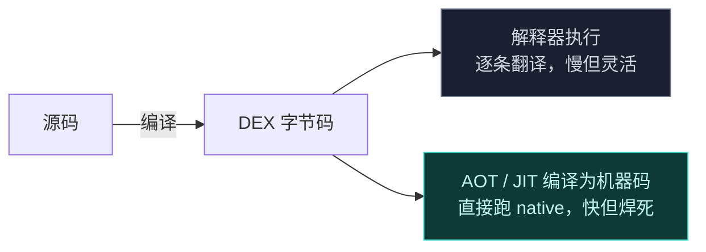
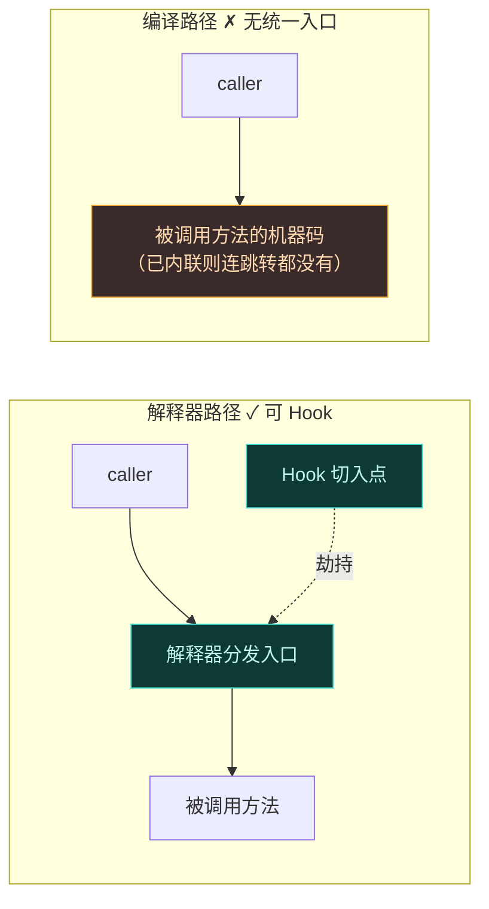
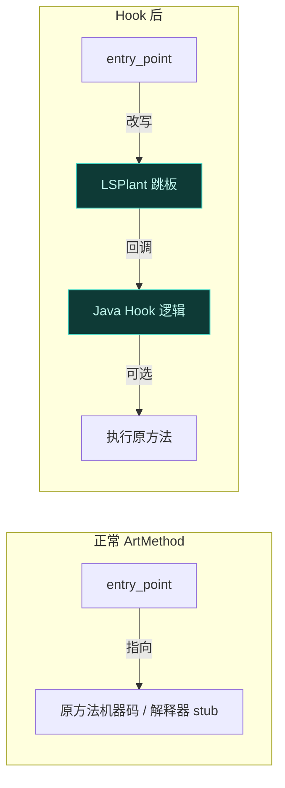
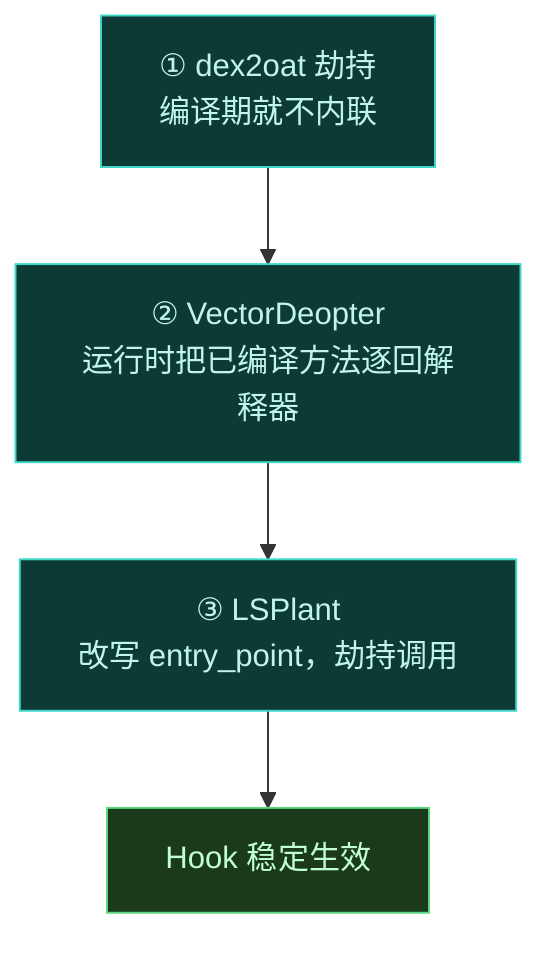

# ART Hook 原理

要理解 Vector 怎么"改"一个方法的执行，得先理解 Android 是怎么"执行"一个方法的。这一节讲清楚从源码到执行的链路，以及 Hook 在哪一步切入。

## 方法是如何被执行的

Android 应用代码编译成 DEX 字节码后，由 ART (Android Runtime) 执行。ART 有两条执行路径：

- **解释器**：逐条翻译字节码。慢，但严格遵循方法边界——每次调用一个方法，都会经过统一入口。
- **编译执行**：ART 把热点方法编译成机器码，调用时直接跳转过去，绕过解释器。

## Hook 的切入点

Hook 的本质是：**当目标方法被调用时，把执行流劫持到我们的代码**。这要求"方法调用"这件事必须是一个**可识别的、集中的入口点**。

解释器天然满足——它有统一的方法分发入口。但编译执行不满足：一旦方法被内联或编译成独立机器码，调用方直接跳进机器码，没有统一的拦截点。

## LSPlant 做了什么

[LSPlant](https://github.com/JingMatrix/LSPlant) 是 Vector 的核心 Hook 引擎。它的工作是：**把目标方法的入口点改写成指向我们的 trampoline（跳板）**。

具体而言，LSPlant 修改 ART 内部 `ArtMethod` 结构里的入口点指针，让方法被调用时先跳到一段跳板代码，由跳板回调到 Java 层的 Hook 逻辑，再决定是否执行原方法。

这是**方法级**的拦截，不依赖反编译、不修改字节码，非常稳定。

## 但还有两道坎

光有 LSPlant 还不够，因为 ART 会"逃逸"出这个入口点：

### 坎一：内联

如果方法被内联进调用方，调用方根本不会查 `entry_point`，直接执行内联的机器码。LSPlant 改了入口点也没用——没人会去走它。

**解法**：Vector 劫持 `dex2oat`，全局禁止内联（`--inline-max-code-units=0`）。详见 [dex2oat 编译劫持](../architecture/dex2oat)。

### 坎二：已编译的方法绕过入口点

已经被 AOT 编译成机器码的方法，其 `entry_point` 指向编译产物。即便 LSPlant 改了它，对那些"调用方也已被编译、直接跳机器码"的场景仍可能失效。更稳妥的做法是把这些方法**逐回解释器**。

**解法**：Vector 的 `VectorDeopter` 调用 `HookBridge.deoptimizeMethod`，强制 ART 丢弃这些方法的编译机器码，让它们重新走解释器入口——而解释器尊重入口点，Hook 就稳了。

## 小结

| 问题 | 机制 | 在哪实现 |
| :--- | :--- | :--- |
| 如何拦截方法调用 | 改写 `ArtMethod` 入口点 | LSPlant / [Native 原生库](../architecture/native) |
| 内联导致 Hook 失效 | 劫持 dex2oat 禁止内联 | [dex2oat 编译劫持](../architecture/dex2oat) |
| 已编译方法绕过入口 | 反优化逐回解释器 | [Xposed API 实现](../architecture/xposed) |

理解了这条链路，后续架构章节就是在讲 Vector 如何把这个 Hook 引擎安全地塞进每一个目标进程。
