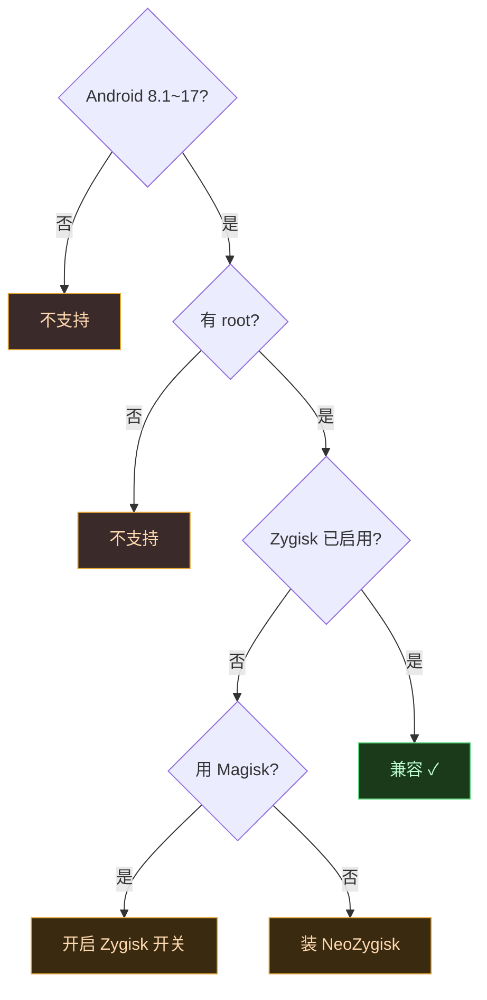

# 🧩 兼容性矩阵

Vector 致力于跨 Android 版本、跨 root 管理器、跨 Zygisk 实现通用。这一页把支持的组合与已知差异讲清楚。

## 支持范围速览

| 维度 | 支持 |
| :--- | :--- |
| Android 版本 | 8.1 ~ 17 Beta |
| Root 管理器 | Magisk、KernelSU |
| Zygisk 实现 | Magisk 内置、NeoZygisk 等 |
| 模块 API | 经典 `de.robv.android.xposed`、现代 libxposed |
| 架构 | 32 位与 64 位（dex2oat 包装器分别处理） |

::: tip 前置要求
必须有一个较新版本的 Magisk 或 KernelSU，并启用 Zygisk 环境。没有 Zygisk，Vector 无法注入。
:::

## Android 版本支持

| Android 版本 | API Level | 支持状态 | 备注 |
| :--- | :--- | :--- | :--- |
| 8.1 | 27 | ✅ 支持 | 最低支持版本 |
| 9 | 28 | ✅ 支持 | — |
| 10 | 29 | ✅ 支持 | — |
| 11 | 30 | ✅ 支持 | — |
| 12 | 31 | ✅ 支持 | — |
| 13 | 33 | ✅ 支持 | — |
| 14 | 34 | ✅ 支持 | — |
| 15 | 35 | ✅ 支持 | — |
| 16 | 36 | ✅ 支持 | — |
| 17 Beta | 37 | ✅ 支持 | 最新支持，可能有边缘问题 |

### 各版本已知差异

| 版本区间 | 已知差异 / 限制 |
| :--- | :--- |
| 8.1 ~ 9 | 早期 ART 内部结构与后续不同，部分反优化路径走老接口 |
| 7.0+ | `MODE_WORLD_READABLE` 抛 `SecurityException`，`XSharedPreferences` 走安全区重定向 |
| 10+ | SELinux 策略收紧，对 socket 创建上下文（`sockcreate`）的处理更严格 |
| 11+ | hidden API 限制加强，依赖 `hiddenapi` 桥接层访问非公开接口 |
| 12+ | `dex2oat` 包装器路径与 `/apex` 挂载点随版本变化，Daemon 动态适配 |
| 14+ | 部分 OEM 强化 Phg 策略，寄生管理器的身份移植需更多 hook 点 |
| 17 Beta | 较新，CI 构建验证通过但边缘场景可能未覆盖，建议用 debug 构建反馈 |

## Root 管理器

| Root 管理器 | Zygisk | 说明 |
| :--- | :--- | :--- |
| **Magisk** | 内置 | 启用 Zygisk 开关即可，原生支持 |
| **KernelSU** | 需额外安装 | 配合 NeoZygisk 等 Zygisk 模块使用 |

::: warning KernelSU 用户注意
KernelSU 本身不内置 Zygisk，必须额外安装一个 Zygisk 实现（如 [NeoZygisk](https://github.com/JingMatrix/NeoZygisk)），否则 Vector 无法注入。
:::

## Zygisk 实现

| 实现 | 来源 | 说明 |
| :--- | :--- | :--- |
| Magisk 内置 Zygisk | Magisk | Magisk 用户直接用 |
| NeoZygisk | [JingMatrix/NeoZygisk](https://github.com/JingMatrix/NeoZygisk) | KernelSU / 无内置 Zygisk 场景的推荐选择 |

Vector 对 Zygisk 实现的要求：能正确触发 `postServerSpecialize` 与 `postAppSpecialize` 回调。主流实现均满足。

## 模块 API 兼容

| API | 实现模块 | 状态 |
| :--- | :--- | :--- |
| 经典 `de.robv.android.xposed` | `legacy` | ✅ 存量模块无需改动 |
| 现代 libxposed | `xposed` | ✅ 新模块推荐 |

两套 API 底层共享同一个 native Hook 引擎，可共存于同一进程。从经典迁移到现代的注意事项见[迁移指南](../developer/migration)。

## ROM 与 OEM

| OEM / ROM | 已知注意点 |
| :--- | :--- |
| AOSP 原生 | 基准，完全兼容 |
| 联想 ZUI 等 | 修改了资源类继承层级，Vector 动态生成中间类层级绕过 `ClassCastException` |
| MIUI / HyperOS | 部分 hidden API 差异，一般兼容 |
| 三星 One UI | 架构与 AOSP 接近，兼容 |
| 其他深度定制 ROM | 若改了 `Resources` 继承链或 `dex2oat` 路径，可能需 debug 构建排查 |

## 不支持的组合

| 场景 | 原因 |
| :--- | :--- |
| 无 root 设备 | Vector 依赖 Zygisk，必须有 root |
| Android < 8.1 | ART 内部结构过旧，不在支持范围 |
| 无 Zygisk 的 KernelSU | 无法注入，需补装 Zygisk 实现 |
| Riru | 已弃用，Vector 仅支持 Zygisk |

## 兼容性决策流程

## 架构与位深

Vector 的 native 组件区分 32 位与 64 位，dex2oat 包装器会自动识别目标架构：

| 架构 | 支持状态 | 说明 |
| :--- | :--- | :--- |
| **arm64-v8a** (64 位) | ✅ 主力 | 主流设备，dex2oat 包装器走 64 位路径 |
| **armeabi-v7a** (32 位) | ✅ 支持 | 包装器识别 32 位，用对应原始编译器 |
| **x86 / x86_64** | ✅ 编译支持 | 模拟器场景，实际兼容性取决于 Zygisk 实现 |

::: tip 64 位设备上的 32 位应用
部分老应用仍跑 32 位进程。Vector 的注入引擎与 dex2oat 包装器对 32/64 位进程分别处理，无需用户干预。
:::

## 下载渠道与构建类型

不同渠道的构建在兼容性上有差异：

| 渠道 | 稳定性 | 适用场景 |
| :--- | :--- | :--- |
| **稳定版** (GitHub Releases) | 高 | 日常使用，推荐 |
| **Canary / CI 版** (GitHub Actions, master 分支) | 中 | 体验最新功能、辅助排查问题 |
| **PR 构建** (GitHub Actions, 非 master) | 低 | 仅调试用，可能不安全 |

::: warning 下载 CI 制品需登录
GitHub 要求登录后才能下载 Actions 产物。建议只用 `master` 分支构建，PR 构建往往不稳定且可能不安全。
:::

排查兼容性问题时**必须用最新 debug 构建**——Bug 报告只接受基于 debug 构建的问题。稳定版与 debug 版的兼容性范围一致，但 debug 版提供更详尽的日志。

## 反馈不兼容问题

遇到兼容性问题时：

1. **必须用最新 debug 构建**复现——Bug 报告只接受基于 debug 构建的问题。
2. 提供设备型号、Android 版本、ROM、root 管理器及版本、Zygisk 实现。
3. 附上 native 日志（Vector 写入的轮转日志文件）。
4. 本项目**仅接受英文 Issue**，中文用户请用翻译工具辅助。

## 相关链接

- [安装](./install) — 满足兼容性后的安装步骤
- [故障排查指南](./troubleshooting) — 兼容性问题怎么排查
- [FAQ](./faq) — 常见兼容性疑问
- [术语表](./glossary) — Zygisk / SELinux 等术语
