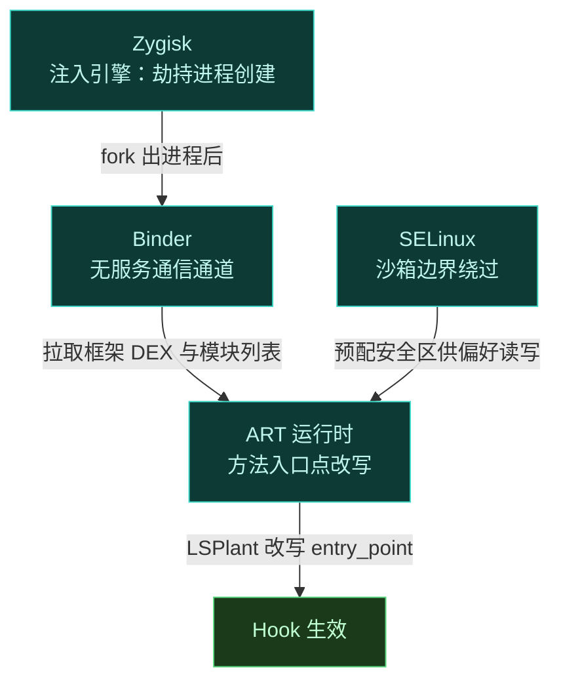
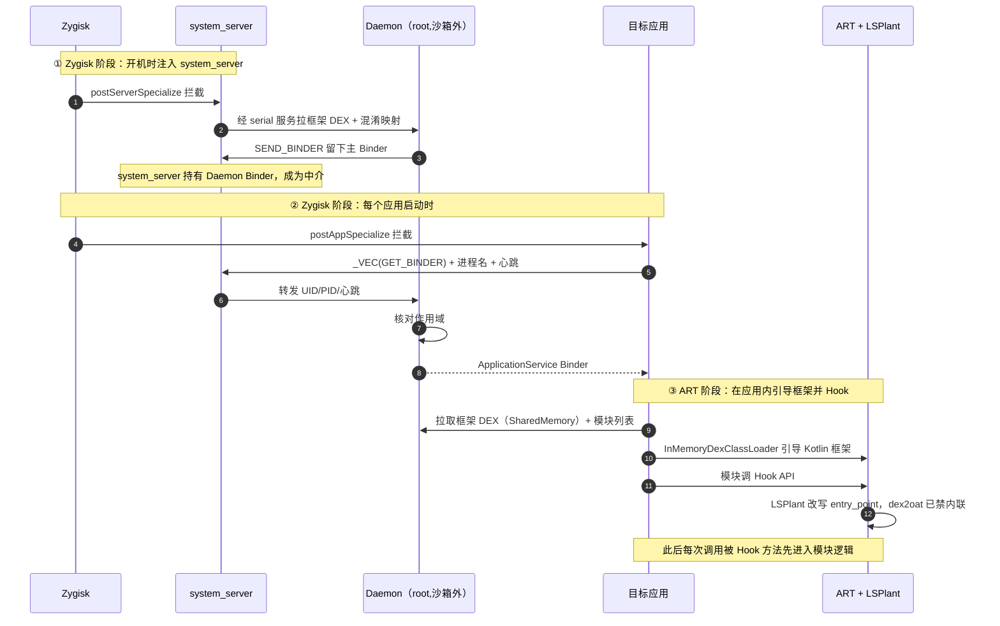
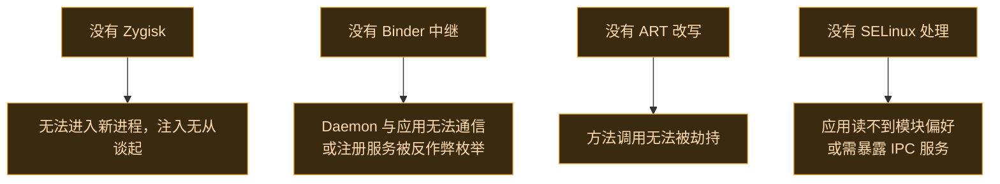

# 🧭 核心概念串讲

Vector 把四个看似不相关的 Android 子系统拧成一根注入链。这一页用一张全景图把它们串起来，让你理解每个零件为什么必不可少。深入细节见对应的架构章节。

## 全景图

## 四个角色各司其职

| 子系统 | 解决的问题 | Vector 的用法 |
| :--- | :--- | :--- |
| **Zygisk** | 怎么进入每个新进程 | hook Zygote 的 `postAppSpecialize`/`postServerSpecialize` |
| **Binder** | 进程间怎么传 Binder 引用而不注册服务 | JNI Trap 拦截 `execTransact`，搭便车 `_VEC` 事务码 |
| **ART** | 怎么改一个方法的执行流 | LSPlant 改写 `ArtMethod` 入口点 + dex2oat 禁内联 |
| **SELinux** | 跨沙箱怎么读写配置 | Daemon 预配 `xposed_data` 宽松上下文安全区 |

## 协同时序：一次 Hook 的诞生

## 为什么缺一不可

- **Zygisk 是入口**：没有它，Vector 根本进不了新进程。这也是为什么必须启用 Zygisk 环境。
- **Binder 是血管**：Daemon 在沙箱外，应用在沙箱内，要安全传递 Binder 引用又不能注册可枚举的服务，全靠 JNI Trap 搭便车。
- **ART 是肌肉**：进到进程只是开始，真正改方法行为靠 LSPlant 改写入口点。但内联和已编译方法会绕过入口点，所以还要 dex2oat 禁内联 + VectorDeopter 逐回解释器。
- **SELinux 是边界**：应用受 `untrusted_app` 域约束，跨进程读数据被拒。Daemon 预配宽松上下文安全区，让偏好读写透明且无 IPC 开销。

## 关键设计取舍

| 取舍 | Vector 的选择 | 代价 |
| :--- | :--- | :--- |
| 注入方式 | Zygisk（非 Riru） | 需 root 管理器支持 Zygisk |
| 通信方式 | 不注册服务，Trap 搭便车 | 实现复杂，调试困难 |
| 代码加载 | 全程内存，不落盘 | 首次加载稍慢，无磁盘缓存 |
| Hook 稳定性 | dex2oat 禁内联 + 反优化 | 首次 AOT 编译稍慢 |
| 管理器 | 寄生宿主进程 | 用户经通知进入，非桌面图标 |

## 下一步深入

每个子系统都有专章拆解：

- [启动与注入链路](../architecture/boot-flow) — Zygisk 两阶段注入
- [IPC 与 Binder 中继](../architecture/ipc) — Binder Trap 细节
- [ART Hook 原理](./art-hook) — LSPlant 与内联/反优化
- [SELinux 边界处理](../architecture/selinux) — 安全区机制
- [安全与隐蔽性](../architecture/security) — 各防线汇总

## 相关链接

- [系统全景](../architecture/overview) — 组件地图
- [术语表](./glossary) — 术语解释
- [安全与责任](./safety) — 合法使用边界
