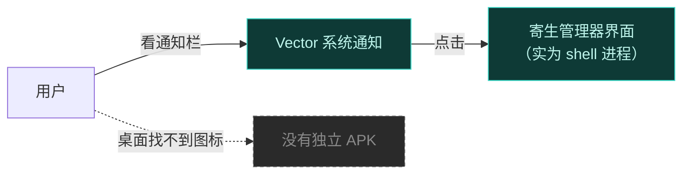
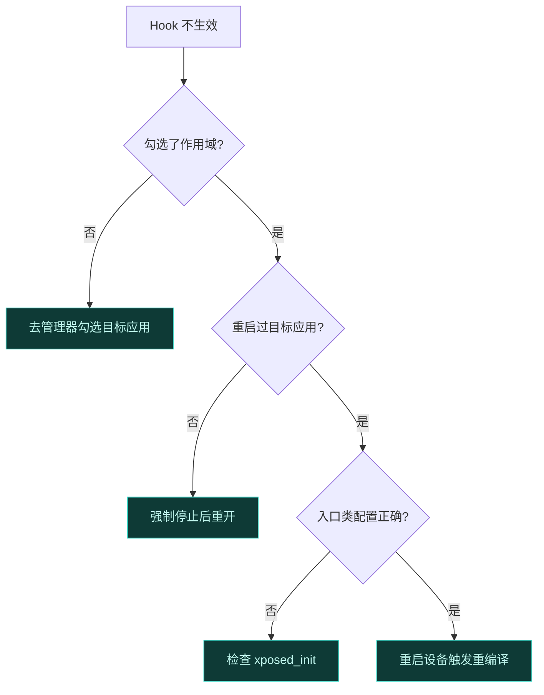
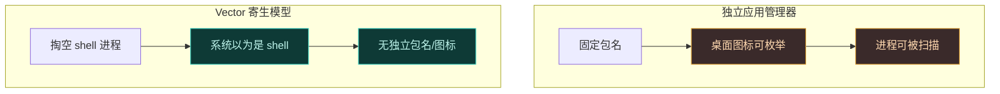

# ❓ 常见问题 FAQ

收集用户最常遇到的问题。先看这一页，大部分疑问都能在这里找到答案。更深入的排错见[故障排查指南](./troubleshooting)。

## 安装与定位

### Q：装完重启后，桌面找不到 Vector 管理器图标？

这是**正常现象**，不是 bug。Vector 的管理器不以独立应用形式存在，而是以"寄生"方式运行在宿主进程（如 `com.android.shell`）里。

进入方式：开机后从系统通知点击进入。如果通知被清理了，重新插拔或重启可再次触发。详见 [寄生式管理器](../architecture/zygisk#寄生式管理器与身份移植)。

### Q：管理器闪退 / 打不开？

常见原因：

| 原因 | 解法 |
| :--- | :--- |
| 宿主进程 `com.android.shell` 被冻结/清理 | 把 shell 加入电池优化白名单，或重新发通知 |
| Zygisk 未正确注入 | 确认 Zygisk 实现（如 NeoZygisk）已启用并工作 |
| 模块与宿主冲突 | 用 debug 构建复现，查看 native 日志 |

### Q：通知不见了怎么办？

通知被系统清理或被"通知权限"关闭。检查：系统设置 → 应用 → shell → 通知权限是否开启。仍不行则重启设备。

## Hook 与模块生效

### Q：我装了模块，但 Hook 不生效？

这是最高频问题，按顺序排查：

1. **作用域**：模块默认不对任何应用生效。必须在管理器里为该模块勾选目标应用。这是 90% 的原因。
2. **重启目标应用**：改完作用域后，目标应用进程要被杀掉重启才会重新加载模块。强制停止目标应用后重开。
3. **`xposed_init` 入口类写错**：模块 APK 的 `assets/xposed_init` 里类名必须全限定且存在。
4. **方法被内联**：极少数情况下，旧编译产物里被内联的方法尚未被反优化。重启设备触发 `dex2oat` 重新编译可解决。

### Q：模块只对部分应用生效？

作用域是**按应用**授予的。你在管理器里勾了哪些应用，模块就只注入这些应用的进程。`system_server` 也可单独加入作用域以影响系统级行为。

### Q：为什么我的模块在 LSPosed 上正常，到 Vector 上就不行？

绝大多数模块无需改动即可运行。少数差异见[迁移指南](../developer/migration)。最常见的是 `XSharedPreferences` 路径变化——Vector 用 Daemon 预配的 `xposed_data` 安全区替代了原版的 IPC 机制，模块需声明 `xposedsharedprefs` 标志才能透明使用。

## 性能与稳定性

### Q：Vector 会耗电 / 卡顿吗？

Hook 框架本身开销极小——它只改写方法入口点，未 Hook 的方法零开销。但：

- **作用域过大**会让大量进程加载模块，间接增加内存与启动耗时。只勾选必要的应用。
- **模块代码本身的逻辑**才是性能瓶颈，不是框架。
- `dex2oat` 劫持会让首次编译稍慢（因禁用内联），但只发生一次。

### Q：重启设备后一切恢复原状？

是的。Vector 的所有改动都在**内存层面**，不修改 APK、不修改系统镜像。重启后框架重新注入，原状态完全恢复。这也是它比重打包安全的地方。

### Q：模块会把宿主应用搞崩吗？

框架有异常保护机制，模块代码抛出的未处理异常**不会**传播到宿主进程：

- 经典 API：`LegacyApiSupport` 兜底，捕获并恢复缓存结果。
- 现代 API：`ExceptionMode.PROTECTIVE`，`proceed()` 之后抛的异常被链捕获。

但依赖这个保护不是好习惯，模块应自行处理异常。详见 [Hook API](../developer/hook-api#hook-失败的稳定性)。

## 兼容性

### Q：支持哪些 Android 版本？

**Android 8.1 至 Android 17 Beta**。完整矩阵见[兼容性矩阵](./compatibility)。

### Q：和 Magisk / KernelSU 兼容吗？

Vector 依赖 root 管理器提供 Zygisk 环境。两者都支持：

| Root 管理器 | 说明 |
| :--- | :--- |
| Magisk | 需较新版本，启用 Zygisk |
| KernelSU | 需配合 Zygisk 实现（如 NeoZygisk） |

Magisk 自带 Zygisk；KernelSU 需额外安装 Zygisk 模块。

### Q：和 LSPosed 有什么区别？

Vector 是 LSPosed 的下游分支，核心差异：

| 维度 | LSPosed | Vector |
| :--- | :--- | :--- |
| IPC | 注册标准 AIDL 服务，可被枚举 | 劫持 `execTransact` + `_VEC` 事务码，不注册服务 |
| 模块加载 | 部分走磁盘 | 严格内存加载，无 FD 残留 |
| 管理器 | 独立应用 | 寄生在宿主进程 |
| 反检测 | 服务可被发现 | 系统视角"什么都没发生" |

技术路线一脉相承，但 Vector 在隐蔽性上做了更深的工程化。

### Q：寄生管理器为什么要这么做？

普通管理器是独立应用，包名固定、图标可被枚举、进程可被反作弊扫描。寄生模型让管理器**根本不以独立应用存在**——系统以为运行的是 `shell`，实际跑的是管理器界面。这从根上消除了管理器自身的检测面。代价是用户不能用常规方式打开它，需经系统通知进入。

### Q：为什么我找不到 Vector 的服务？

因为你**不该**找到它。Vector 故意不向 `ServiceManager` 注册任何标准服务——这正是它的隐蔽设计。用 `service list` 看不到任何 Vector 相关条目是预期行为。

### Q：框架类名是不是固定的？

不是。Daemon 每次开机都**随机化**框架类名（如 `org.matrix.vector.core.Main` → 随机名），native 经混淆映射定位。这意味着框架每次启动后"长得都不一样"，对抗静态特征检测。模块开发者**不应硬编码**框架内部类名，只通过公开 API 交互。

### Q：模块是从磁盘加载还是内存加载？

严格**内存加载**。模块 APK 被映射进 `SharedMemory`（ashmem），ART 摄取完 DEX 后立即解除映射，不留文件描述符。模块的 ClassLoader 也只挂在框架私有分支上，目标应用无法通过反射链发现它。所以用 `getParent()` 遍历找模块是找不到的——这是有意的隐蔽设计。

## 日志与上报

### Q：怎么看 Vector 的日志？

Vector 的 native logcat 监控器直接对接 Android `liblog` 缓冲（`LOG_ID_MAIN` 与 `LOG_ID_CRASH`），按精确标签（Magisk、KernelSU）和前缀标签（dex2oat、Vector、LSPosed）过滤，写入两个轮转日志文件：

| 日志文件 | 内容 |
| :--- | :--- |
| 模块框架日志 | 模块与框架层事件 |
| 详细系统调试日志 | 系统级详细事件，达 4MB 轮转 |

经管理器或 CLI socket（`/data/adb/lspd/.cli_sock`，UUID 令牌认证）可拉取实时日志流。

### Q：怎么正确上报 Bug？

1. 用**最新 debug 构建**复现——Bug 报告只接受 debug 构建的问题。
2. 提供设备型号、Android 版本、ROM、root 管理器及版本、Zygisk 实现。
3. 附上 native 日志。
4. 本项目**仅接受英文 Issue**，中文用户请用 [DeepL](https://www.deepl.com/zh/translator) 等翻译工具辅助提交。

## 相关链接

- [故障排查指南](./troubleshooting) — 按症状分类的详细排查
- [兼容性矩阵](./compatibility) — 版本与 root 管理器支持
- [术语表](./glossary) — 不认识的术语来这里查
- [安装](./install) — 安装步骤
- [它能解决什么](./why) — 设计动机
