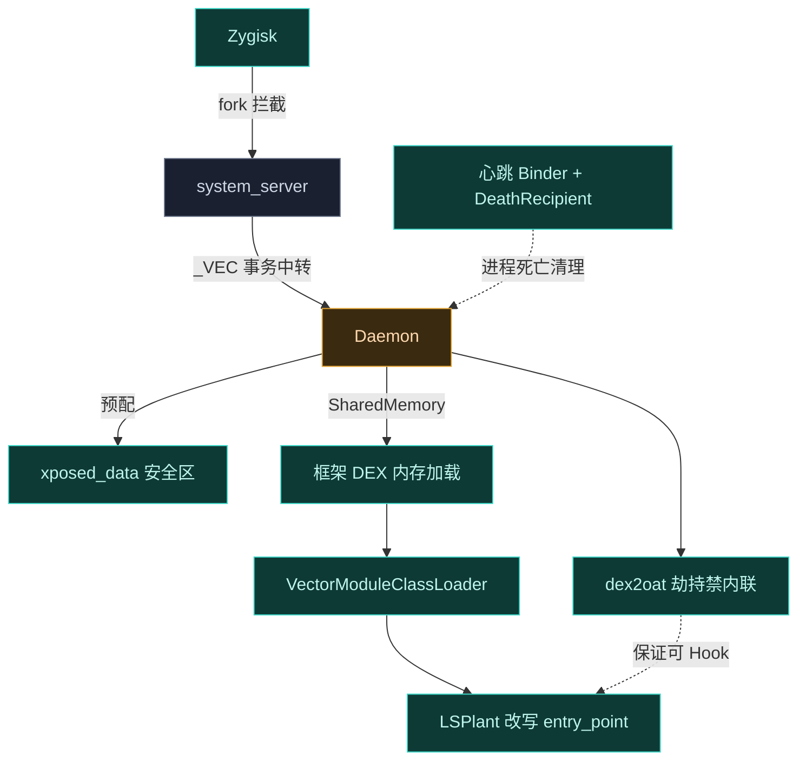

# 📖 术语表

理解 Vector 文档时遇到的不熟悉的术语，来这里查。每条给出**中文释义**与**在 Vector 中的角色**，方便把术语和工程实现对应起来。

## 运行时与编译

| 术语 | 释义 | 在 Vector 中的角色 |
| :--- | :--- | :--- |
| **ART** (Android Runtime) | Android 的应用运行时，取代早期的 Dalvik，负责执行 DEX 字节码 | Vector 的全部 Hook 都作用于 ART 的 `ArtMethod` 结构 |
| **AOT** (Ahead-of-Time) | 安装或开机时提前把 DEX 编译成机器码，运行时直接执行 | AOT 会内联方法导致 Hook 失效，Vector 劫持 `dex2oat` 禁止内联 |
| **JIT** (Just-in-Time) | 运行时把热点字节码编译成机器码，介于解释器与 AOT 之间 | JIT 同样可能内联，Vector 的反优化对 JIT 产物也有效 |
| **dex2oat** | Android 的 AOT 编译器，把 DEX 编译成 OAT | Vector 用包装器替换它，强制 `--inline-max-code-units=0` |
| **OAT** | dex2oat 的输出产物，ELF 格式的编译后机器码 | Vector 清洗 OAT 头元数据，抹除劫持痕迹 |
| **ArtMethod** | ART 内部表示一个方法的结构体，含 `entry_point` 等字段 | LSPlant 改写它的入口点指针实现 Hook |
| **entry_point** | ArtMethod 里指向方法实际执行代码的指针 | Hook 的本质是把它改指向跳板代码 |

## 进程与注入

| 术语 | 释义 | 在 Vector 中的角色 |
| :--- | :--- | :--- |
| **Zygote** | Android 所有应用进程的"祖先"，预加载通用类后 fork 出各进程 | Vector 经 Zygisk 在 Zygote fork 时拦截进程创建 |
| **Zygisk** | Magisk 提供的 Zygote 注入机制，允许在 fork 点植入代码 | Vector 的注入引擎依托 Zygisk 运作 |
| **system_server** | 系统核心进程，持有 `activity` 等关键服务 | Vector 用它做代理路由器，中转 Daemon 与应用间的 Binder |
| **postAppSpecialize** | Zygisk 回调，在新应用进程 fork 完成后触发 | Vector 在此处拦截应用、建立 IPC |
| **postServerSpecialize** | Zygisk 回调，在 system_server 初始化时触发 | Vector 在此处安装 Binder Trap、引导 Kotlin 框架 |

## IPC 与 Binder

| 术语 | 释义 | 在 Vector 中的角色 |
| :--- | :--- | :--- |
| **Binder** | Android 的核心 IPC 机制，进程间通信的底层管道 | Vector 不注册标准服务，而是劫持 Binder 事务搭便车 |
| **AIDL** (Android Interface Definition Language) | 定义跨进程服务接口的语言 | Vector 的服务契约（如 `IDaemonService`）用 AIDL 定义 |
| **ServiceManager** | Android 的服务注册中心，服务按名字注册并可被枚举 | Vector 故意不向它注册任何服务，避免被发现 |
| **execTransact** | `android.os.Binder` 的 native 方法，所有 Binder 事务的入口 | Vector 用 `SetTableOverride` hook 它，截获特定事务码 |
| **_VEC** | Vector 的自定义 Binder 事务码（`kBridgeTransactionCode`） | 仅匹配此码的事务被劫持到 `BridgeService`，其余原样放行 |
| **Binder Trap** | Vector 对 `execTransact` 的 JNI 级拦截机制 | 整个隐蔽 IPC 的基石，让系统视角"什么都没发生" |
| **心跳 Binder** (heartbeat_binder) | 一个 dummy Binder 对象，用于追踪进程生命周期 | 进程死亡时 GlobalRef 销毁、Binder 节点释放，触发 Daemon 清理 |
| **DeathRecipient** | Binder 的死亡监听回调 | Daemon 链接到心跳 Binder，进程一死立即清理跟踪映射 |
| **SCM_RIGHTS** | Unix domain socket 传递文件描述符的机制 | Daemon 经它把 dex2oat 所需 FD 传给包装器 |

## Hook 引擎与加载

| 术语 | 释义 | 在 Vector 中的角色 |
| :--- | :--- | :--- |
| **LSPlant** | Vector 的核心 ART Hook 引擎，负责改写 `ArtMethod` 入口点 | 所有方法 Hook 最终都路由到它 |
| **Dobby** | inline hook 实现库，用于 native 函数拦截 | Vector 的 native hook 基础设施之一 |
| **trampoline** (跳板) | 一段跳转代码，把执行流从原入口劫持到 Hook 逻辑 | LSPlant 改写 entry_point 指向它 |
| **反优化** (deoptimize) | 把已编译成机器码的方法逐回解释器执行 | `VectorDeopter` 调 `HookBridge.deoptimizeMethod` 实现 |
| **内联** (inlining) | 编译器把短方法体直接嵌入调用方，省去调用开销 | 内联会让 Hook 失效，Vector 全局禁止它 |
| **SharedMemory / ashmem** | Android 的共享内存机制，进程间映射同一块内存 | 模块 APK 与框架 DEX 经它从内存加载，不留 FD |
| **InMemoryDexClassLoader** | Android 的内存 DEX 类加载器 | Vector 用它把 SharedMemory 里的 DEX 引导成可执行代码 |
| **VectorModuleClassLoader** | Vector 自定义的模块类加载器 | 独占挂在框架私有分支，防反射链发现模块 |
| **混淆映射** | 框架类名到随机名的字典 | Daemon 每次开机随机化类名，对抗静态特征检测 |

## 框架组件

| 术语 | 释义 | 在 Vector 中的角色 |
| :--- | :--- | :--- |
| **Daemon** | Vector 的 root 守护进程，运行在应用沙箱之外 | 状态管理、IPC 资产服务器、SELinux 安全区、编译劫持的总控 |
| **寄生管理器** | 不以独立应用存在的管理器 UI，寄生在宿主进程里 | 让管理器自身无检测面，经系统通知进入 |
| **作用域** (scope) | 模块对哪些应用生效的授权列表 | Daemon 按作用域过滤，未授权进程拿不到模块 |
| **ConfigCache / DaemonState** | Daemon 持有的不可变状态快照 | IPC 线程无锁读取，决定哪些模块对某进程生效 |
| **xposed_data** | Daemon 预配的 SELinux 宽松上下文安全区目录 | 模块与目标应用都能合法访问，替代 `MODE_WORLD_READABLE` |
| **XSharedPreferences** | 经典 Xposed 的跨进程配置读取 API | Vector 经路径重定向把它透明映射到安全区，无 IPC 开销 |

## API 体系

| 术语 | 释义 | 在 Vector 中的角色 |
| :--- | :--- | :--- |
| **经典 API** (`de.robv.android.xposed`) | 原版 Xposed 的回调式接口 | 由 `legacy` 兼容层实现，存量模块无需改动即可运行 |
| **现代 API** (libxposed) | 类型安全的 OkHttp 风格拦截器链 | 由 `xposed` 模块实现，新模块推荐使用 |
| **Hooker** | 现代 API 的拦截器单元，带 `priority` | 多个 Hooker 按优先级组成链 |
| **XC_MethodHook** | 经典 API 的回调基类，含 `before`/`after` | 经 `LegacyApiSupport` 翻译执行 |
| **ExceptionMode** | 现代 API 的异常保护策略 | `PROTECTIVE` 模式保护宿主进程不被模块异常搞崩 |
| **Invoker** | 现代 API 调用原方法的系统 | `Type.Origin` 绕过所有 Hook，`Type.Chain` 执行部分链 |

## 加载与隐蔽

| 术语 | 释义 | 在 Vector 中的角色 |
| :--- | :--- | :--- |
| **VectorURLStreamHandler** | Vector 自定义的 URL 流处理器，拦截标准 `jar:` 请求 | 避免触发 Android 全局 `JarFile` 缓存与文件锁 |
| **VectorDeopter** | Vector 的反优化器，位于 `xposed` 模块 | 把已知内联方法逐回解释器，保证 Hook 生效 |
| **VectorInlinedCallers** | 已知会内联的方法注册表 | `VectorDeopter` 遍历它发反优化命令 |
| **LegacyDelegateImpl** | legacy 与 modern 之间的翻译边界 | 把现代 payload 翻译成经典 `LoadPackageParam` 等格式 |
| **VectorBootstrap** | 依赖注入引导器 | 启动时把 `LegacyDelegateImpl` 注入 `xposed` 模块 |
| **VectorChain** | 现代 API 的递归 `proceed()` 状态机 | 实现 `ExceptionMode` 与拦截器链执行 |
| **VectorCtorInvoker** | 构造函数调用器 | 分离内存分配与初始化，支持 `newInstanceSpecial` |
| **MemberCacheKey** | 结构化反射缓存 key | 基于对象身份与结构属性而非字符串，重复查找零分配 |
| **CliSocketServer** | Daemon 的命令行 socket 服务 | 在 `/data/adb/lspd/.cli_sock` 暴露，用 UUID 令牌认证 |
| **Dex2OatServer** | Daemon 的 dex2oat 包装器 socket 服务 | 监听随机化的 abstract socket，经 SCM_RIGHTS 传 FD |

## 杂项

| 术语 | 释义 | 在 Vector 中的角色 |
| :--- | :--- | :--- |
| **app_process** | Android 启动 Java 进程的入口程序 | Daemon 经它引导，作为 root Dalvik 可执行程序运行 |
| **bind mount** | 把一个文件/目录挂到另一个路径的挂载方式 | Daemon 用它把替换后的 dex2oat 挂到 `/apex` 下 |
| **setns / CLONE_NEWNS** | 进入目标挂载命名空间的系统调用 | Daemon fork 特权子进程进入 PID 1 命名空间做 bind mount |
| **resetprop** | Magisk 提供的系统属性重写工具 | dex2oat 包装器不可用时的回退手段，注入 `dalvik.vm.dex2oat-flags` |
| **IUidObserver** | 监听 UID 进程生命周期的系统接口 | Daemon 用它监控 libxposed 模块进程，触发主动推送 |
| **ContentProvider 推送** | 经合成 authority 投递 Binder 的机制 | 在 `Application.onCreate` 前把 `IXposedService` 注入模块进程 |

## 安全模型

| 术语 | 释义 | 在 Vector 中的角色 |
| :--- | :--- | :--- |
| **SELinux** | Android 的强制访问控制安全子系统 | 阻止应用跨进程读数据，Vector 用 Daemon 预配安全区绕过 |
| **应用沙箱** | 每个应用进程的隔离执行环境 | 目标应用读不到模块目录，Daemon 在沙箱外代劳 |
| **sockcreate** | SELinux 的 socket 创建上下文标记接口 | Daemon 写 `/proc/self/task/[tid]/attr/sockcreate` 给 abstract socket 标记上下文 |
| **MODE_WORLD_READABLE** | 让文件全局可读的标志，原版 Xposed 依赖它 | Android 7.0 起抛 `SecurityException`，已被安全区取代 |

## 术语关系一图

## 易混淆术语辨析

几组常被混用、但在 Vector 语境里含义不同的术语：

| 易混对 | 区别 |
| :--- | :--- |
| **AOT vs JIT** | AOT 是安装/开机时提前编译；JIT 是运行时编译热点。两者都可能内联，Vector 都要处理 |
| **Zygote vs Zygisk** | Zygote 是 Android 的进程母体；Zygisk 是 Magisk 提供的 Zygote 注入机制。Vector 依托 Zygisk，不是 Zygote 本身 |
| **Binder Trap vs _VEC** | Binder Trap 是对 `execTransact` 的拦截机制；`_VEC` 是被它识别的事务码。前者是手段，后者是信号 |
| **Daemon vs system_server** | Daemon 是 Vector 的 root 守护进程（沙箱外）；system_server 是系统核心进程，充当两者间的代理路由器 |
| **作用域 vs 模块列表** | 作用域是"哪些应用允许加载某模块"的授权；模块列表是某进程实际拿到的模块 APK 路径。后者由前者过滤得出 |
| **反优化 vs 禁内联** | 禁内联是编译期不让方法内联（dex2oat 劫持）；反优化是运行时把已编译方法逐回解释器（VectorDeopter）。一个预防、一个补救 |
| **经典 API vs legacy 模块** | 经典 API 是接口规范（`de.robv.android.xposed`）；legacy 模块是 Vector 实现这套规范的代码模块 |
| **安全区 vs MODE_WORLD_READABLE** | 安全区是 Daemon 预配的 SELinux 宽松目录；MODE_WORLD_READABLE 是已废弃的全局可读标志。前者是后者的安全替代 |

## 相关链接

- [它能解决什么](./why) — 这些术语如何在设计动机中体现
- [ART Hook 原理](./art-hook) — ART/entry_point/内联 的深入解释
- [IPC 与 Binder 中继](../architecture/ipc) — Binder Trap / _VEC / 心跳 的实现
- [Daemon 守护进程](../architecture/daemon) — Daemon / ConfigCache / xposed_data 的实现
- [系统全景](../architecture/overview) — 所有组件的地图
