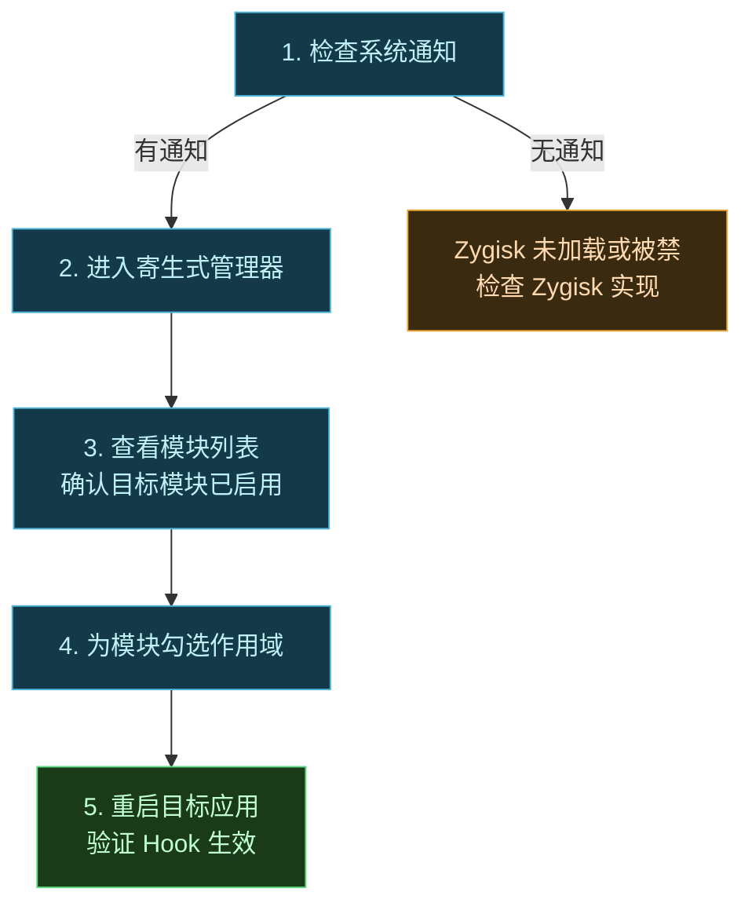

# 安装

Vector 以 Magisk/KernelSU 模块的形式分发，安装过程对终端用户来说和装普通 root 模块无异。

## 前置要求

| 依赖 | 要求 | 说明 |
| :--- | :--- | :--- |
| Root 管理器 | 较新版本的 Magisk / KernelSU / APatch | 三者均可，但 Zygisk 实现不同，见下表 |
| Zygisk | 已启用 | 不同 root 管理器用不同的 Zygisk 实现 |
| Android 版本 | 8.1 至 17 Beta | 跨 ROM 通用 |
| 架构 | arm64 / arm / x86_64 | 见 Release 资产对应的 ABI |

### Root 管理器与 Zygisk 实现的搭配

Vector 本身是一个 Zygisk 模块，它**不自带 Zygisk 运行时**——运行时由 root 管理器或独立的 Zygisk 实现提供。不同搭配在工作机制上有差异：

| Root 管理器 | Zygisk 实现 | 触发时机 | 备注 |
| :--- | :--- | :--- | :--- |
| **Magisk** | Magisk 内置 Zygisk | 早期 init（early-init） | 最经典组合；设置 → Zygisk 开关 |
| **Magisk** | [NeoZygisk](https://github.com/JingMatrix/NeoZygisk) | early-init / 按需延迟注入 | Vector 官方推荐；支持 AOSP 调试构建的手动后注入 |
| **Magisk** | [ZygiskNext](https://github.com/Dr-TSNG/ZygiskNext) | 独立模块，兼容性广 | 可替代 Magisk 内置实现 |
| **KernelSU** | [NeoZygisk](https://github.com/JingMatrix/NeoZygisk) | 按需注入 | KernelSU 无内置 Zygisk，必须配 NeoZygisk |
| **APatch** | [NeoZygisk](https://github.com/JingMatrix/NeoZygisk) / ZygiskNext | 按需注入 | 同 KernelSU，需独立 Zygisk 模块 |

::: tip 为什么推荐 NeoZygisk
NeoZygisk 由 Vector 同一维护者开发，对 Vector 的**后注入（late injection）**特性有原生支持。对 AOSP 调试构建这类不走 Magisk early-init 的环境，NeoZygisk 能手动触发注入，使 Vector 仍可工作。详见 [架构 · Zygisk 注入](../architecture/zygisk)。
:::

::: warning Magisk 内置 Zygisk 与 NeoZygisk 二选一
不要同时启用 Magisk 内置 Zygisk 和 NeoZygisk/ZygiskNext，否则会出现重复注入导致 `LoadedApk` 重复回调或进程崩溃。装了独立 Zygisk 模块后，请在 Magisk 设置里**关闭内置 Zygisk**。
:::

## 安装步骤

1. **下载模块包**：从 [GitHub Releases](https://github.com/android-security-engineer/Vector-skills/releases) 获取最新的系统模块 zip。
2. **刷入模块**：在你的 root 管理器（Magisk/KernelSU/APatch）的"模块"页选择该 zip 安装。安装过程会解压 zip、放置 DEX/原生库、注册 Zygisk 模块条目。
3. **确认 Zygisk**：确保 Zygisk 环境正常工作——Magisk 用户在设置里开启内置 Zygisk，或装 NeoZygisk/ZygiskNext；KernelSU/APatch 用户必须装独立 Zygisk 模块。
4. **重启设备**：模块在重启后生效。Zygisk 在 Zygote 启动阶段加载 Vector。
5. **打开管理器**：重启后系统通知栏会出现一条 Vector 的通知，点按即可进入 Vector 的管理设置界面。

::: tip 管理器是"寄生"的
Vector 的管理器**不是**一个独立安装的应用。它寄生在宿主进程（如 `com.android.shell`）里运行——所以你在桌面找不到图标，而是通过系统通知进入。详见 [寄生式管理器](../architecture/zygisk#寄生式管理器与身份移植)。
:::

## 下载渠道

| 渠道 | 来源 | 说明 |
| :--- | :--- | :--- |
| **稳定版** | [GitHub Releases](https://github.com/android-security-engineer/Vector-skills/releases) | 推荐日常使用 |
| **Canary (CI) 版** | [GitHub Actions](https://github.com/android-security-engineer/Vector-skills/actions) | 最新但可能不稳定 |

::: warning 下载 CI 制品需登录
GitHub 要求登录后才能下载 Actions 产物。建议只使用 `master` 分支的构建，PR 构建往往不稳定且可能不安全。
:::

## 刷入后验证

重启后按以下顺序确认 Vector 已正常工作：

1. **系统通知**：Vector 在宿主进程（默认 `com.android.shell`）首次启动时拉起管理器并发出通知。通知栏**有**这条通知，基本说明 Zygisk 已注入、Vector 的 DEX 已加载。
2. **进入管理器**：点通知进入设置界面。若能看到模块列表与作用域页，说明 IPC（Binder 隐形通道）也已建立。
3. **模块状态**：在管理器里确认你的 Xposed 模块已勾选"启用"，并为其配置作用域（勾选目标应用）。
4. **功能验证**：强制停止目标应用并重新打开，观察模块预期效果。若无效，先查 logcat 中是否出现模块的日志输出。

::: tip 没有通知怎么办
没有通知最常见原因是 Zygisk 未启用或被某 ROM 的反 root 机制压制。可尝试：
- 在 Magisk 里确认 Zygisk 开关已开（或装了 NeoZygisk/ZygiskNext 且关闭了内置 Zygisk）。
- 检查设备是否处于"基本完整性"通过状态，部分厂商 ROM 在检测到 root 后会压制系统通知。
- 用 `adb shell su -c "magisk --zygisk"` 或对应 Zygisk 实现的状态命令确认运行时存活。
:::

## 常见安装失败排查

| 现象 | 可能原因 | 处理 |
| :--- | :--- | :--- |
| 刷入时提示 "zip 校验失败" / "脚本异常" | 下载不完整或被代理截断 | 重新下载，校验 Release 的 SHA256 |
| 刷入成功但重启后无通知 | Zygisk 未启用 / 与某 Zygisk 实现冲突 | 检查 Zygisk 实现；确保内置与独立 Zygisk 不同开 |
| 反复重启（bootloop） | 模块与当前 Android 版本不匹配 / Zygisk 实现版本过旧 | 在 recovery 卸载 Vector 模块；升级 Zygisk 实现至最新 |
| 管理器打开后白屏/闪退 | 宿主进程被厂商 ROM 限制 / DEX 注入失败 | 切换 debug 构建；查阅 logcat `Vector` / `LSPosed` 标签 |
| 模块勾选作用域后仍不生效 | 未重启目标应用 / 作用域未保存 | 强停目标应用重启；确认作用域列表已保存到 Daemon |
| Android 10 上 dex2oat 相关崩溃 | linker 命名空间限制 | Vector 2.0 已用 `memfd_create` 绕过，确保版本 ≥ 2.0 |

::: warning 救砖：卸载模块
若安装后反复 bootloop，可在 recovery（TWRP/OrangeFox）下挂载 `/data` 并删除 `/data/adb/modules/<vector模块id>` 目录，或在 Magisk 安全模式下禁用所有模块后进入系统卸载。
:::

## 排错建议

遇到问题时：

1. **优先使用 debug 构建**复现问题——Bug 报告只接受基于最新 debug 构建的问题。
2. 先查阅[排错指南](https://github.com/android-security-engineer/Vector-skills/issues)再上报。
3. 本项目**仅接受英文 Issue**，中文用户请用翻译工具辅助提交。
