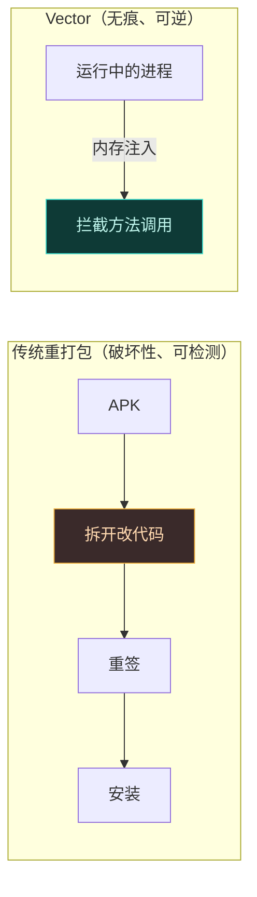
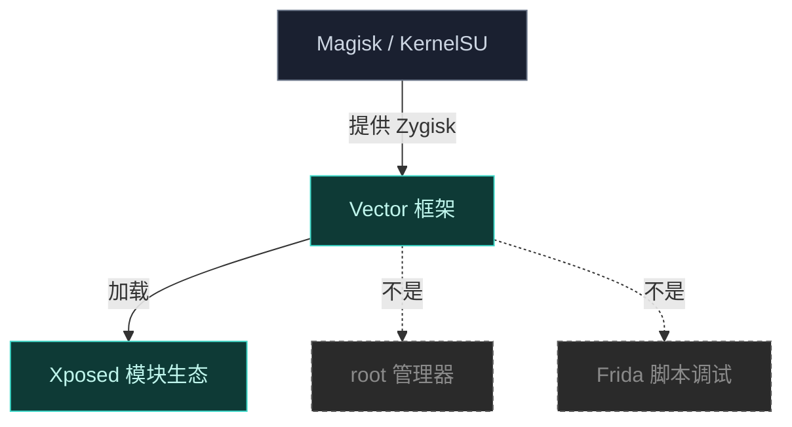

# 什么是 Vector

> **一句话**：Vector 是一个运行在 Zygisk 之上的 ART Hook 框架，它让你能在不修改 APK 的前提下，从内存层面改写系统与应用的行为。

## 它在解决什么

Android 应用与系统的行为是编译进 APK 与系统镜像里的。传统修改方式要么**重打包 APK**（破坏签名、易被检测、不可逆），要么**改系统镜像**（刷机、风险高）。这两条路都沉重且危险。

Vector 走第三条路：**在运行时从内存层面拦截方法调用**。



模块开发者写一段 Hook 逻辑（"当应用调用 `getDeviceId()` 时，返回假值"），Vector 负责把它注入到目标进程里并接管对应方法的执行。**APK 文件本身一个字节都不动**，重启设备即可完全恢复原状。

### Vector 解决的核心问题

| 痛点 | 传统方案的困境 | Vector 的解法 |
| :--- | :--- | :--- |
| **现代 Android 兼容** | 原版 Xposed 自 Android 8.1+ 的 ART 重构后失效；EdXposed 仅覆盖到早期 Android 10 | 基于 LSPlant，稳定支持 8.1–17 Beta |
| **Xposed 模块生态复用** | LSPosed 在新版 Android 上维护停滞，老模块面临无处可跑 | API 与原版 Xposed 完全一致，老模块近乎原样迁移 |
| **无 APK 修改 / 可逆** | 重打包破坏签名、触发完整性校验、不可逆 | 纯内存注入，APK 字节不动，重启即恢复 |
| **隐蔽性** | 注册 ServiceManager 服务、留下 IPC 痕迹 | 不注册服务，拦截 Binder 事务主动推送引用 |
| **对抗内联逃逸** | dex2oat 把被 Hook 方法内联，Hook 失效 | 劫持 dex2oat 强制 `--inline-max-code-units=0` |

## 核心定位

Vector 建立在 [LSPlant](https://github.com/JingMatrix/LSPlant) 之上，提供与原版 Xposed **API 完全一致**的接口。这意味着：

- **对模块开发者**：你写的 Xposed 模块可以几乎原样跑在 Vector 上，无需改代码。
- **对终端用户**：装一个 Magisk/KernelSU 模块即可，不需要为每个应用单独处理。

Vector 2.0 是 libxposed **API 100 时代的最终实现**——它构建自 API 101 跳变前的精确提交，补齐了静态初始化器、构造函数 Hook、集中式日志等 API 100 的剩余特性。详见 [Release 说明](https://github.com/android-security-engineer/Vector-skills/releases)。

## 兼容性

支持 **Android 8.1 至 Android 17 Beta**，跨 ROM、跨版本通用。

::: tip 前置要求
需要一个较新版本的 Magisk 或 KernelSU，并启用 Zygisk 环境（例如 [NeoZygisk](https://github.com/JingMatrix/NeoZygisk)）。
:::

## 与同类项目的关系

```mermaid
graph TD
    XPOSED["原版 Xposed<br/>(rovo89)"]:::legacy
    EDXPOSED["EdXposed<br/>(Riru 时代)"]:::legacy
    LSPOSED["LSPosed<br/>(早期 Zygisk)"]:::legacy
    VECTOR["Vector"]:::core
    LSPLANT["LSPlant<br/>ART Hook 引擎"]:::engine
    XPOSED -.基于同一 API→ VECTOR
    EDXPOSED -.演进.-> LSPOSED
    LSPOSED -.重构重命名.-> VECTOR
    LSPLANT -->|底层引擎| VECTOR
    classDef legacy fill:#1a2030,stroke:#6b7689,color:#cdd6e3,stroke-dasharray:4 3
    classDef core fill:#0e3a36,stroke:#3dd8c8,color:#bff5ec
    classDef engine fill:#143a4a,stroke:#4fb3d8,color:#bff0f5
```

- **原版 Xposed**：定义了 `de.robv.android.xposed` API 标准，但只支持到 Android 7 左右，现代 Android 上已不可用。Vector 与之 **API 兼容**。
- **EdXposed**：基于 Riru 的过渡方案，覆盖到早期 Android 10，已停更。
- **LSPosed**：Zygisk 时代的代表，Vector 的上游源。Vector 是其**重构重命名**后的延续，底层换用 LSPlant 并重写了 Zygisk 架构。
- **Vector**：吸收上述经验，目标是"现代 Android 上稳定跑老 Xposed 生态"。

> Vector 2.0 由 `LSPosed` 正式更名为 `Vector`，项目仍在持续内部重构，2.0 提供稳定、功能完整的环境给依赖经典 libxposed API 的用户。

## 核心概念

理解 Vector 需要抓住四个概念：


| 概念 | 一句话解释 | 深入 |
| :--- | :--- | :--- |
| **Zygisk 注入** | Vector 借 Zygisk 在每个进程 fork 出来时把自己注入进去 | [架构 · Zygisk](../architecture/zygisk) |
| **LSPlant** | 在 ART 运行时层面拦截 Java 方法的引擎，是 Hook 的真正执行者 | [ART Hook 原理](./art-hook) |
| **模块** | 你写的 Xposed 模块 APK，含入口类与 Hook 逻辑，Vector 从内存加载它 | [模块机制](./modules) |
| **作用域** | 控制模块在哪些进程生效；默认不对任何应用生效，需用户勾选 | [实战 · 作用域](../cookbook/scope) |

::: tip 一个心智模型
把 Vector 想成"运行时补丁引擎"：你提供 Hook 逻辑（模块）+ 指定在哪里生效（作用域），Vector 负责"把逻辑塞进目标进程并让它生效"，LSPlant 负责"真正改写方法分派"。APK、系统镜像都不动。
:::

## 它不是什么

- **不是** root 管理器——它依赖 Magisk/KernelSU 提供 Zygisk。
- **不是** 单独的应用——管理器界面以"寄生"方式运行在宿主进程中。
- **不是** 通用 Frida 替代——它面向 Xposed 模块生态，而非脚本化动态调试。



## 接下来

- 想知道为什么需要这么复杂的设计，看 [它能解决什么](./why)。
- 想直接上手，看 [安装](./install)。
- 想理解底层原理，看 [ART Hook 原理](./art-hook)。
