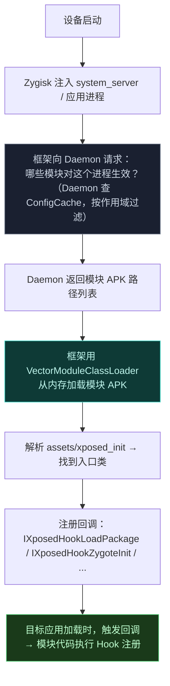
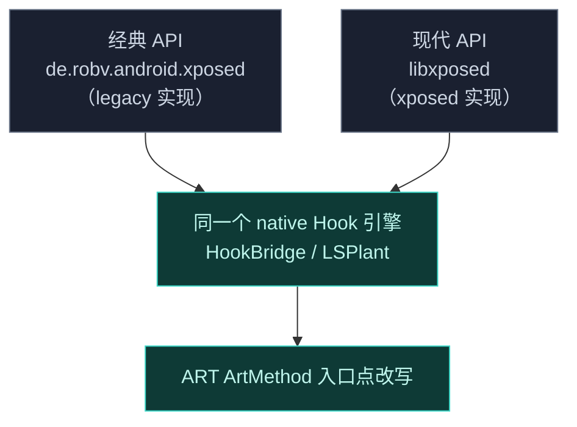

# 模块机制

模块是用户实际接触 Vector 的方式。这一节讲清楚"一个模块是什么、怎么被加载、怎么生效"。

## 模块是什么

一个 Xposed 模块本质上是一个**普通 APK**，但它声明了特殊的入口点。Vector 不会把它当作普通应用安装运行，而是把它的代码注入到目标进程里执行。

模块 APK 里有两个关键清单文件：

| 文件 | 作用 |
| :--- | :--- |
| `assets/xposed_init` | 声明 Java 入口类 |
| `assets/native_init` | 声明 native Hook 库文件名（可选） |

## 模块的生命周期

## 两种 API 体系

Vector 同时支持两套模块 API：

### 经典 API (`de.robv.android.xposed`)

老牌 Xposed 模块用的接口，由 [legacy 兼容层](../architecture/legacy) 实现。模块实现 `IXposedHookLoadPackage` 等接口，通过 `XposedHelpers.findAndHookMethod` 注册 Hook。

### 现代 API (libxposed)

类型安全的 OkHttp 风格拦截器链，由 [xposed 模块](../architecture/xposed) 实现。模块实现 `Hooker` 接口，通过 `HookBuilder` 注册 Hook。

两套 API 底层都路由到同一个 native Hook 引擎，可以共存。

## 作用域

模块默认**不**对所有应用生效。用户需要管理器里为每个模块勾选"作用域"——即哪些应用进程允许加载该模块。

作用域信息存在 Daemon 的 SQLite 数据库里，以 `DaemonState` 不可变快照的形式缓存。每次有进程请求模块列表时，Daemon 都会核对作用域，**未授权的进程拿不到模块**。

## 隔离与隐蔽

模块加载时有几个关键设计：

- **从内存加载**：APK 映射进 `SharedMemory`，ART 摄取完 DEX 后立即解除映射，不留文件描述符。
- **ClassLoader 隔离**：模块的 ClassLoader 只挂在框架私有分支上，目标应用无法通过 `ClassLoader.getParent()` 链式反射发现模块。
- **`jar:` 拦截**：`VectorURLStreamHandler` 拦截标准 `jar:` 请求，避免触发 Android 全局 `JarFile` 缓存导致的文件锁。

## 接下来

想自己写模块，看[开发者文档](../developer/modules)。
