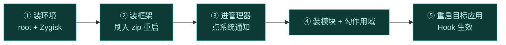
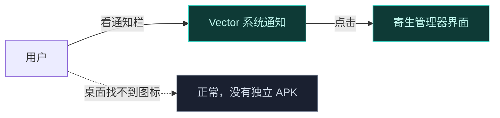
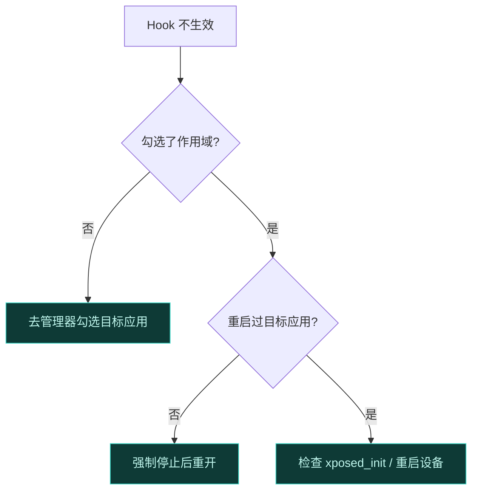

# 🚀 快速上手

从零到第一个 Hook 生效，全程五步。这一页不深究原理，只带你跑通最短路径。理解每个环节的细节，后续再读 [核心概念](./concepts) 与 [架构](../architecture/overview)。

## 全流程一图

## 第 1 步：准备环境

Vector 依赖 Zygisk 注入，必须先有 root 和 Zygisk。

| 依赖 | 要求 |
| :--- | :--- |
| Root 管理器 | 较新版本的 Magisk 或 KernelSU |
| Zygisk | 已启用（Magisk 内置；KernelSU 需配 [NeoZygisk](https://github.com/JingMatrix/NeoZygisk)） |
| Android 版本 | 8.1 至 17 Beta |

::: tip KernelSU 用户
KernelSU 不内置 Zygisk，必须额外安装一个 Zygisk 实现，否则 Vector 无法注入。
:::

## 第 2 步：安装 Vector

1. 从 [GitHub Releases](https://github.com/JingMatrix/Vector/releases) 下载最新系统模块 zip。
2. 在 root 管理器里选择该 zip 刷入模块。
3. 重启设备。

重启后框架在 Zygote fork 子进程时自动注入，无需手动启动。

## 第 3 步：进入管理器

Vector 管理器**不以独立应用存在**，而是寄生在 `com.android.shell` 进程里。开机后从系统通知点击进入。

通知被清了？重启或重新插拔可再次触发。详见 [寄生式管理器](../architecture/manager-parasitic)。

## 第 4 步：安装模块并勾选作用域

模块默认**不对任何应用生效**，这是 90% 的"Hook 不生效"原因。

1. 在管理器里添加一个 Xposed 模块（支持经典 `de.robv.android.xposed` 与现代 libxposed 两种 API）。
2. 进入该模块的"作用域"，勾选你要 Hook 的目标应用。
3. 如需影响系统级行为，可把 `system_server` 也加入作用域。

::: warning 必须重启目标应用
改完作用域后，目标应用进程要被杀掉重启才会重新加载模块。强制停止目标应用后重开。
:::

## 第 5 步：验证 Hook 生效

重启目标应用，触发你 Hook 的方法。验证手段：

- 看模块日志输出（管理器内可查看 native 轮转日志）。
- 观察目标应用行为是否符合预期改动。

不生效时按顺序排查：作用域 → 重启目标应用 → `xposed_init` 入口类 → 重启设备触发 dex2oat 重编译。详见 [故障排查](./troubleshooting)。

## 下一步

跑通后，建议按顺序深入：

- [核心概念](./concepts) — Zygisk/Binder/ART/SELinux 如何协同
- [ART Hook 原理](./art-hook) — Hook 在哪一步切入
- [安全与责任](./safety) — 合法使用边界

## 相关链接

- [安装](./install) — 更详细的安装说明
- [兼容性矩阵](./compatibility) — 支持的设备组合
- [常见问题 FAQ](./faq) — 高频疑问
- [典型用例](./use-cases) — Vector 适合做什么
