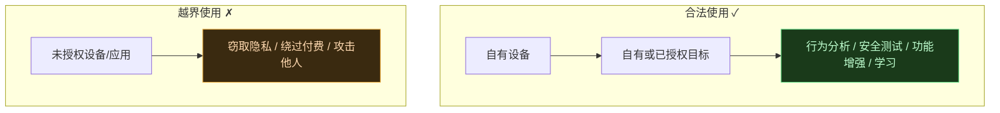
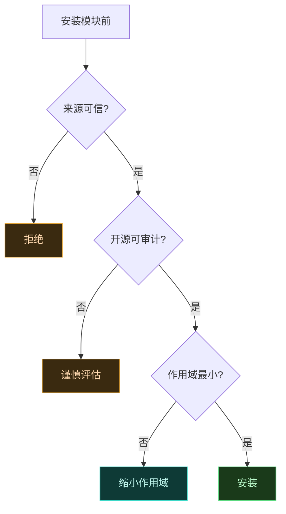

# 🛡️ 安全与责任

Vector 是一个强大的 ART Hook 框架，能深入修改 Android 应用与系统行为。能力越大，责任越大。这一页讲清楚合法使用的边界、风险与注意事项。

## 合法使用边界

| 场景 | 合法性 |
| :--- | :--- |
| 在自有设备上分析自有应用 | 合法 |
| 对已获书面授权的目标做安全测试 | 合法 |
| 给自有设备/应用做功能增强 | 合法 |
| 学习 Android 运行时原理 | 合法 |
| 未授权访问他人设备或应用数据 | 违法 |
| 窃取他人隐私 | 违法 |
| 绕过应用付费或版权保护 | 侵权 |
| 制作恶意软件 | 违法 |

## root 与设备风险

Vector 依赖 root + Zygisk，这本身有风险：

| 风险 | 说明 | 缓解 |
| :--- | :--- | :--- |
| 设备变砖 | root 操作或模块冲突可能导致启动失败 | 保留原厂镜像，可恢复出厂；用稳定版而非 PR 构建 |
| 安全降级 | root 后设备整体安全模型被削弱 | 仅在知情前提下 root；重要设备不 root |
| 银行/支付应用拒绝运行 | 部分应用检测 root 后拒绝 | 按需隐藏 root 或接受不兼容 |
| OTA 失败 | 系统分区改动可能影响 OTA | 升级前卸载相关模块 |

::: caution 关于 PR 构建
PR 分支的 CI 构建往往不稳定且**可能不安全**（取决于作者）。日常请用 `master` 分支构建或稳定版。详见 [下载渠道](./compatibility#下载渠道与构建类型)。
:::

## 模块来源审核

Vector 本身是框架，真正改变行为的是你装的**模块**。模块拥有在你勾选的作用域内任意 Hook 的能力，等同于在目标进程里执行任意代码。

| 审核要点 | 说明 |
| :--- | :--- |
| 来源可信 | 优先官方仓库 [Xposed-Modules-Repo](https://github.com/Xposed-Modules-Repo) 或可信作者 |
| 开源优先 | 开源模块可审计，闭源模块风险更高 |
| 权限最小化 | 只给模块勾选必要的作用域应用，不要全选 |
| 关注更新 | 模块漏洞会被利用，及时更新 |
| 警惕过度权限 | 一个去广告模块却要 root 通信权限，可疑 |

## 隐私

Hook 框架能拦截应用的所有数据流，包括隐私数据。

- 你 Hook 到的数据可能含他人隐私（如通讯录、消息），需妥善处理，不得外传。
- 不要用 Vector 收集他人设备的隐私数据。
- 分析结果如需公开，先脱敏。

## 关于隐蔽性设计的说明

Vector 在隐蔽性上做了大量工程（不注册服务、内存执行、类名随机化、寄生管理器）。这些设计的初衷是**对抗反作弊对合法 Hook 框架本身的无差别检测**——很多反作弊会扫到任何 Hook 框架就封禁，不论用途。隐蔽性让合法用途（自有应用分析、学习）不被误伤。

::: warning 隐蔽性 ≠ 免责
隐蔽性不能让违法行为变合法。无论框架多难检测，未授权访问他人设备/数据仍是违法。本项目不为任何滥用行为背书。
:::

## 不用于恶意

明确禁止以下用途：

| 禁止用途 | 性质 |
| :--- | :--- |
| 攻击、入侵他人设备 | 违法 |
| 窃取他人账号、凭证、隐私 | 违法 |
| 绕过应用付费、版权保护 | 侵权 |
| 制作恶意软件、木马 | 违法 |
| 妨碍正常司法调查 | 违法 |

发现他人滥用 Vector 从事违法活动，本项目不承担任何责任，并保留配合调查的权利。

## 报告安全问题

如果你发现 Vector 自身的安全问题（如可被利用的漏洞），请通过 GitHub Issues 或私下渠道 responsibly disclose。本项目**仅接受英文 Issue**，中文用户请用翻译工具辅助。

## 相关链接

- [典型用例](./use-cases) — 合法用途举例
- [兼容性矩阵](./compatibility) — 下载渠道与构建类型风险
- [安全与隐蔽性设计](../architecture/security) — 隐蔽性的技术实现
- [它能解决什么](./why) — 项目设计目标
