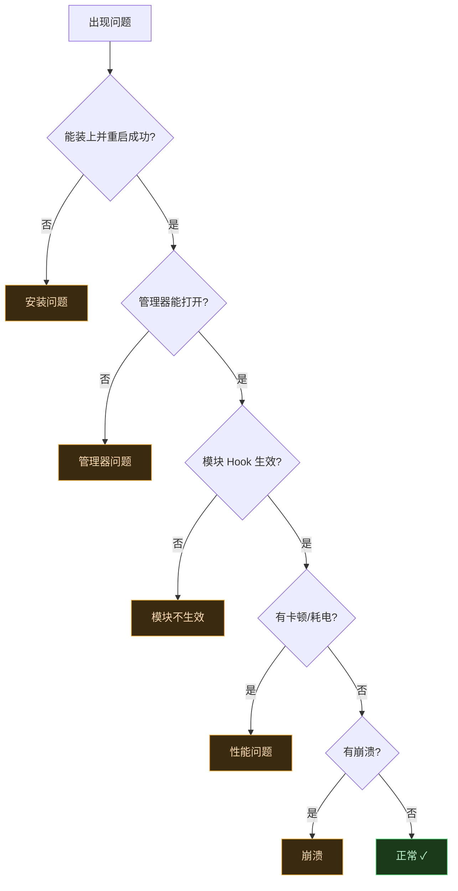
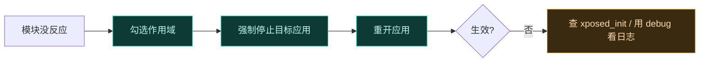

# 🛠️ 故障排查指南

按问题类别组织，每类列**症状 → 原因 → 解法**。先定位问题属于哪一类，再对症处理。通用疑问先看 [FAQ](./faq)。

## 排查决策流程

不确定问题归属时，从这张图开始：

## 安装问题

### 症状：模块刷入失败

| 可能原因 | 解法 |
| :--- | :--- |
| zip 损坏或不完整 | 重新下载，校验文件大小 |
| root 管理器版本过旧 | 升级 Magisk / KernelSU 到较新版本 |
| 存储空间不足 | 清理空间后重试 |

### 症状：装完重启后，开机卡 logo 或反复重启

| 可能原因 | 解法 |
| :--- | :--- |
| Zygisk 实现与系统不兼容 | 换一个 Zygisk 实现（如 Magisk 内置 ↔ NeoZygisk） |
| 模块与当前 Android 版本不匹配 | 确认版本在 8.1~17 范围内 |
| 框架注入失败 | 进入 recovery 移除模块 zip，或用 `magisk --remove-modules` |

::: warning 卡开机时的应急
若卡在 logo，可通过 recovery 或 `adb` 移除 Vector 模块目录以恢复启动。Vector 不修改系统镜像，移除模块即完全恢复。
:::

### 症状：刷入提示成功但功能不工作

| 可能原因 | 解法 |
| :--- | :--- |
| Zygisk 未启用 | 确认 Zygisk 开关已打开 / NeoZygisk 已装 |
| 重启未完成 | 模块需重启后才生效，确保完整重启过 |

## 模块不生效

### 症状：Hook 没有任何反应

| 可能原因 | 解法 |
| :--- | :--- |
| 未勾选作用域 | 管理器里为目标应用勾选该模块（最常见） |
| 目标应用未重启 | 强制停止目标应用后重开，让其重新加载模块 |
| `xposed_init` 入口类错误 | 检查模块 APK 内 `assets/xposed_init` 的类名是否正确 |
| 模块被禁用 | 管理器里确认模块处于启用状态 |

### 症状：模块只对部分应用生效

这是**预期行为**，不是 bug。作用域按应用授权，未勾选的应用不会加载模块。在管理器里补勾目标应用即可。

### 症状：经典 API 模块的 `XSharedPreferences` 读不到配置

| 可能原因 | 解法 |
| :--- | :--- |
| 未声明 `xposedsharedprefs` 标志 | 模块清单加 `xposedsharedprefs` meta-data |
| `xposedminversion` ≤ 92 | 声明 `xposedminversion` > 92 才触发路径重定向 |
| 旧式 `/data/data` 路径 | 现代模块走安全区，路径已被透明重定向，无需改代码 |

详见 [Legacy 兼容层 → SharedPreferences 与 SELinux 边界](../architecture/legacy#sharedpreferences-与-selinux-边界)。

### 症状：Hook 了但方法仍走原逻辑

| 可能原因 | 解法 |
| :--- | :--- |
| 方法被 AOT 内联进调用方 | 重启设备触发 `dex2oat` 重新编译（带禁内联标志） |
| 已编译方法绕过入口点 | `VectorDeopter` 会反优化；若未覆盖该方法，重启触发重编译 |

## 管理器问题

### 症状：桌面找不到管理器图标

**正常现象**。管理器寄生在 `com.android.shell`，经系统通知进入。详见 [FAQ](./faq#q装完重启后桌面找不到-vector-管理器图标)。

### 症状：点通知进不去 / 管理器闪退

| 可能原因 | 解法 |
| :--- | :--- |
| shell 进程被清理/冻结 | 把 shell 加入电池优化白名单 |
| 通知被清理 | 重启设备重新触发通知 |
| Zygisk 未注入 shell | 确认 Zygisk 工作正常，用 debug 构建看日志 |
| 寄生身份移植失败 | OEM 定制导致 hook 点变动，用 debug 构建反馈 |

### 症状：管理器里模块列表为空

| 可能原因 | 解法 |
| :--- | :--- |
| 未安装任何模块 | 先安装 Xposed 模块 APK |
| 模块未声明 `xposedmodule` | 模块清单需声明 `xposedmodule` meta-data |
| Daemon 状态未刷新 | 重启设备，让 Daemon 重建 ConfigCache |

## 性能问题

### 症状：耗电增加

| 可能原因 | 解法 |
| :--- | :--- |
| 作用域过大，大量进程加载模块 | 只勾选必要的应用 |
| 模块自身逻辑频繁执行 | 检查模块代码，避免在热点路径做重活 |
| native 日志详尽度过高 | 触发器降到正常级别 |

::: tip 框架本身零开销
Hook 只改写方法入口点，未 Hook 的方法没有任何额外开销。性能瓶颈几乎总在模块代码，而非框架。
:::

### 症状：应用启动变慢

| 可能原因 | 解法 |
| :--- | :--- |
| 首次 `dex2oat` 编译（禁内联） | 一次性开销，编译完后恢复 |
| 作用域内应用过多 | 精简作用域 |
| 模块在 `onPackageLoaded` 做重活 | 让模块延迟初始化或异步化 |

## 崩溃

### 症状：目标应用崩溃

| 可能原因 | 解法 |
| :--- | :--- |
| 模块 Hook 逻辑抛未处理异常 | 框架 PROTECTIVE 模式会兜底，但仍应让模块自行 try-catch |
| 模块改了不该改的关键方法 | 缩小 Hook 范围，避免 Hook 系统关键路径 |
| 类型不匹配 | 检查 `param.args` / 返回值类型是否与方法签名一致 |

### 症状：system_server 崩溃（反复重启）

| 可能原因 | 解法 |
| :--- | :--- |
| 模块在 system_server 作用域内做了危险操作 | 把该模块移出 system_server 作用域 |
| 寄生管理器 hook 点与 OEM 冲突 | 用 debug 构建反馈，临时移除管理器相关模块 |

::: warning system_server 崩溃会带重启
system_server 崩溃会触发系统软重启。若反复发生，先用 recovery 移除可疑模块，再逐步定位。
:::

### 症状：开机即崩溃（bootloop）

| 可能原因 | 解法 |
| :--- | :--- |
| 框架注入失败 | recovery 移除模块，换 Zygisk 实现 |
| Zygisk 实现与系统不兼容 | 切换 Zygisk 实现 |
| 模块在 Zygote 级 Hook 出错 | 移除该模块，排除 `IXposedHookZygoteInit` 类模块 |

## 通用排错建议

1. **永远先用最新 debug 构建**复现——Bug 报告只接受 debug 构建的问题。
2. **查 native 日志**：Vector 写入轮转日志（一个模块框架、一个详细系统调试，达 4MB 轮转）。
3. **最小化复现**：只留一个模块、一个作用域应用，逐步加回。
4. **先查文档再上报**：[FAQ](./faq)、本页、[兼容性矩阵](./compatibility) 已覆盖大部分情况。
5. **英文 Issue**：本项目仅接受英文 Issue，中文用户请用翻译工具辅助提交。

## 相关链接

- [FAQ](./faq) — 常见疑问速答
- [兼容性矩阵](./compatibility) — 版本与 root 管理器支持
- [安装](./install) — 正确安装步骤
- [它能解决什么](./why) — 理解机制以判断问题
- [Legacy 兼容层](../architecture/legacy) — `XSharedPreferences` 等机制细节
