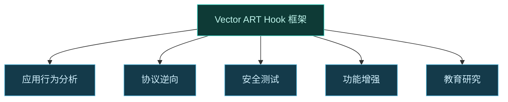
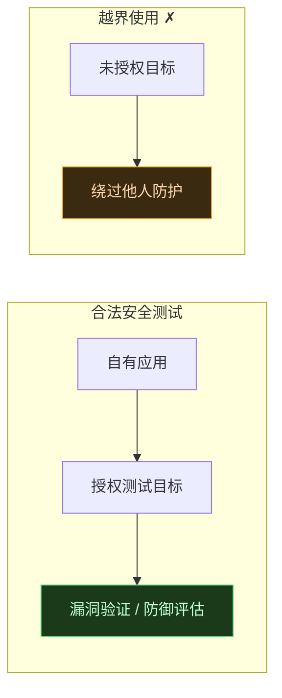

# 🎯 典型用例

Vector 是一个通用的 ART Hook 框架，但不同场景下用法和注意事项不同。这一页把常见用例分类说明，帮你判断 Vector 是否适合你的需求，以及该注意什么。

## 用例总览

## 应用行为分析

观察某个应用在运行时调用了哪些系统方法、传了什么参数、返回什么。

| 维度 | 说明 |
| :--- | :--- |
| Vector 如何适用 | 在目标应用作用域内勾选模块，Hook 关键 API（如定位、网络、存储读写），记录参数与调用栈 |
| 典型 Hook 点 | `LocationManager`、`TelephonyManager`、`SensorManager`、文件 I/O |
| 注意事项 | 只分析自有或已获授权的应用；记录到的数据可能含隐私，需妥善处理 |

::: tip 优势
Vector 全程内存加载、不修改 APK，分析行为时不破坏应用完整性，重启即恢复，适合做对比实验。
:::

## 协议逆向

理解应用与后端通信的协议格式、加密方式。

| 维度 | 说明 |
| :--- | :--- |
| Vector 如何适用 | Hook 序列化/加密入口（如 `Cipher.doFinal`、OkHttp 拦截器、自研序列化方法），在明文处抓取数据 |
| 典型 Hook 点 | `javax.crypto`、`OkHttpClient`、`HttpURLConnection`、自研加解密类 |
| 注意事项 | 仅用于互操作性研究或自有服务；不得用于绕过付费、窃取他人数据 |

## 安全测试

对应用做漏洞验证、防御机制测试、加固强度评估。

| 维度 | 说明 |
| :--- | :--- |
| Vector 如何适用 | Hook SSL pinning、root 检测、调试检测等防御逻辑，验证其强度；或 Hook 关键路径验证漏洞影响 |
| 典型 Hook 点 | `TrustManager`、`Build` 字段、`PackageManager`、SafetyNet 相关 |
| 注意事项 | 必须对自己拥有或已获书面授权的目标测试；Vector 的隐蔽设计不应成为规避授权的借口 |

## 功能增强

给应用添加原版没有的功能，如去广告、界面定制、辅助功能。

| 维度 | 说明 |
| :--- | :--- |
| Vector 如何适用 | Hook 渲染、广告加载、权限校验等逻辑，注入自定义行为 |
| 典型 Hook 点 | `LayoutInflater`、广告 SDK 入口、`Resources`、视图回调 |
| 注意事项 | 增强自有应用无可厚非；对他人应用的改造不得侵犯其商业利益或用户权益 |

Vector 的资源 Hook 子系统能运行时改写二进制 XML 资源，适合界面层定制。详见 [资源 Hook](../architecture/resources)。

## 教育研究

学习 Android 运行时、ART 内部结构、Hook 技术原理。

| 维度 | 说明 |
| :--- | :--- |
| Vector 如何适用 | 阅读源码与文档，在 debug 构建上做实验，观察 ART 方法分发、Binder 事务、ClassLoader 行为 |
| 推荐路径 | [快速上手](./quickstart) → [核心概念](./concepts) → [ART Hook 原理](./art-hook) → 架构各章 |
| 注意事项 | 实验在自有设备上进行；debug 构建提供详尽日志，便于学习 |

## 不适合的用途

| 场景 | 原因 |
| :--- | :--- |
| 攻击他人设备 | 违法，违反项目宗旨 |
| 窃取他人隐私数据 | 违法，侵犯他人权益 |
| 绕过应用付费/版权 | 侵权 |
| 制作恶意软件 | 违反 GPL 精神与法律 |

::: warning 边界
Vector 是工具，工具本身中立。但本项目的隐蔽性设计是为了对抗**反作弊对合法 Hook 框架的检测**，而非为了实施未授权访问。详见 [安全与责任](./safety)。
:::

## 选型对照

| 需求 | 是否适合 Vector |
| :--- | :--- |
| 无 root 设备上改应用 | 不适合，必须有 root + Zygisk |
| 修改 APK 后重打包 | 不适合，Vector 不改 APK，重打包用其它工具 |
| 长期常驻的系统能力扩展 | 适合，重启后自动注入 |
| 一次性快速行为分析 | 适合，勾作用域即可 |
| 需要被反作弊检测到 | 不适合，Vector 设计为低可探测 |

## 相关链接

- [安全与责任](./safety) — 合法使用边界
- [它能解决什么](./why) — Vector 的设计目标
- [快速上手](./quickstart) — 跑通第一个 Hook
- [模块机制](./modules) — 模块如何编写
