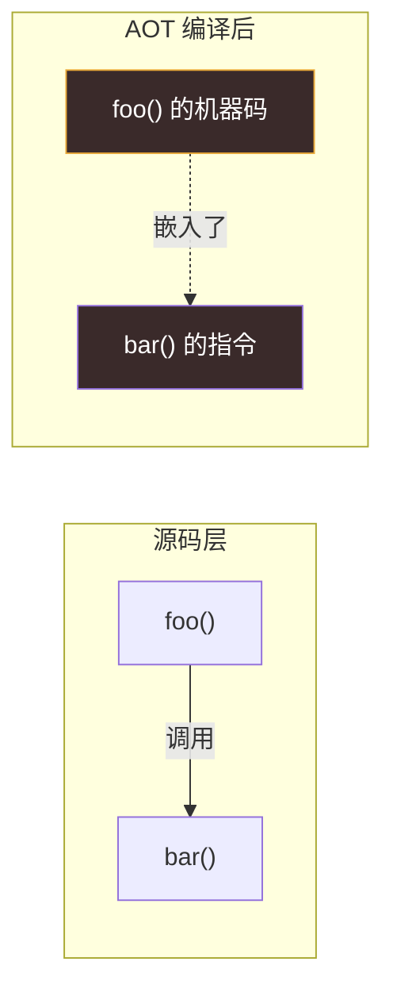
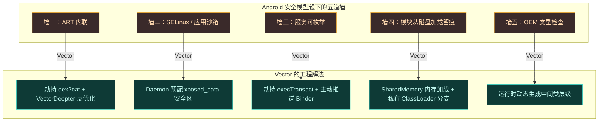

# 它能解决什么

理解 Vector 的设计，要先理解它要绕开的一道道墙。Android 的安全模型在设计上就是要**阻止**一个进程干预另一个进程——而 Hook 框架恰恰要做这件事。下面这几道墙，每一道都对应 Vector 的一个核心机制。

## 墙一：方法被内联了，Hook 不到

### 问题

Android Runtime (ART) 会把短方法**内联**进调用者——编译后，被调用方法的机器码直接嵌在调用方里，根本不会发生真正的"方法调用"。如果你 Hook 的方法被内联了，你的拦截代码永远不会执行。



> 编译后没有"调用"这个动作可拦截——`entry_point` 根本没人走。

### Vector 的解法

Vector 劫持系统的 `dex2oat` 编译器，全局强制 `--inline-max-code-units=0`，让 ART 不再内联任何方法。对于已经在旧编译产物里被内联的方法，再通过 `VectorDeopter` 主动**反优化**，把它们逐回解释器执行——而解释器严格尊重方法边界，Hook 才能生效。

详见 [dex2oat 编译劫持](../architecture/dex2oat)。

## 墙二：SELinux 与应用沙箱

### 问题

模块需要读取配置、需要把自身注入目标应用，但现代 Android 的 SELinux 策略强制**应用数据隔离**——目标应用读不到模块目录里的文件，模块也碰不到目标进程的内存空间。原版 Xposed 依赖的 `MODE_WORLD_READABLE` 从 Android 7.0 起直接抛 `SecurityException`。

### Vector 的解法

Vector 引入一个**运行在沙箱之外、拥有 root 权限的 Daemon 守护进程**，由它：

- 在合法范围内预配一个 SELinux 上下文为 `xposed_data` 的"安全区"目录，模块和目标应用都能合法访问，无需 IPC 即可读写配置。
- 作为 IPC 资产服务器，通过 Binder 把框架 DEX、模块列表、混淆映射安全地递送给目标进程。

详见 [Daemon 守护进程](../architecture/daemon)。

## 墙三：不能在系统里留下服务注册痕迹

### 问题

标准 Android IPC 要把 AIDL 服务注册进 `ServiceManager`，这会留下公开可查的痕迹——反作弊机制只要枚举服务就能发现你。

### Vector 的解法

Vector **不注册任何标准服务**。它用 Zygisk 在 Dalvik VM 最底层 hook 掉 `Binder.execTransact`，用一个自定义事务码 `_VEC` 截获 Binder 通信，再由 Daemon **主动推送** Binder 引用到目标进程。从系统视角看，这些通信不存在。

```mermaid
graph LR
    subgraph 普通框架["普通框架"]
        N1["ServiceManager"] -->|注册| N2["\"lsposed\" 服务"]
        N3["反作弊"] -->|listServices| N2
        N2 -.可被枚举发现.-> N3
    end
    subgraph Vector["Vector"]
        V1["Binder.execTransact 被劫持"] -->|仅识别| V2["_VEC 事务码"]
        V3["系统视角"] -.什么都没发生.-> V2
    end
    style N2 fill:#3a2a2a,stroke:#e8a838,color:#fff
    style V2 fill:#0e3a36,stroke:#3dd8c8,color:#fff
```

详见 [IPC 与 Binder 中继](../architecture/ipc)。

## 墙四：模块要从磁盘加载，会留下文件锁和检测面

### 问题

普通方式加载模块 APK 会触发系统 `JarFile` 缓存、留下文件描述符、能被 `ClassLoader.getParent()` 链式反射发现。

### Vector 的解法

模块**严格从内存加载**：APK 被映射进 `SharedMemory`（ashmem），ART 摄取完 DEX 缓冲区后立即解除映射，不留文件描述符。模块的 ClassLoader 也只挂在框架的私有分支上，目标应用无法通过反射链发现它。

详见 [Zygisk 模块](../architecture/zygisk) 与 [Xposed API 实现](../architecture/xposed)。

## 墙五：OEM 定制 ROM 的类型检查

### 问题

OEM（如联想 ZUI）会修改资源类的继承层级。Hook 框架要用自己的 `XResources` 替换系统的 `Resources`，但如果 `XResources` 硬编码继承 AOSP 基类，OEM 框架把它强转回自家私有类型时就会 `ClassCastException` 崩溃。

### Vector 的解法

Vector 在运行时**动态生成**中间类层级——用 `dex_builder` 在内存里造出 dummy 父类，让它的父类正好指向当前 OEM 的实际资源类。这样 `XResources` 既能继承 OEM 的方法与字段，又能通过任何内部类型检查。

详见 [资源 Hook 子系统](../architecture/resources)。

---

## 一图总结

五道墙、五个解法，全部在一张图里：



每一道墙都对应一个经过验证的工程解法。后续架构章节会逐一拆解这些解法的实现细节。
