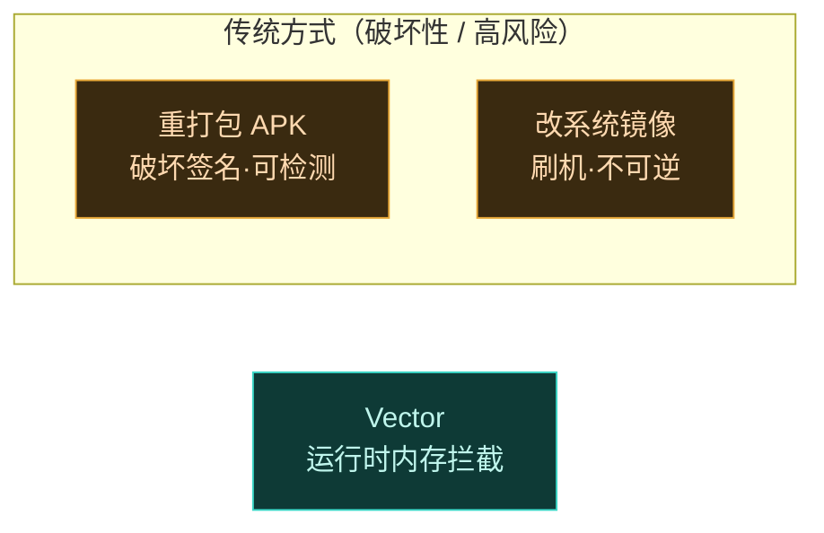

<InjectionDiagram />

## Vector 是什么

Vector 是一个运行在 **Zygisk** 之上的 ART Hook 框架，基于 [LSPlant](https://github.com/JingMatrix/LSPlant) 实现，**保持与原版 Xposed API 完全兼容**。它让你在不修改 APK、不刷系统镜像的前提下，从内存层面改写 Android 系统与应用的行为——可逆、无痕、跨版本。

- **支持 Android 8.1 至 17 Beta**，跨 ROM 通用。
- **双 API 兼容**：经典 `de.robv.android.xposed` 与现代 `libxposed` 皆可运行，老模块近乎原样迁移。
- **纯内存执行**：框架 DEX 经 SharedMemory 注入，零磁盘足迹，对抗反作弊检测。
- **寄生式管理器**：无独立包名，寄生在 `com.android.shell` 等宿主进程中运行。

## 快速导航

| 你想… | 去哪 |
| :--- | :--- |
| 了解 Vector 解决什么问题 | [指南 · 什么是 Vector](./guide/intro) |
| 装上试试 | [指南 · 安装](./guide/install) |
| 写第一个 Hook 模块 | [实战配方](./cookbook/) |
| 理解注入链路与 IPC | [架构总览](./architecture/overview) |
| 本地预览文档站 | [部署 · 本地预览](./deployment/local) |

## 它在解决什么

传统修改 Android 行为的两条路都沉重且危险：

Vector 走第三条路——在运行时从内存层面拦截方法调用。**APK 字节不动，重启即恢复**。

## 上手三步

1. 准备一台 root 设备，装 [Magisk](https://github.com/topjohnwu/Magisk) / [KernelSU](https://github.com/tiann/KernelSU) 并启用 Zygisk（推荐 [NeoZygisk](https://github.com/JingMatrix/NeoZygisk)）。
2. 从 [GitHub Releases](https://github.com/android-security-engineer/Vector-skills/releases) 下载 Vector 模块 zip，在 root 管理器里刷入并重启。
3. 通过系统通知进入寄生式管理器，勾选模块作用域，开始写你的第一个 [Hook 配方](./cookbook/)。

## 文档站部署

本站基于 VitePress，由 GitHub Actions 自动构建并部署到 GitHub Pages：

- 访问地址：`https://<org>.github.io/Vector-skills/`
- 触发条件：push 到 `master` 且改动 `website/**`
- 本地预览：`cd website && npm install && npm run dev`

详见 [部署与运维](./deployment/)。

