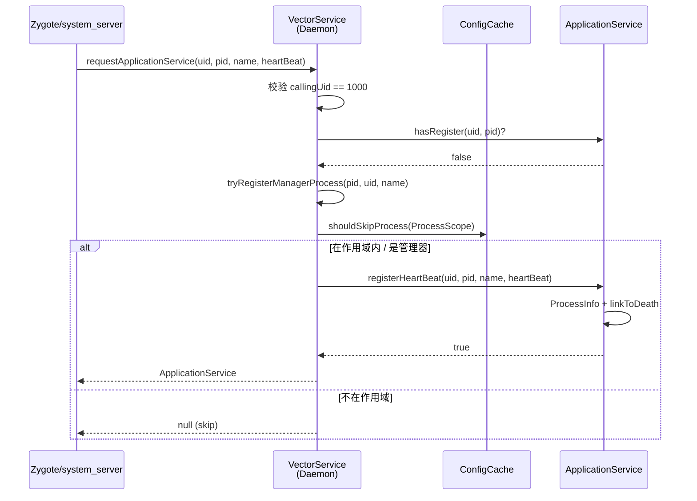
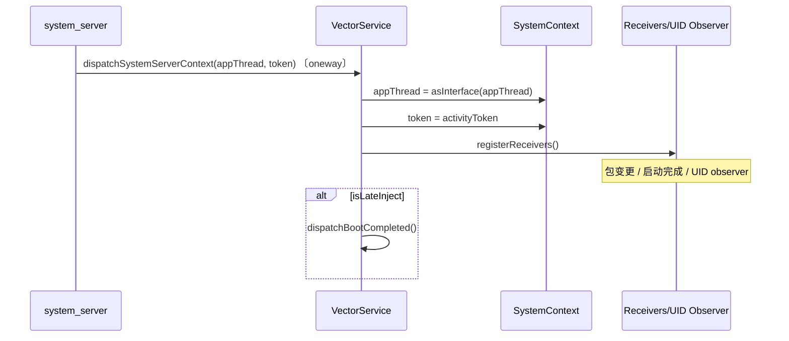
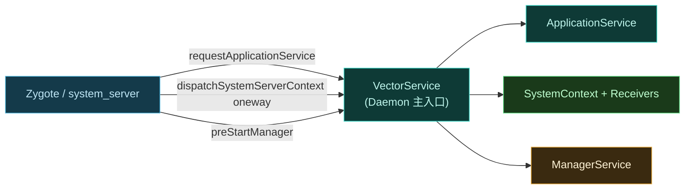

# 📡 IDaemonService

Daemon 的**主入口接口**。Zygote 启动应用进程或 system_server 时，通过此接口向 Daemon 请求该进程专属的应用服务 binder，并可能接收系统上下文分派。

> 📂 [`services/daemon-service/src/main/aidl/org/lsposed/lspd/service/IDaemonService.aidl`](https://github.com/android-security-engineer/Vector-skills/blob/master/services/daemon-service/src/main/aidl/org/lsposed/lspd/service/IDaemonService.aidl)
> 包：`org.lsposed.lspd.service`

## 方法

```aidl
ILSPApplicationService requestApplicationService(int uid, int pid, String processName, IBinder heartBeat);

oneway void dispatchSystemServerContext(in IBinder activityThread, in IBinder activityToken);

boolean preStartManager();
```

## 方法说明

| 方法 | 标记 | 说明 |
| :--- | :--- | :--- |
| `requestApplicationService` | — | 请求该进程的 `ILSPApplicationService`，传入 uid/pid/进程名与心跳 binder |
| `dispatchSystemServerContext` | `oneway` | system_server 向 Daemon 分派 `ActivityThread` 与 activity token |
| `preStartManager` | — | 请求 Daemon 预启动管理器 app，返回是否成功 |

> 📂 实现：[`daemon/src/main/kotlin/org/matrix/vector/daemon/VectorService.kt`](https://github.com/android-security-engineer/Vector-skills/blob/master/daemon/src/main/kotlin/org/matrix/vector/daemon/VectorService.kt)（`object VectorService : IDaemonService.Stub()`）

### requestApplicationService

调用方在 fork 出新进程后调用，Daemon 据此判断该进程是否需要注入、返回一个绑定到该进程的 [`ILSPApplicationService`](./ilspapplicationservice)。`heartBeat` 用于进程存活监测——进程死亡时 binder 掉线，Daemon 据此清理状态。

#### 参数

| 参数 | 类型 | 含义 |
| :--- | :--- | :--- |
| `uid` | `int` | 新进程的 uid |
| `pid` | `int` | 新进程的 pid |
| `processName` | `String` | 进程名（如 `"com.foo"` 或 `"system"`） |
| `heartBeat` | `IBinder` | 心跳 binder，进程死亡触发 `binderDied` 清理 |

#### 返回值

| 情形 | 返回 |
| :--- | :--- |
| 调用方 `uid != 1000`（非 system 触发） | `null`（记为未授权） |
| 该 (uid,pid) 已注册过 | `null`（重复注册被拒） |
| 命中管理器进程（`tryRegisterManagerProcess`） | `ApplicationService` |
| 管理器未命中且 `shouldSkipProcess`（不在任何模块作用域） | `null`（记为 skip） |
| `registerHeartBeat` 成功 | `ApplicationService` 单例 |
| `registerHeartBeat` 失败 | `null` |

#### 约束

- 仅 system（uid 1000）有权调用——Zygote/system_server 代 fork 出的子进程发起。
- `shouldSkipProcess` 查 `ConfigCache.state.scopes` 是否含该 `ProcessScope(processName, uid)`，不含则跳过注入，避免无模块进程无谓 IPC。
- 注册成功后 `ApplicationService` 内部以 `(uid,pid)` 为键维护 `ProcessInfo`，`heartBeat.linkToDeath` 绑定清理。

#### 典型场景

Zygote fork 应用进程 → 注入桥在进程内拿到 Daemon binder → 调 `requestApplicationService` → 拿到 `ApplicationService` → 拉取模块列表并加载 DEX。

### dispatchSystemServerContext

`oneway` 异步调用，system_server 用它把自身的 `ActivityThread`（`IApplicationThread`）和 activity token 传给 Daemon，使 Daemon 获得 startActivity / getContentProvider 等系统级能力。参数均标 `in`。

#### 参数

| 参数 | 类型 | 含义 |
| :--- | :--- | :--- |
| `activityThread` | `IBinder` | system_server 的 `IApplicationThread` binder |
| `activityToken` | `IBinder` | 当前 activity token（`SystemContext.token`） |

#### 副作用

Daemon 侧 `VectorService.dispatchSystemServerContext`：

1. `SystemContext.appThread = IApplicationThread.Stub.asInterface(activityThread)`。
2. `SystemContext.token = activityToken`。
3. `registerReceivers()`——注册包变更、启动完成、UID 观察者等系统广播与 UID observer。
4. 若 `VectorDaemon.isLateInject`（迟注入），强制触发 `dispatchBootCompleted()`。

#### 约束

- `activityThread` 为 `null` 时不设置 appThread；`activityToken` 允许为 `null`。
- `oneway` 保证 system_server 不阻塞在此调用上。

#### 典型场景

system_server 启动并完成首次注入后，立刻把自己的上下文交给 Daemon——此后 Daemon 才能拉起管理器、广播通知、响应包变更。

### preStartManager

在系统就绪但管理器尚未被拉起时，由 system_server 侧触发，让 Daemon 提前启动管理器进程。返回是否成功（恒为 `true`）。

#### 返回值

`boolean`——`ManagerService.preStartManager()` 置 `pendingManager = true`、`managerPid = -1` 并返回 `true`。

#### 约束

- 仅置预启动标志，真正拉起发生在 `tryRegisterManagerProcess` 时——当管理器进程随后注册，`pendingManager` 标志被消费，Daemon 识别为寄生管理器。
- 与 [`ILSPApplicationService.requestInjectedManagerBinder`](./ilspapplicationservice#requestinjectedmanagerbinder) 配合：`postStartManager(pid)` 判定当前 pid 是否为待启动管理器。

#### 典型场景

开机后用户尚未点开管理器，system_server 触发 `preStartManager`，Daemon 在合适时机把寄生管理器进程拉起，确保模块配置 UI 即时可用。

## 调用时序：应用进程注入



## 调用时序：系统上下文分派



## 主入口职责概览



## 使用示例

本接口由注入桥在 fork 子进程后调用，模块开发者不直接持有。伪代码示意流程：

```kotlin
// 运行在被注入的新进程内
val daemon = IDaemonService.Stub.asInterface(getDaemonBinder())
val heartBeat = HeartBeat()  // 自定义 IBinder
val appService = daemon.requestApplicationService(
    Process.myUid(), Process.myPid(), processName, heartBeat
) ?: return  // 该进程无需注入

// 拉取模块列表并加载
appService.modulesList.forEach { module ->
    loadModuleDex(module.file, module.service)
}
```

## 相关

- [ILSPApplicationService](./ilspapplicationservice) — 本接口返回的应用服务
- [ILSPSystemServerService](./ilspsystemserverservice) — system_server 侧变体
- [services 模块总览](../modules/services)
