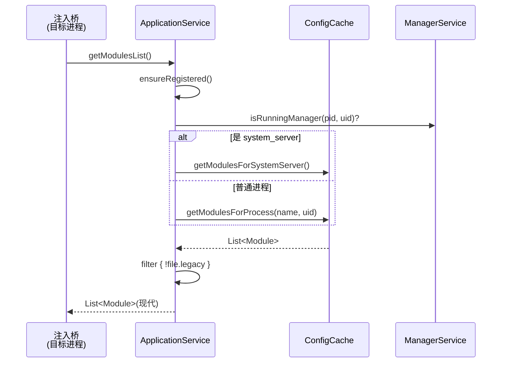
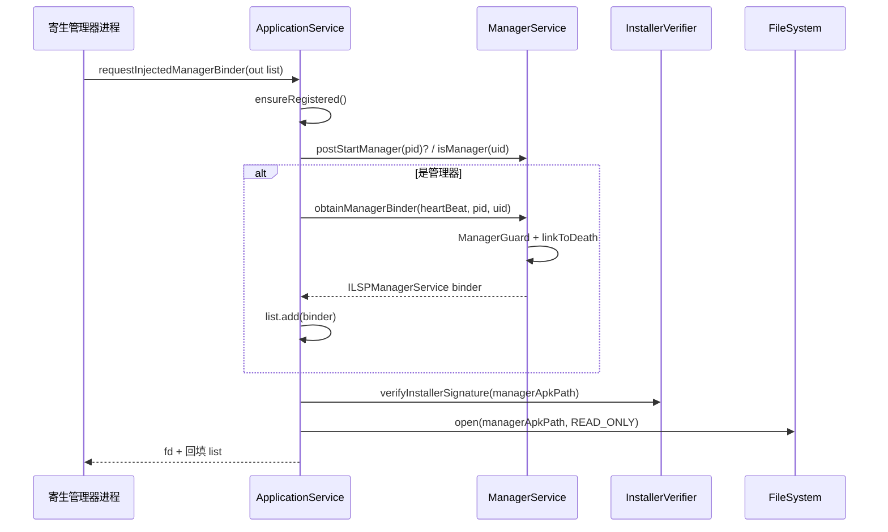
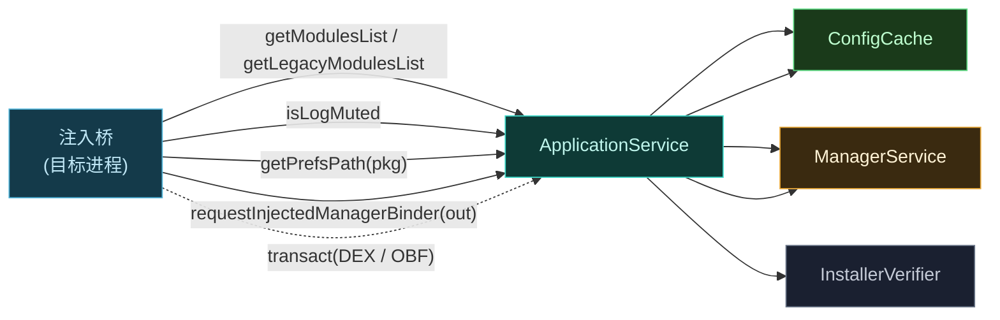

# 📡 ILSPApplicationService

被注入应用（用户 app 或 system_server）持有的**应用侧服务接口**。Daemon 把这个 binder 注入到目标进程，进程借此拉取框架资产：模块列表、偏好路径、混淆映射、日志开关，以及管理器 binder。

> 📂 `services/daemon-service/src/main/aidl/org/lsposed/lspd/service/ILSPApplicationService.aidl`
> 包：`org.lsposed.lspd.service`

## 方法

```aidl
boolean isLogMuted();

List<Module> getLegacyModulesList();

List<Module> getModulesList();

String getPrefsPath(String packageName);

ParcelFileDescriptor requestInjectedManagerBinder(out List<IBinder> binder);
```

> 📂 实现：`daemon/src/main/kotlin/org/matrix/vector/daemon/ipc/ApplicationService.kt`（`object ApplicationService : ILSPApplicationService.Stub()`）
> 除 AIDL 声明的方法外，本接口还承载两个**自定义 transaction code**（见[桥接 transaction](#桥接-transaction)）。

## 方法说明

| 方法 | 返回值 | 说明 |
| :--- | :--- | :--- |
| `isLogMuted` | `boolean` | 该进程是否被静音日志（避免模块 spam） |
| `getLegacyModulesList` | `List<Module>` | 经典 Xposed 模块列表（兼容 `de.robv.android.xposed`） |
| `getModulesList` | `List<Module>` | 现代 libxposed 模块列表 |
| `getPrefsPath` | `String` | 指定包名模块的偏好文件路径 |
| `requestInjectedManagerBinder` | `ParcelFileDescriptor` | 请求被注入的管理器 binder，经 out 参数回填 binder 列表 |

> 📝 所有方法均经 `ensureRegistered()` 校验：调用方 (uid,pid) 必须已通过 `requestApplicationService` 注册心跳，否则抛 `RemoteException("Not registered")`。

### getModulesList / getLegacyModulesList

两套列表对应两套 API：现代 libxposed 与经典 Xposed。底层同调 `getAllModules()`，再按 `Module.file.legacy` 过滤分流。

`getAllModules()` 的分发逻辑：

| 调用方身份 | 返回 |
| :--- | :--- |
| `uid == SYSTEM_UID && processName == "system"` | `ConfigCache.getModulesForSystemServer()` |
| 正在运行的管理器进程（`ManagerService.isRunningManager`） | 空列表（管理器自身不注入模块） |
| 其他已注册进程 | `ConfigCache.getModulesForProcess(processName, uid)` |

每个 [`Module`](./models) parcelable 含 `packageName`、`appId`、`apkPath`、`file`（`PreLoadedApk`，预加载 DEX）、`applicationInfo`、`service`（[`ILSPInjectedModuleService`](./ilspinjectedmoduleservice)）。注入侧据此加载模块 DEX 与 native 库。

#### 返回值约束

- `getModulesList` 仅返回 `file.legacy == false` 的现代模块。
- `getLegacyModulesList` 仅返回 `file.legacy == true` 的经典模块。
- system_server 的模块由 `getModulesForSystemServer` 现场查库表构造（含 sepolicy `execmem` 前置检查），不走缓存。

#### 典型场景

注入桥在进程启动后调 `getModulesList`，遍历每个 `Module` 加载其 `PreLoadedApk.preLoadedDexes` 与 `moduleLibraryNames`，并缓存 `service` binder 供模块 API 使用。

### isLogMuted

返回该进程的日志静音状态，模块据此决定是否输出调试日志。

#### 实现

`!ManagerService.isVerboseLog`——当管理器未开启 verbose 日志时，所有进程视为静音，避免模块 spam logcat。

#### 典型场景

模块在 hook 入口处 `if (!appService.isLogMuted) Log.d(...)`，既保留调试能力又避免线上噪声。

### getPrefsPath

返回指定包名模块的偏好存储目录路径。

#### 参数

| 参数 | 类型 | 含义 |
| :--- | :--- | :--- |
| `packageName` | `String` | 目标模块包名 |

#### 返回值

`String` 路径，形如 `<miscPath>/prefs[<userId>]/<packageName>`。由 `ConfigCache.getPrefsPath(packageName, uid)` 计算：

- userId = `uid / PER_USER_RANGE`；userId==0 时无后缀，否则路径带 userId。
- 若该模块属于调用用户（`module.appId == uid % PER_USER_RANGE`），Daemon 会确保目录存在并设置 SELinux 标签/属主，使模块进程可读写。

#### 约束

- 偏好存储在框架统一管理的路径，而非应用沙箱内，便于跨用户、跨进程共享。
- `miscPath` 未初始化时抛 `IllegalStateException("Fatal: miscPath not initialized!")`。

#### 典型场景

模块用 `SharedPreferences` 直接读写该路径下的文件，实现跨进程持久化配置（管理器写、模块读）。

### requestInjectedManagerBinder

`out` 参数——Daemon 在 List 中回填 `IBinder`，使被注入进程内的管理器 UI 能与 Daemon 通信。返回的 `ParcelFileDescriptor` 指向管理器 APK 文件描述符。

#### 参数

| 参数 | 类型 | 方向 | 含义 |
| :--- | :--- | :--- | :--- |
| `binder` | `List<IBinder>` | `out` | Daemon 回填管理器 binder（`ManagerService` 自身） |

#### 返回值

| 情形 | 返回 |
| :--- | :--- |
| 调用方是待启动管理器（`postStartManager(pid)`）或已注册管理器（`ConfigCache.isManager(uid)`） | 回填 binder + 管理器 APK 只读 fd |
| 非管理器进程 | 仅返回 APK fd，binder 列表为空 |
| APK 签名校验失败或打开失败 | fd 为 `null`（日志记 `"Failed to open or verify manager APK"`） |

#### 约束

- 回填的 binder 即 `ManagerService`（`ILSPManagerService`），经 `ManagerGuard` 与调用方 `heartBeat` 绑定生命周期。
- APK fd 在返回前经 `InstallerVerifier.verifyInstallerSignature` 校验签名，防伪造管理器。
- 管理器进程还会触发 `ensureWebViewPermission`，修复 WebView 缓存目录的 SELinux 标签与属主。

#### 典型场景

寄生管理器在被注入进程内启动时，调本方法拿到 `ILSPManagerService` binder 与自身 APK fd，据此完成 UI 与配置库的对接。

## 桥接 transaction

除 AIDL 方法外，`ApplicationService.onTransact` 还处理两个自定义 transaction code（由注入桥直接 `transact` 调用，绕过 AIDL 生成代码）：

| code | 助记 | 行为 |
| :--- | :--- | :--- |
| `DEX_TRANSACTION_CODE` (`'_DEX'`) | 预加载 DEX | 返回框架 `lspd.dex` 的 `SharedMemory` + size |
| `OBFUSCATION_MAP_TRANSACTION_CODE` (`'_OBF'`) | 混淆映射 | 返回签名→映射的键值对数组；混淆关闭时映射即原值 |

> system_server 经 [`ILSPSystemServerService`](./ilspsystemserverservice) 代理时，这两个 code 由 `SystemServerService.onTransact` 转发到 `ApplicationService.onTransact`，复用同一处理逻辑。

## 调用时序：模块列表拉取



## 调用时序：管理器 binder 注入



## 应用侧服务职责概览



## 使用示例

```kotlin
class MyModule : IXposedHookLoadPackage {
    override fun onPackageLoaded(param: PackageLoadedParam) {
        // ApplicationService 由注入桥注入到进程，模块经框架上下文获取
        val appService = param.appService ?: return

        // 1) 日志静音探测
        if (appService.isLogMuted) return  // 线上不输出调试

        // 2) 拉取现代模块列表
        appService.modulesList.forEach { module ->
            Log.d("MyModule", "loaded module: ${module.packageName}")
            // module.service 即 ILSPInjectedModuleService，详见对应文档
        }

        // 3) 偏好路径（跨进程共享）
        val prefsPath = appService.getPrefsPath("com.example.mymodule")
        val sp = SharedPreferences(prefsPath)  // 伪代码：直接读写框架管理路径

        // 4) 管理器 binder（仅管理器进程有意义）
        val binders = mutableListOf<IBinder>()
        val apkFd = appService.requestInjectedManagerBinder(binders)
        binders.firstOrNull()?.let { binder ->
            val mgr = ILSPManagerService.Stub.asInterface(binder)
            // 管理器 UI 可经此操作模块开关、作用域等
        }
    }
}
```

## 相关

- [IDaemonService](./idaemonservice) — 获取本接口的入口
- [ILSPInjectedModuleService](./ilspinjectedmoduleservice) — `Module.service` 字段
- [ILSPSystemServerService](./ilspsystemserverservice) — system_server 侧代理本接口
- [Module / PreLoadedApk 模型](./models)
- [services 模块总览](../modules/services)
