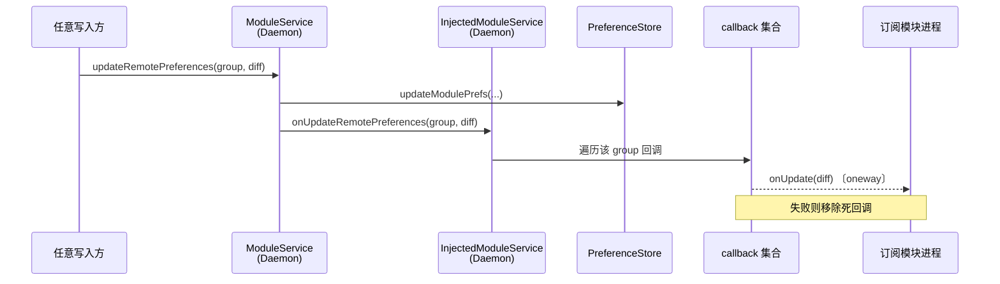
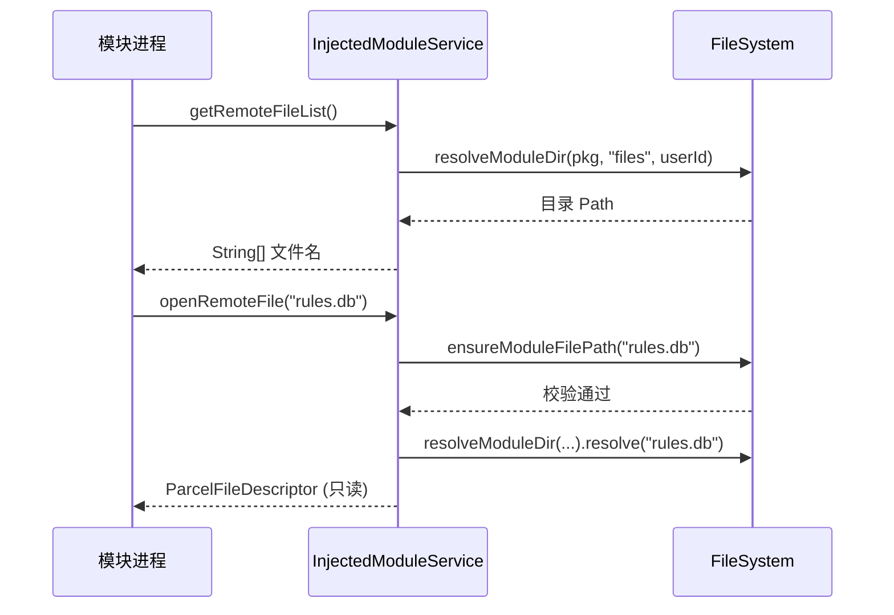
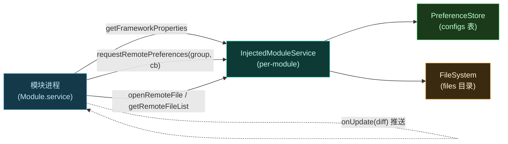

# 📡 ILSPInjectedModuleService

**libxposed 模块侧**的 API binder。每个被加载的模块通过 `Module.service` 拿到此接口，用于查询框架属性、读写远程偏好、访问远程文件。

> 📂 `services/daemon-service/src/main/aidl/org/lsposed/lspd/service/ILSPInjectedModuleService.aidl`
> 包：`org.lsposed.lspd.service`

## 方法

```aidl
long getFrameworkProperties();

Bundle requestRemotePreferences(String group, IRemotePreferenceCallback callback);

ParcelFileDescriptor openRemoteFile(String path);

String[] getRemoteFileList();
```

## 方法说明

| 方法 | 返回值 | 说明 |
| :--- | :--- | :--- |
| `getFrameworkProperties` | `long` | 获取框架属性位（版本、能力标志等编码为 long） |
| `requestRemotePreferences` | `Bundle` | 订阅指定 group 的远程偏好，返回当前快照并注册回调 |
| `openRemoteFile` | `ParcelFileDescriptor` | 打开远程文件（模块资产等），返回 fd |
| `getRemoteFileList` | `String[]` | 列出可用的远程文件路径 |

> 📂 实现：`daemon/src/main/kotlin/org/matrix/vector/daemon/ipc/InjectedModuleService.kt`
> 每个 `InjectedModuleService` 实例绑定单个模块包名（构造时传入 `packageName`），用户隔离按 `Binder.getCallingUid() / PER_USER_RANGE`（100000）解析 userId。

### getFrameworkProperties

返回框架**能力位掩码**，模块据此判断是否启用依赖某项能力的特性。

```kotlin
var prop = IXposedService.PROP_CAP_SYSTEM or IXposedService.PROP_CAP_REMOTE
if (ConfigCache.state.isDexObfuscateEnabled) {
    prop = prop or IXposedService.PROP_RT_API_PROTECTION
}
return prop
```

| 能力位 | 含义 |
| :--- | :--- |
| `PROP_CAP_SYSTEM` | 支持 system_server 作用域 |
| `PROP_CAP_REMOTE` | 支持远程偏好/文件 |
| `PROP_RT_API_PROTECTION` | dex 混淆启用时的运行时 API 保护 |

#### 典型场景

模块在初始化时探测是否具备 `PROP_CAP_REMOTE`，若否决则回退到本地 `SharedPreferences`，避免对 Daemon 发起注定失败的远程调用。

### requestRemotePreferences

模块用 `SharedPreferences` 的等价语义读写偏好，但实际存储在 Daemon 侧（SQLite `configs` 表）。首次调用返回当前值的 `Bundle` 快照，后续变更通过传入的 [`IRemotePreferenceCallback`](./iremotepreferencecallback) 推送。

#### 参数

| 参数 | 类型 | 含义 |
| :--- | :--- | :--- |
| `group` | `String` | 偏好分组名（如 `"main"`），不同 group 互隔离 |
| `callback` | `IRemotePreferenceCallback` | 变更回调；传 `null` 表示仅取快照不订阅 |

#### 返回值

`Bundle`，其 `Serializable` 键 `"map"` 内为 `Map<String, Any>`——该 group 当前的全量键值。

#### 约束

- 回调以 `group` 为键存入 `ConcurrentHashMap`，同一 group 可注册多个回调（多模块进程/多实例）。
- 对 callback binder `linkToDeath`，模块进程死亡时自动从集合移除。
- userId 取自 `Binder.getCallingUid() / PER_USER_RANGE`，跨用户隔离。

#### 典型场景

模块启动时拉取配置快照渲染 UI，同时订阅后续变更以实时刷新；配置变更由管理器或另一进程写入后，所有订阅者即时同步。

### openRemoteFile

打开模块专属 `files` 目录下的文件，返回只读 `ParcelFileDescriptor`。

#### 参数

| 参数 | 类型 | 含义 |
| :--- | :--- | :--- |
| `path` | `String` | 文件名，**不得含路径分隔符**，不得为 `"."`/`".."` |

#### 返回值

只读 fd，指向 `<moduleDir>/<userId>/<pkg>/files/<path>`。

#### 异常/约束

- `FileSystem.ensureModuleFilePath` 校验：`path` 含 `File.separatorChar`、为 `"."` 或 `".."` 时抛 `RemoteException("Invalid path")`。
- 文件以 `MODE_READ_ONLY` 打开；不存在或不可读时抛 `RemoteException`。
- 目录由 `FileSystem.resolveModuleDir` 解析，自动设置 SELinux 标签 `u:object_r:xposed_data:s0` 与属主。

#### 典型场景

模块需要访问打包在 APK 外、由 Daemon 统一分发的资产（混淆映射、预编译资源、规则数据库）。

### getRemoteFileList

列出模块 `files` 目录下的所有文件名。

#### 返回值

`String[]`——目录下文件名列表；目录不存在或为空时返回空数组。

#### 约束

- 与 `openRemoteFile` 使用同一目录解析逻辑（按 calling uid 的 userId）。
- 仅返回文件名，不含路径前缀；可直接作为 `openRemoteFile` 的入参。

## 偏好回调推送

`requestRemotePreferences` 注册的回调由 daemon 侧 `onUpdateRemotePreferences(group, diff)` 驱动推送（当任一进程经 `IXposedService.updateRemotePreferences` 写入时触发）：



## 远程文件访问时序



## API 全貌



## 使用示例

```kotlin
class MyModule : IXposedHookLoadPackage {
    override fun onPackageLoaded(param: PackageLoadedParam) {
        // Module.service 即 ILSPInjectedModuleService
        val service = (param.module?.service) ?: return

        // 1) 探测能力
        val props = service.frameworkProperties
        val hasRemote = props and PROP_CAP_REMOTE != 0L

        // 2) 拉取偏好快照 + 订阅变更
        val snapshot = service.requestRemotePreferences("main", object : IRemotePreferenceCallback.Stub() {
            override fun onUpdate(map: Bundle) {
                val diff = map.getSerializable("map") as? Map<*, *>
                diff?.forEach { (k, v) -> applyPrefChange(k as String, v) }
            }
        })
        val current = snapshot.getSerializable("map") as? Map<*, *>
        current?.forEach { (k, v) -> applyPref(k as String, v) }

        // 3) 读取远程资产
        if (hasRemote) {
            service.remoteFileList.forEach { name ->
                if (name.endsWith(".db")) {
                    service.openRemoteFile(name).use { pfd ->
                        loadRulesFromFd(pfd.fileDescriptor)
                    }
                }
            }
        }
    }
}
```

## 相关

- [IRemotePreferenceCallback](./iremotepreferencecallback) — 偏好变更回调
- [ILSPApplicationService](./ilspapplicationservice) — 经 `Module.service` 获取本接口
- [services 模块总览](../modules/services)
