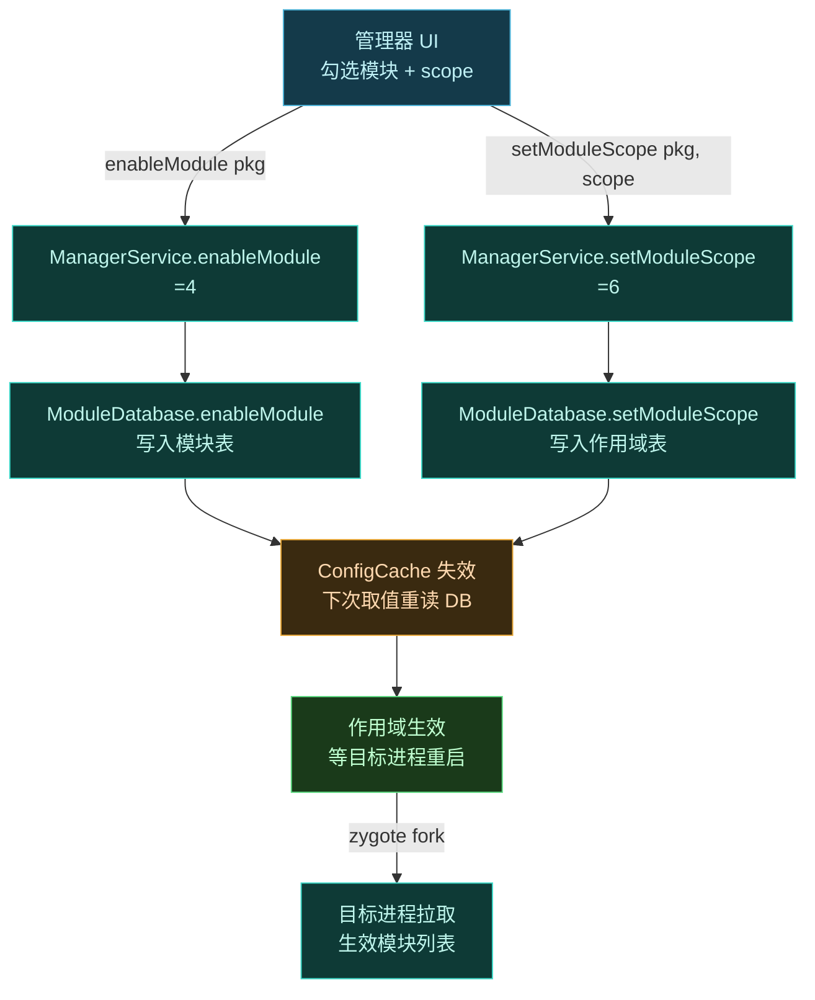
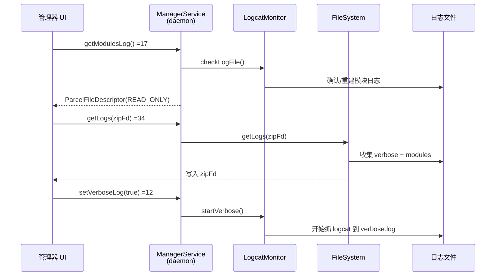

# 📡 ILSPManagerService

管理器 app 调用的**控制接口**——Vector 所有管理操作的总线。模块开关、作用域、日志、强停、重启、包管理、用户管理、DEX 优化等全部经此。本接口方法最多，按功能分组说明。

> 📂 [`services/manager-service/src/main/aidl/org/lsposed/lspd/ILSPManagerService.aidl`](https://github.com/android-security-engineer/Vector-skills/blob/master/services/manager-service/src/main/aidl/org/lsposed/lspd/ILSPManagerService.aidl)
> 实现侧：[`daemon/.../ipc/ManagerService.kt`](https://github.com/android-security-engineer/Vector-skills/blob/master/daemon/src/main/kotlin/org/matrix/vector/daemon/ipc/ManagerService.kt) · 调用侧：[`app/.../receivers/LSPManagerServiceHolder.java`](https://github.com/android-security-engineer/Vector-skills/blob/master/app/src/main/java/org/lsposed/manager/receivers/LSPManagerServiceHolder.java)
> 包：`org.lsposed.lspd`

## 调用拓扑

管理器 UI 跑在普通 app 进程，`ManagerService` 实现跑在 daemon（root）进程，二者通过 Binder 跨进程通信。下图展示一次管理调用的端到端链路：


- 调用侧 holder 在 [`LSPManagerServiceHolder.java`](https://github.com/android-security-engineer/Vector-skills/blob/master/app/src/main/java/org/lsposed/manager/receivers/LSPManagerServiceHolder.java) 中 `linkToDeath` 监听 daemon Binder，一旦 daemon 进程死亡管理器 `System.exit(0)` 自杀重启；
- 实现侧 `ManagerService` 是单例 `object : ILSPManagerService.Stub()`，所有方法在 daemon 的 Binder 线程池执行；
- 持久化层由 `ModuleDatabase`（模块表/作用域表）、`PreferenceStore`（开关偏好）、`ConfigCache`（热缓存）三层组成。

## 常量

DEX2OAT 状态码（`getDex2OatWrapperCompatibility` 等返回值）：

| 常量 | 值 | 含义 |
| :--- | :--- | :--- |
| `DEX2OAT_OK` | `0` | 正常 |
| `DEX2OAT_CRASHED` | `1` | dex2oat 包装器崩溃 |
| `DEX2OAT_MOUNT_FAILED` | `2` | 挂载失败 |
| `DEX2OAT_SELINUX_PERMISSIVE` | `3` | SELinux 处于 permissive |
| `DEX2OAT_SEPOLICY_INCORRECT` | `4` | SE 策略不正确 |

## 方法总览

```aidl
ParcelableListSlice<PackageInfo> getInstalledPackagesFromAllUsers(int flags, boolean filterNoProcess) = 2;
String[] enabledModules() = 3;
boolean enableModule(String packageName) = 4;
boolean disableModule(String packageName) = 5;
boolean setModuleScope(String packageName, in List<Application> scope) = 6;
List<Application> getModuleScope(String packageName) = 7;
boolean isVerboseLog() = 11;
void setVerboseLog(boolean enabled) = 12;
ParcelFileDescriptor getVerboseLog() = 16;
ParcelFileDescriptor getModulesLog() = 17;
long getXposedVersionCode() = 18;
String getXposedVersionName() = 19;
int getXposedApiVersion() = 20;
boolean clearLogs(boolean verbose) = 21;
PackageInfo getPackageInfo(String packageName, int flags, int uid) = 22;
void forceStopPackage(String packageName, int userId) = 23;
void reboot() = 24;
boolean uninstallPackage(String packageName, int userId) = 25;
boolean isSepolicyLoaded() = 26;
List<UserInfo> getUsers() = 27;
int installExistingPackageAsUser(String packageName, int userId) = 28;
boolean systemServerRequested() = 29;
int startActivityAsUserWithFeature(in Intent intent, int userId) = 30;
ParcelableListSlice<ResolveInfo> queryIntentActivitiesAsUser(in Intent intent, int flags, int userId) = 31;
boolean dex2oatFlagsLoaded() = 32;
void setHiddenIcon(boolean hide) = 33;
void getLogs(in ParcelFileDescriptor zipFd) = 34;
void restartFor(in Intent intent) = 35;
boolean performDexOptMode(String packageName) = 40;
int getDex2OatWrapperCompatibility() = 44;
void clearApplicationProfileData(in String packageName) = 45;
boolean enableStatusNotification() = 47;
void setEnableStatusNotification(boolean enable) = 48;
boolean getAutoInclude(String packageName) = 51;
boolean setAutoInclude(String packageName, boolean enable) = 52;
```

> 注：方法后的 `= N` 是 AIDL 的 **transaction code**，定义了 Binder 调用的编号，保证二进制兼容。

## 按功能分组

### 模块管理

| 方法 | 返回值 | 说明 |
| :--- | :--- | :--- |
| `enabledModules` | `String[]` | 当前已启用模块包名列表 |
| `enableModule` | `boolean` | 启用指定模块 |
| `disableModule` | `boolean` | 禁用指定模块 |
| `getModuleScope` | `List<Application>` | 模块的作用域（生效应用列表） |
| `setModuleScope` | `boolean` | 设置模块作用域，scope 标 `in` |
| `getAutoInclude` | `boolean` | 查询模块是否启用自动包含 |
| `setAutoInclude` | `boolean` | 设置自动包含开关 |

`setModuleScope` 是作用域勾选界面的持久化端，UI 批量收集变更后一次性调用。

### 模块启用与作用域持久化流程

用户在 UI 上勾选一个模块 + 一组作用域应用，背后是一次 `enableModule` + 一次 `setModuleScope` 的组合调用，随后触发缓存失效：



关键点：

- `enableModule`(=4) 与 `setModuleScope`(=6) 是两个独立 transaction，UI 可分可合；只 enable 不设 scope 模块仍不生效（scope 为空）；
- 持久化在 daemon 进程的 `ModuleDatabase`，重启设备后保留；
- `ConfigCache` 是热缓存——写入后立即失效，避免读到旧 scope；
- 真正"生效"要等目标进程被 `forceStopPackage`(=23) 后由 zygote 重新 fork，新进程在 fork 时拉取最新模块列表。

### 包与用户管理

| 方法 | 返回值 | 说明 |
| :--- | :--- | :--- |
| `getInstalledPackagesFromAllUsers` | `ParcelableListSlice<PackageInfo>` | 跨所有用户枚举已装包，`filterNoProcess` 过滤无进程的 |
| `getPackageInfo` | `PackageInfo` | 查指定包/uid 的 PackageInfo |
| `forceStopPackage` | `void` | 强停指定用户的包 |
| `uninstallPackage` | `boolean` | 卸载指定用户的包 |
| `installExistingPackageAsUser` | `int` | 为指定用户安装已存在的包 |
| `getUsers` | `List<UserInfo>` | 系统用户列表 |
| `startActivityAsUserWithFeature` | `int` | 以指定用户身份启动 Activity，intent 标 `in` |
| `queryIntentActivitiesAsUser` | `ParcelableListSlice<ResolveInfo>` | 以指定用户查 Intent 活动，intent 标 `in` |

跨用户枚举是作用域界面列出所有应用的基础——普通 `PackageManager` 只看当前用户。

### 日志

| 方法 | 返回值 | 说明 |
| :--- | :--- | :--- |
| `isVerboseLog` | `boolean` | 是否开启详细日志 |
| `setVerboseLog` | `void` | 开关详细日志 |
| `getVerboseLog` | `ParcelFileDescriptor` | 详细日志文件 fd |
| `getModulesLog` | `ParcelFileDescriptor` | 模块日志文件 fd |
| `clearLogs` | `boolean` | 清空日志，`verbose` 区分两类 |
| `getLogs` | `void` | 把所有日志打包写入传入的 zip fd，参数标 `in` |

#### 日志获取时序

日志分「模块日志」与「详细日志」两类，前者由 LSPlant hook 回调写、后者由 `LogcatMonitor` 抓 logcat。两类都可单独取 fd，也可一键打包成 zip：



- `getModulesLog`(=17) 先 `LogcatMonitor.checkLogFile()` 保证文件存在，再以只读 `ParcelFileDescriptor` 返回——管理器直接读 fd 即可，无需文件路径权限；
- `getLogs`(=34) 接收调用方传入的 `zipFd`（标 `in`），把所有日志打包写入，适合"导出全部日志"按钮；
- `setVerboseLog`(=12) 切换时即时 `startVerbose()`/`stopVerbose()`，无需重启 daemon。

### 框架信息与系统控制

| 方法 | 返回值 | 说明 |
| :--- | :--- | :--- |
| `getXposedVersionCode` | `long` | 框架版本号 |
| `getXposedVersionName` | `String` | 框架版本名 |
| `getXposedApiVersion` | `int` | Xposed API 版本 |
| `systemServerRequested` | `boolean` | system_server 是否已请求注入 |
| `isSepolicyLoaded` | `boolean` | 自定义 SELinux 策略是否已加载 |
| `reboot` | `void` | 重启设备 |
| `restartFor` | `void` | 以指定 Intent 重启框架进程 |
| `setHiddenIcon` | `void` | 隐藏/显示管理器图标 |
| `enableStatusNotification` | `boolean` | 查询状态通知开关 |
| `setEnableStatusNotification` | `void` | 设置状态通知开关 |

### DEX 优化

| 方法 | 返回值 | 说明 |
| :--- | :--- | :--- |
| `dex2oatFlagsLoaded` | `boolean` | dex2oat 劫持标志是否已加载 |
| `performDexOptMode` | `boolean` | 对指定包执行 DEX 优化 |
| `clearApplicationProfileData` | `void` | 清除应用 profile 数据，packageName 标 `in` |
| `getDex2OatWrapperCompatibility` | `int` | dex2oat 包装器兼容性状态（见上方常量） |

## 相关

- [services 模块总览](../modules/services)
- [app 模块](../modules/app) — 管理器 UI 调用侧
- [daemon 模块](../modules/daemon) — 接口实现侧
