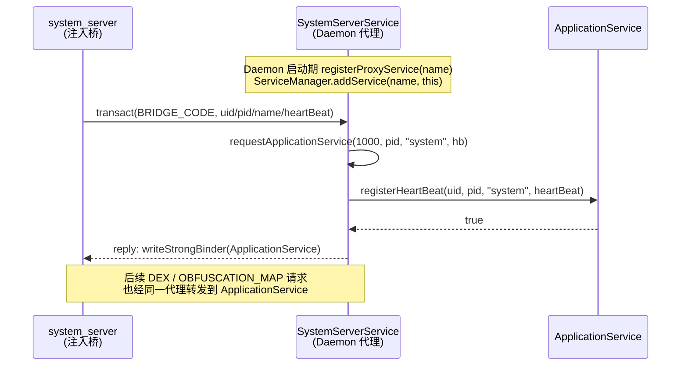
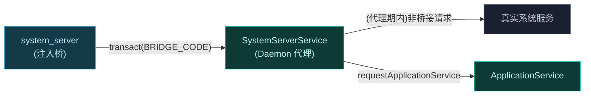

# 📡 ILSPSystemServerService

**system_server 内框架**专用的服务接口。结构与 `IDaemonService` 中请求应用服务的部分相似，但面向 system_server 进程。

> 📂 `services/daemon-service/src/main/aidl/org/lsposed/lspd/service/ILSPSystemServerService.aidl`
> 包：`org.lsposed.lspd.service`

## 方法

```aidl
ILSPApplicationService requestApplicationService(int uid, int pid, String processName, IBinder heartBeat);
```

## 方法说明

| 方法 | 返回值 | 说明 |
| :--- | :--- | :--- |
| `requestApplicationService` | `ILSPApplicationService` | system_server 请求自身的应用服务 binder，失败返回 `null` |

### requestApplicationService

system_server 作为特殊进程被注入后，通过此接口获取 [`ILSPApplicationService`](./ilspapplicationservice)。Daemon 在 `SystemServerService` 中校验后注册心跳并返回 `ApplicationService` 单例。

system_server 走独立接口而非复用 [`IDaemonService`](./idaemonservice#requestapplicationservice)，是因为其上下文初始化时机与普通应用不同——普通应用在 `IDaemonService` 里先经 `dispatchSystemServerContext` 建立上下文，而 system_server 自身就是上下文来源。

#### 参数

| 参数 | 类型 | 含义 |
| :--- | :--- | :--- |
| `uid` | `int` | 调用方 uid，必须为 `1000`（`Process.SYSTEM_UID`） |
| `pid` | `int` | system_server 进程 pid |
| `processName` | `String` | 必须为 `"system"` |
| `heartBeat` | `IBinder` | 心跳 binder，进程死亡时 binder 掉线，Daemon 据此清理状态 |

#### 返回值

| 情形 | 返回 |
| :--- | :--- |
| 校验通过且心跳注册成功 | `ApplicationService` 单例（`ILSPApplicationService`） |
| `uid != 1000` 或 `processName != "system"` 或 `heartBeat == null` | `null` |
| 心跳注册失败（`registerHeartBeat` 抛异常） | `null` |

#### 约束

- Daemon 侧标记 `systemServerRequested = true`，供 [`ILSPManagerService.systemServerRequested`](./ilspmanagerservice) 查询注入状态。
- 注册成功后 `ApplicationService` 即接管该进程的模块列表、偏好路径、管理器 binder 等请求。
- `heartBeat` 经 `linkToDeath` 绑定，system_server 崩溃时自动从进程表移除。

## 桥接机制（桥接 transaction）

system_server 并不通过常规 binder 名字找到本接口。Daemon 在启动早期调用 `registerProxyService(serviceName)`，以指定服务名向 `ServiceManager` 注册自身（Android R+ 经 `IServiceCallback` 拦截真实服务的注册），随后 system_server 内的注入桥用自定义 transaction code `BRIDGE_TRANSACTION_CODE`（`'_VEC'`）发起 `onTransact`：



### 代理与转发概览



当真实系统服务随后注册时，`IServiceCallback.onRegistration` 捕获原始 binder，此后 `onTransact` 把非桥接请求透传给真实服务，Daemon 不再拦截流量。

## 使用示例

此接口由 system_server 内的注入桥代码调用，模块开发者通常不直接持有。但了解其存在有助于诊断 system_server 注入失败：

```kotlin
// 注入桥伪代码（运行在 system_server 内）
val daemon = IBinder.asInterface(/* 经 ServiceManager 拿到代理名 */)
val data = Parcel.obtain()
data.writeInt(Process.myUid())          // 1000
data.writeInt(Process.myPid())
data.writeString("system")
data.writeStrongBinder(heartBeat)
val reply = Parcel.obtain()
if (daemon.transact(BRIDGE_TRANSACTION_CODE, data, reply, 0)) {
    val appService = ILSPApplicationService.Stub.asInterface(reply.readStrongBinder())
    // appService.getModulesList() 将返回 system_server 作用域的模块
}
```

## 相关

- [IDaemonService](./idaemonservice) — 普通应用侧入口
- [ILSPApplicationService](./ilspapplicationservice) — 返回的应用服务
- [services 模块总览](../modules/services)
