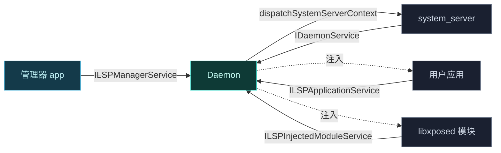
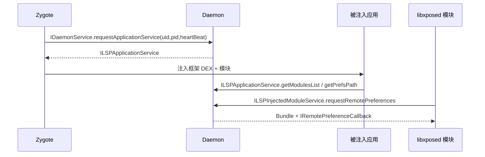

# 📡 AIDL 接口参考

Vector 跨进程通信的全部 **AIDL 接口契约**。源码位于 `services` 模块的两个子模块，纯接口定义，实现散落在 [daemon](../modules/daemon) 与 [app](../modules/app)。

> 📂 [`services/daemon-service/src/main/aidl/`](https://github.com/android-security-engineer/Vector-skills/blob/master/services/daemon-service/src/main/aidl/) · [`services/manager-service/src/main/aidl/`](https://github.com/android-security-engineer/Vector-skills/blob/master/services/manager-service/src/main/aidl/)
> 语言：AIDL

## 接口清单

### daemon-service

| 接口 | 调用方 | 职责 |
| :--- | :--- | :--- |
| [`IDaemonService`](./idaemonservice) | system_server / 应用 | Daemon 主入口：请求应用服务、分发系统上下文、预启动管理器 |
| [`ILSPApplicationService`](./ilspapplicationservice) | 被注入应用 | 拉取框架 DEX、模块列表、混淆映射、偏好、日志开关 |
| [`ILSPInjectedModuleService`](./ilspinjectedmoduleservice) | libxposed 模块进程 | 模块侧 API：框架属性、远程偏好、远程文件 |
| [`ILSPSystemServerService`](./ilspsystemserverservice) | system_server 内框架 | 系统服务上下文下请求应用服务 |
| [`IRemotePreferenceCallback`](./iremotepreferencecallback) | 偏好监听方 | 远程偏好变更的回调接口 |

### manager-service

| 接口 | 调用方 | 职责 |
| :--- | :--- | :--- |
| [`ILSPManagerService`](./ilspmanagerservice) | 管理器 app | 启用/禁用模块、作用域、日志、强停、重启等全部管理操作（方法最多） |

## 数据模型

| parcelable | 字段 | 定义位置 |
| :--- | :--- | :--- |
| `Module` | packageName · appId · apkPath · file · applicationInfo · service | daemon-service |
| `PreLoadedApk` | preLoadedDexes · moduleClassNames · moduleLibraryNames · legacy | daemon-service |
| `Application` | packageName · userId | manager-service |
| `UserInfo` | id · name | manager-service |

## 通信全景

## 调用链概览

## 相关

- [services 模块总览](../modules/services)
- [daemon 模块](../modules/daemon) — 接口实现侧
- [app 模块](../modules/app) — 管理器调用侧
