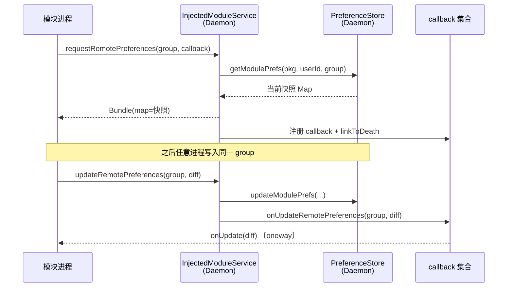

# 📡 IRemotePreferenceCallback

远程偏好变更的**回调接口**。模块经 [`ILSPInjectedModuleService.requestRemotePreferences`](./ilspinjectedmoduleservice#requestremotepreferences) 注册后，偏好变更通过此接口推送。

> 📂 `services/daemon-service/src/main/aidl/org/lsposed/lspd/service/IRemotePreferenceCallback.aidl`
> 包：`org.lsposed.lspd.service`

## 方法

```aidl
oneway void onUpdate(in Bundle map);
```

## 方法说明

| 方法 | 标记 | 参数方向 | 说明 |
| :--- | :--- | :--- | :--- |
| `onUpdate` | `oneway` | `in Bundle map` | 偏好变更时被调用，`map` 携带本次变更的增量键值 |

### onUpdate

`oneway` 异步推送，避免 Daemon 等待模块处理完才返回——Daemon 遍历该 group 的回调集合逐个 `onUpdate`，调用立即返回，模块在自身进程内异步消化变更。`map` 参数标 `in`，仅携带本次变更的键值对（增量），而非全量偏好。

Daemon 侧由 `InjectedModuleService.onUpdateRemotePreferences(group, diff)` 驱动：当模块经 `IXposedService.updateRemotePreferences` 写入偏好后，Daemon 把同一份 `diff` Bundle 推送给该 group 下所有已注册的回调。任一回调调用失败（模块进程已死）即从集合移除，避免后续向死 binder 重试。

> ⚠️ 模块不应在 `onUpdate` 中执行耗时操作或再次同步调用 `requestRemotePreferences`——前者会阻塞模块自身的 binder 线程，后者可能造成递归。正确做法是更新本地缓存并投递到主线程监听器。

#### 参数

| 参数 | 类型 | 方向 | 含义 |
| :--- | :--- | :--- | :--- |
| `map` | `Bundle` | `in` | 增量变更。键为偏好名，值为新值；删除项的值为 `null` |

#### 约束

- 仅在模块先前以非空 `callback` 调用过 `requestRemotePreferences` 后才会收到推送。
- 回调随模块进程死亡自动注销（Daemon 对其 binder `linkToDeath`）。
- 同一 group 多次注册同一回调不会去重，会收到多份推送。

## 调用时序



### 推送链路概览


## 使用示例

模块侧需提供一个 `IRemotePreferenceCallback.Stub` 实现，并在 `requestRemotePreferences` 时传入：

```kotlin
class MyModule : IXposedHookLoadPackage {
    override fun onPackageLoaded(param: PackageLoadedParam) {
        val service = param.service  // IXposedService

        // 当前快照（首次返回）
        val snapshot = service.requestRemotePreferences("main", object : IRemotePreferenceCallback.Stub() {
            override fun onUpdate(map: Bundle) {
                // oneway 推送：仅含本次变更的键
                val changed = map.getSerializable("map") as? Map<*, *>
                changed?.forEach { (k, v) ->
                    Log.d("MyModule", "pref changed: $k -> $v")
                    // 更新本地缓存并通知监听器（切到主线程）
                }
            }
        })

        // 首次拿到全量快照
        val initial = snapshot.getSerializable("map") as? Map<*, *>
        initial?.forEach { (k, v) -> Log.d("MyModule", "init pref: $k -> $v") }
    }
}
```

## 相关

- [ILSPInjectedModuleService](./ilspinjectedmoduleservice) — 注册方
- [services 模块总览](../modules/services)
