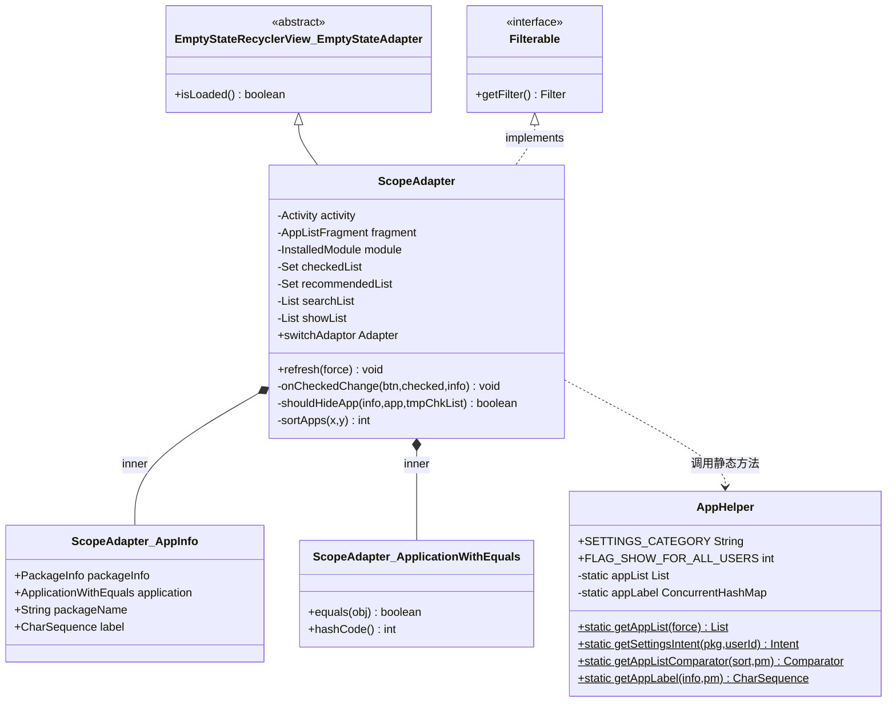
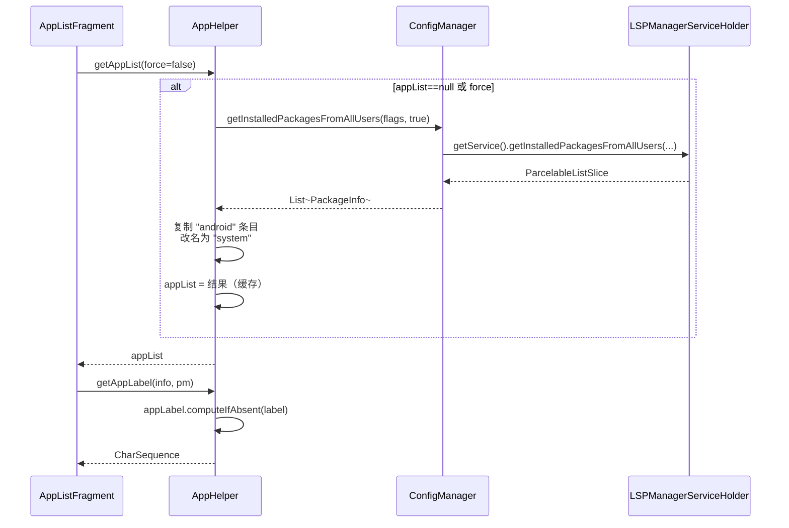

# app · adapters 包

> 📂 [`app/src/main/java/org/lsposed/manager/adapters/`](https://github.com/android-security-engineer/Vector-skills/blob/master/app/src/main/java/org/lsposed/manager/adapters/)
> 🟦 管理器 UI 的列表适配层

## 核心类

| 类 | 职责 | 关键方法 |
| :--- | :--- | :--- |
| [`AppHelper`](https://github.com/android-security-engineer/Vector-skills/blob/master/app/src/main/java/org/lsposed/manager/adapters/AppHelper.java) | 应用列表静态工具门面：取列表、构造 Intent、比较器 | `getAppList(force)`、`getSettingsIntent(pkg,userId)`、`getAppListComparator(sort,pm)`、`getAppLabel(info,pm)` |
| [`ScopeAdapter`](https://github.com/android-security-engineer/Vector-skills/blob/master/app/src/main/java/org/lsposed/manager/adapters/ScopeAdapter.java) | 作用域列表适配器：为模块勾选生效应用 | `refresh(force)`、`onCheckedChange(...)`、`getFilter()`、`onContextItemSelected(item)` |

## 类继承结构



## 包职责

为管理器的列表界面提供 `RecyclerView` 适配器：应用列表、作用域列表。负责数据装配、视图绑定、过滤、菜单与上下文操作。

## 类清单

| 类 | 说明 |
| :--- | :--- |
| [`AppHelper`](#apphelper) | 应用列表的工具门面：获取应用列表、启动 Intent、比较器 |
| [`ScopeAdapter`](#scopeadapter) | 作用域列表适配器：为模块勾选生效应用 |

### 应用列表获取与缓存流程



`getAppList` 内部带缓存——首次查询后列表常驻，`force` 参数强制重查。多用户场景下会跨用户枚举。`"android"` 包被复制成名为 `"system"` 的伪条目，代表 Android 框架本身可被勾选为作用域目标。

---

## AppHelper

`public class AppHelper` — 应用列表相关操作的**静态工具集**，UI 层获取应用列表、打开模块设置、构造启动 Intent都经此。

### 关键常量

| 常量 | 值 | 含义 |
| :--- | :--- | :--- |
| `SETTINGS_CATEGORY` | `"de.robv.android.xposed.category.MODULE_SETTINGS"` | Xposed 模块设置 Activity 的 Intent category |
| `FLAG_SHOW_FOR_ALL_USERS` | `0x0400` | 标记某条目对所有用户可见 |

### 主要方法

```java
// 获取某模块的设置 Activity Intent
public static Intent getSettingsIntent(String packageName, int userId)

// 获取应用启动 Intent
public static Intent getLaunchIntentForPackage(String packageName, int userId)

// 菜单项点击处理（搜索、排序、刷新）
public static boolean onOptionsItemSelected(MenuItem item, SharedPreferences preferences)

// 应用列表比较器（按名称/安装时间等排序）
public static Comparator<PackageInfo> getAppListComparator(int sort, PackageManager pm)

// 获取应用列表（带缓存，force=true 强制刷新）
synchronized public static List<PackageInfo> getAppList(boolean force)

// 应用显示名（带图标缓存）
public static CharSequence getAppLabel(PackageInfo info, PackageManager pm)
```

`getAppList` 内部带缓存——首次查询后列表常驻，`force` 参数强制重查。多用户场景下会跨用户枚举。

---

## ScopeAdapter

`public class ScopeAdapter extends EmptyStateRecyclerView.EmptyStateAdapter<ScopeAdapter.ViewHolder> implements Filterable`

**作用域列表适配器**——管理器里"为模块勾选哪些应用生效"那个界面的核心。每个条目是一个应用，带开关；开关状态经 `ConfigManager.setModuleScope` 持久化到 Daemon。

### 关键设计

- **嵌套 switchAdaptor**：内部持有一个独立的 [`RecyclerView.Adapter`](https://github.com/android-security-engineer/Vector-skills/blob/master/app/src/main/java/org/lsposed/manager/adapters/ScopeAdapter.java#L108-L127) 负责顶部"全选/反向选择"开关行，与下方应用列表分离渲染。
- **`onSwitchChanged` 回调**：[`switchBarOnCheckedChangeListener`](https://github.com/android-security-engineer/Vector-skills/blob/master/app/src/main/java/org/lsposed/manager/adapters/ScopeAdapter.java#L129-L144) 切换总开关时，先 `setModuleEnabled`，成功后再批量 `setModuleScope` 写回，避免半开态。
- **Filterable**：实现 [`getFilter()`](https://github.com/android-security-engineer/Vector-skills/blob/master/app/src/main/java/org/lsposed/manager/adapters/ScopeAdapter.java#L487-L489) 返回内部 `ApplicationFilter`，支持搜索框过滤应用名/包名。
- **Glide 图标加载**：`onBindViewHolder` 里用 [`GlideApp`](https://github.com/android-security-engineer/Vector-skills/blob/master/app/src/main/java/org/lsposed/manager/adapters/ScopeAdapter.java#L404-L419) 异步加载应用图标，`onResourceReady`/`onLoadFailed` 处理回调。
- **并行刷新**：[`refresh(force)`](https://github.com/android-security-engineer/Vector-skills/blob/master/app/src/main/java/org/lsposed/manager/adapters/ScopeAdapter.java#L500-L557) 用 `parallelStream` 遍历 `appList`，`synchronized` 收集到 `installedList`/`tmpList`，再切回 UI 线程调 `getFilter().filter(query)`。

### 构造与生命周期

```java
public ScopeAdapter(AppListFragment fragment, ModuleUtil.InstalledModule module)
```

绑定一个 Fragment 和目标模块。`onViewRecycled` 时清理 Glide 请求防内存泄漏。

### 刷新与过滤流程

```mermaid
flowchart TD
    A["refresh(force)"] --> B["setLoaded(null,false)"]
    B --> C["fragment.runAsync 异步"]
    C --> D["AppHelper.getAppList(force)"]
    D --> E["parallelStream 遍历"]
    E --> F{"应跳过?"}
    F -->|"system 非 userId0<br/>本模块<br/>管理器自身"| G["skip"]
    F -->|"命中 scopeList"| H["加入 recommendedList"]
    F -->|"shouldHideApp"| G
    F -->|"通过"| I["装入 tmpList + installedList"]
    H --> I
    I --> J["tmpChkList.retainAll(installedList)<br/>剔除已卸载项"]
    J --> K["sortApps 排序"]
    K --> L["searchList = 排序结果"]
    L --> M["runOnUiThread"]
    M --> N["getFilter.filter(query)"]
    N --> O["ApplicationFilter.performFiltering"]
    O --> P["按 label/packageName 过滤"]
    P --> Q["setLoaded(filtered,true)"]
    Q --> R["notifyDataSetChanged"]

    classDef vec fill:#0e3a36,stroke:#3dd8c8,color:#fff
    classDef hot fill:#3a2a10,stroke:#e8a838,color:#fff
    classDef plain fill:#1a2030,stroke:#6b7689,color:#fff
    class A,B,C,D,E,I,J,K,L,M,N,O,P,Q,R class vec
    class F class hot
    class G class plain
    class H class vec
```

排序优先级链：**已勾选 > 推荐 > 框架(system 置顶) > 用户排序规则**，每层相等再比下一层，保证常用项始终在列表顶部。

### 菜单与上下文菜单

- `onOptionsItemSelected`：处理"推荐作用域""重置"等菜单。
- `onContextItemSelected`：长按条目的"强制停止""卸载""应用详情"等操作。
- `onPrepareOptionsMenu`：根据当前选择动态启用/禁用菜单项。

## 相关

- [app 模块总览](../modules/app)
- [app · util 包](./app-util)（`ModuleUtil` 等工具）
- 作用域概念见 [guide · 模块机制](../../guide/modules#作用域)
