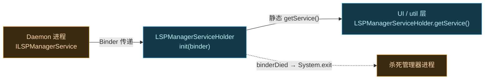

# app · receivers 包

> 📂 `app/src/main/java/org/lsposed/manager/receivers/`
> 🟦 管理器与 Daemon 服务 Binder 的持有者

## 包职责

持有管理器与 Daemon 之间的核心 IPC Binder——`ILSPManagerService`。管理器进程启动时把收到的 Binder 注册进来，此后全 app 通过 `getService()` 静态方法取用。Binder 一旦死亡，直接杀死管理器进程（寄生场景下没有 Binder 等于失去对框架的控制）。

## 类清单

| 类 | 说明 |
| :--- | :--- |
| [`LSPManagerServiceHolder`](#lspmanagerserviceholder) | 持有 `ILSPManagerService` Binder，监听其死亡并自杀 |



---

## LSPManagerServiceHolder

`public class LSPManagerServiceHolder implements IBinder.DeathRecipient`

**Binder 持有者单例**。管理器以寄生方式注入宿主进程后，Daemon 通过某种渠道把 `ILSPManagerService` 的 IBinder 传进来，本类负责接住、转成 AIDL 接口、注册死亡监听。

### 关键设计

- **静态字段持有**：`service` 与 `holder` 都是 `static`，整个进程共享一份。`init()` 仅在 `holder == null` 时创建实例，保证幂等。
- **`IBinder.DeathRecipient`**：实现 `binderDied()`，Daemon 一旦崩溃即触发。
- **激进自杀**：`binderDied()` 里先 `System.exit(0)` 再 `Process.killProcess(Os.getpid())`——双保险。寄生管理器失去与 Daemon 的连接后没有任何独立存活的意义。

### 主要方法

```java
// 进程启动时调用，注册 Daemon 传入的 Binder（幂等）
public static void init(IBinder binder)

// 取得 ILSPManagerService 代理对象（全 app 都用它）
public static ILSPManagerService getService()

// Binder 死亡回调：杀掉自身进程
@Override
public void binderDied()
```

### 内部流程

构造时先 `linkToDeath(binder)`，若 `linkToDeath` 抛 `RemoteException`（说明 Binder 已死）则直接走 `binderDied()`；否则把 Binder 转成 `ILSPManagerService` 存入静态 `service`。

### 谁在用

- `LogsFragment`：`LSPManagerServiceHolder.getService().getLogs(zipFd)` 拉取日志 FD 写入 zip。
- `CompileDialogFragment`：`getService().clearApplicationProfileData(...)` / `performDexOptMode(...)` 触发 dex 优化。
- `ConfigManager` 也封装了大量经此 Binder 的调用。

## 相关

- [app 模块总览](../modules/app)
- [app · util 包](./app-util)（`ModuleUtil` 等使用此 Holder 的工具）
- AIDL 接口见 [services AIDL · ILSPManagerService](../aidl/ilspmanagerservice)
- 寄生注入机制见 [Zygisk 模块 · 寄生式管理器](../../architecture/zygisk#寄生式管理器与身份移植)
