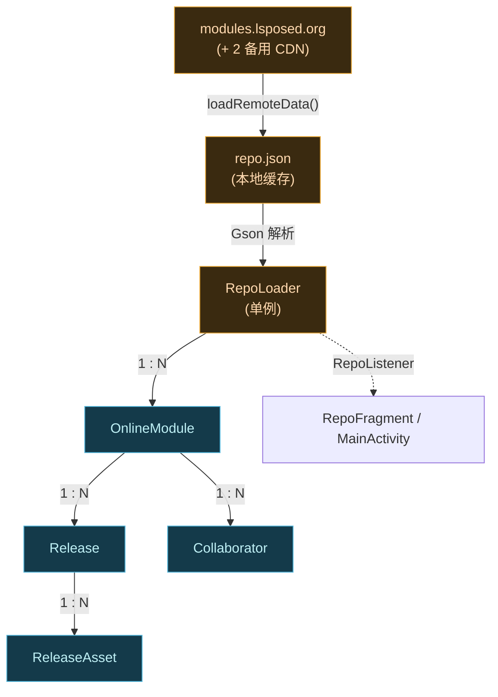

# app · repo 包

> 📂 `app/src/main/java/org/lsposed/manager/repo/`（含 `repo/model/` 子包）
> 🟦 在线模块仓库的拉取、缓存与解析

## 包职责

从 LSPosed 模块仓库（`modules.lsposed.org`）拉取在线模块元数据：模块清单、各模块的发布版本、README、协作者等。数据本地缓存为 `repo.json`，支持三段式故障转移 URL、稳定版/Beta/Snapshot 三条更新通道、按通道计算"可升级"判断。监听器机制让 UI（`RepoFragment`、`MainActivity` 等）在数据就绪后刷新。

## 类清单

| 类 | 说明 |
| :--- | :--- |
| [`RepoLoader`](#repoloader) | 单例加载器：本地/远程数据加载、版本计算、监听分发 |
| [`OnlineModule`](#onlinemodule) | 在线模块 POJO，对应仓库里的一个模块条目 |
| [`Release`](#release) | 一次发布（版本）POJO |
| [`ReleaseAsset`](#releaseasset) | 发布附件 POJO（APK/zip 等下载资产） |
| [`Collaborator`](#collaborator) | 模块协作者 POJO |



---

## RepoLoader

`public class RepoLoader` — **仓库加载单例**。负责本地缓存读写、远程拉取、版本号解析、更新通道切换、监听器分发。

### 关键常量/字段

| 字段 | 值/类型 | 含义 |
| :--- | :--- | :--- |
| `originRepoUrl` | `https://modules.lsposed.org/` | 主仓库 URL |
| `backupRepoUrl` | `https://modules-blogcdn.lsposed.org/` | 第一备用 CDN |
| `secondBackupRepoUrl` | `https://modules-cloudflare.lsposed.org/` | 第二备用 CDN（Cloudflare） |
| `repoFile` | `filesDir/repo.json` | 本地缓存文件路径 |
| `repoUrl` | 动态 | 当前在用的 URL，故障时逐级切换 |
| `onlineModules` | `Map<String, OnlineModule>` | 以包名为键的模块表 |
| `latestVersion` | `Map<String, ModuleVersion>` | 每模块按当前通道的最新版本 |

### 故障转移

远程请求失败时按 `origin → backup → secondBackup` 顺序重试，每次都重置 `repoUrl` 后递归调用自身。`loadRemoteData()`（同步、拉 `modules.json`）与 `loadRemoteReleases(packageName)`（异步、拉单模块 `module/<pkg>.json`）均遵循此策略。

### 主要方法

```java
// 取单例；首次取时后台异步加载本地数据并触发远程刷新
public static synchronized RepoLoader getInstance()

// 是否已完成加载（本地或远程）
public boolean isRepoLoaded()

// 从远程拉取全量 modules.json，写盘后 reload 本地
synchronized public void loadRemoteData()

// 从本地 repo.json 读取解析；updateRemoteRepo=true 时再触发远程刷新
synchronized public void loadLocalData(boolean updateRemoteRepo)

// 按通道重算每模块最新版本（stable / beta / snapshot）
synchronized private void updateLatestVersion(OnlineModule[] onlineModules, String channel)

// 手动按新通道重算最新版本
public void updateLatestVersion(String channel)

// 取某模块当前通道的最新版本（含 versionCode/versionName）
@Nullable public ModuleVersion getModuleLatestVersion(String packageName)

// 取某模块的发布列表（按通道选择 releases/beta/snapshot）
@Nullable public List<Release> getReleases(String packageName)

// 取某模块当前通道最新发布时间
@Nullable public String getLatestReleaseTime(String packageName, String channel)

// 异步拉取单模块的完整发布列表（触发 onModuleReleasesLoaded）
public void loadRemoteReleases(String packageName)

// 取单个/全部在线模块
@Nullable public OnlineModule getOnlineModule(String packageName)
@Nullable public Collection<OnlineModule> getOnlineModules()

// 监听器增删
public void addListener(RepoListener listener)
public void removeListener(RepoListener listener)
```

### 内部类 ModuleVersion

```java
public static class ModuleVersion {
    public String versionName;
    public long versionCode;

    // 当前仓库版本是否比传入的 (versionCode, versionName) 更新
    public boolean upgradable(long versionCode, String versionName)
}
```

`upgradable` 的判定：仓库 `versionCode` 更大即升级；`versionCode` 相等但 `versionName`（空格替成下划线后）不同也视为升级——用于"同 code 不同名"的场景。

### 监听器接口 RepoListener

```java
public interface RepoListener {
    default void onRepoLoaded() {}
    default void onModuleReleasesLoaded(OnlineModule module) {}
    default void onThrowable(Throwable t) { /* 默认记日志 */ }
}
```

三个回调都带 `default` 空实现，监听方按需覆写。`MainActivity` 用 `onRepoLoaded` 计算可升级模块数并在底部导航栏打角标；`RepoFragment` / `RepoItemFragment` 用它刷新列表。

---

## OnlineModule

`public class OnlineModule`（`repo.model` 子包）— **在线模块 POJO**，Gson 反序列化仓库 JSON 的产物。字段全部用 `@SerializedName` + `@Expose` 标注。

### 关键字段（经 getter 暴露）

| 字段 | 类型 | 含义 |
| :--- | :--- | :--- |
| `name` | String | 模块包名（也是 Map 的键） |
| `description` | String | 模块显示名 |
| `summary` | String | 一句话摘要 |
| `homepageUrl` / `sourceUrl` / `url` | String | 主页 / 源码 / 仓库地址 |
| `scope` | `List<String>` | 推荐作用域包名列表 |
| `readme` / `readmeHTML` | String | README 原文 / 渲染后 HTML |
| `collaborators` | `List<Collaborator>` | 协作者 |
| `releases` / `betaReleases` / `snapshotReleases` | `List<Release>` | 三条通道的发布列表 |
| `latestRelease` / `latestBetaRelease` / `latestSnapshotRelease` | String | 三通道最新版本字符串（`"versionCode-versionName"`） |
| `latestReleaseTime` / `latestBetaReleaseTime` / `latestSnapshotReleaseTime` | String | 对应发布时间 |
| `stargazerCount` | Integer | GitHub star 数 |
| `hide` | Boolean | 是否在仓库列表隐藏 |
| `updatedAt` / `createdAt` | String | 创建/更新时间 |
| `releasesLoaded` | boolean | **公开字段**：是否已拉取该模块的完整发布列表（初始 false，`loadRemoteReleases` 成功后置 true） |

::: tip 版本字符串格式
`latestRelease` 等字段是 `"versionCode-versionName"` 形式（如 `"93-v1.8.6"`）。`RepoLoader.updateLatestVersion` 用 `split("-", 2)` 拆出两部分。
:::

---

## Release

`public class Release`（`repo.model`）— **一次发布 POJO**。

| 字段 | 类型 | 含义 |
| :--- | :--- | :--- |
| `name` | String | 发布标题 |
| `url` | String | 该发布页面 URL |
| `description` / `descriptionHTML` | String | 发布说明（Markdown / HTML） |
| `tagName` | String | Git tag 名 |
| `isPrerelease` | Boolean | 是否预发布 |
| `createdAt` / `publishedAt` / `updatedAt` | String | 时间戳 |
| `releaseAssets` | `List<ReleaseAsset>` | 附件列表 |

---

## ReleaseAsset

`public class ReleaseAsset`（`repo.model`）— **发布附件 POJO**，即每个可下载文件。

| 字段 | 类型 | 含义 |
| :--- | :--- | :--- |
| `name` | String | 文件名 |
| `contentType` | String | MIME 类型 |
| `downloadUrl` | String | 下载地址 |
| `downloadCount` | int | 下载次数（默认 0） |
| `size` | int | 文件大小（字节，默认 0） |

`RepoItemFragment.DownloadDialog` 用这些字段拼出"文件名 + 大小 + 下载次数"的列表项。

---

## Collaborator

`public class Collaborator`（`repo.model`）— **协作者 POJO**。

| 字段 | 类型 | 含义 |
| :--- | :--- | :--- |
| `login` | String | GitHub 登录名（用于拼 `github.com/<login>` 链接） |
| `name` | String | 显示名（可为空，回退到 login） |

`RepoItemFragment.InformationAdapter` 把协作者渲染成可点击的 Custom Tabs 链接。

## 相关

- [app 模块总览](../modules/app)
- [app · fragment 包](./app-fragment)（`RepoFragment` / `RepoItemFragment` 消费这些数据）
- [app · util 包](./app-util)（`ModuleUtil` 与 `RepoLoader` 协作判断升级）
