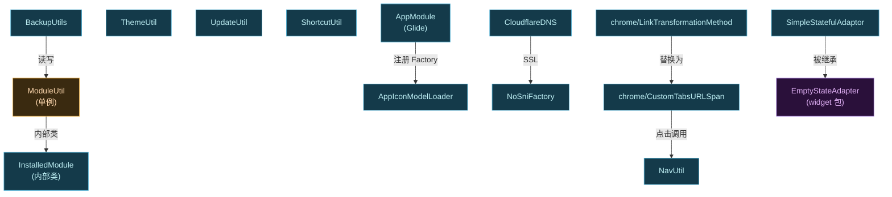

# app · util 包

> 📂 [`app/src/main/java/org/lsposed/manager/util/`](https://github.com/android-security-engineer/Vector-skills/blob/master/app/src/main/java/org/lsposed/manager/util/)（含 [`app/src/main/java/org/lsposed/manager/util/chrome/`](https://github.com/android-security-engineer/Vector-skills/blob/master/app/src/main/java/org/lsposed/manager/util/chrome/) 子包）
> 🟦 管理器的工具集：模块枚举、备份、主题、更新、导航、快捷方式、Glide、网络、无障碍

## 包职责

为 UI 层提供横切关注点的工具类与单例：已安装模块的枚举与启用状态管理、模块作用域的备份/恢复、主题与夜间模式、自身更新检查、Custom Tabs 网页导航、桌面快捷方式、Glide 图标加载、DoH DNS、无障碍动画检测，以及 chrome 子包下把 `URLSpan` 重定向到 Custom Tabs 的两个辅助类。

## 类清单

| 类 | 说明 |
| :--- | :--- |
| [`ModuleUtil`](#moduleutil) | 已安装模块枚举、启用状态、`InstalledModule` 模型（单例） |
| [`BackupUtils`](#backuputils) | 模块启用状态 + 作用域的 gzip JSON 备份/恢复 |
| [`ThemeUtil`](#themeutil) | 颜色主题/夜间主题/暗色模式的资源解析 |
| [`UpdateUtil`](#updateutil) | 检查 GitHub release 判断管理器自身是否需更新 |
| [`NavUtil`](#navutil) | 用 Custom Tabs 打开 URL |
| [`ShortcutUtil`](#shortcututil) | 寄生模式下创建/更新桌面快捷方式 |
| [`AppIconModelLoader`](#appiconmodelloader) | Glide 的 `PackageInfo → Bitmap` 图标加载器 |
| [`AppModule`](#appmodule) | Glide `AppGlideModule`，注册图标加载器 |
| [`AccessibilityUtils`](#accessibilityutils) | 检测系统动画缩放是否关闭 |
| [`CloudflareDNS`](#cloudflaredns) | OkHttp 的 DoH DNS 解析器 |
| [`NoSniFactory`](#nosnifactory) | 关闭 SNI 的 `SSLSocketFactory`（DoH 配套） |
| [`SimpleStatefulAdaptor`](#simplestatefuladaptor) | 带状态保存的 RecyclerView Adapter 抽象基类 |
| [`EmptyAccessibilityDelegate`](#emptyaccessibilitydelegate) | 屏蔽 View 无障碍事件的空实现 |
| [`chrome/CustomTabsURLSpan`](#customtabsurlspan) | 把 `URLSpan` 点击重定向到 Custom Tabs |
| [`chrome/LinkTransformationMethod`](#linktransformationmethod) | 把 TextView 里的 URLSpan 替换成 CustomTabsURLSpan |



---

## ModuleUtil

`public final class ModuleUtil` — **已安装模块枚举单例**。扫描设备上所有用户的所有包，挑出含 Xposed 模块标识的（modern：`META-INF/xposed/java_init.list`；legacy：meta-data `xposedminversion`），构造 `InstalledModule` 缓存。同时维护启用模块集合（来自 `ConfigManager.getEnabledModules()`）。

### 关键常量

| 常量 | 值 | 含义 |
| :--- | :--- | :--- |
| `MIN_MODULE_VERSION` | `2` | 拒绝低于此 minVersion 的模块 |
| `MATCH_ANY_USER` | `0x00400000` | 对应 `PackageManager.MATCH_ANY_USER` |
| `MATCH_ALL_FLAGS` | 多 flag 或 | 查询包时用的一组匹配标志 |

### 主要方法

```java
// 取单例；首次取时后台异步 reloadInstalledModules()
public static synchronized ModuleUtil getInstance()

public boolean isModulesLoaded()                          // 模块表是否已加载

// 全量重扫：跨用户枚举包，识别 modern/legacy 模块，刷启用集合
synchronized public void reloadInstalledModules()

// 重扫单个包（packageFullyRemoved=true 时若该模块已启用则移除）
public InstalledModule reloadSingleModule(String packageName, int userId, boolean packageFullyRemoved)
public InstalledModule reloadSingleModule(String packageName, int userId)   // 等价于 false

// 取模块
@Nullable public InstalledModule getModule(String packageName, int userId)
@Nullable public InstalledModule getModule(String packageName)               // userId=0
@Nullable synchronized public Map<Pair<String,Integer>, InstalledModule> getModules()
@Nullable public List<UserInfo> getUsers()

// 启用状态（写回经 ConfigManager.setModuleEnabled）
public boolean setModuleEnabled(String packageName, boolean enabled)
public boolean isModuleEnabled(String packageName)
public int getEnabledModulesCount()                        // 未加载返回 -1

// 静态工具：从 ApplicationInfo 判定 modern/legacy 模块
public static ZipFile getModernModuleApk(ApplicationInfo info)   // 找含 java_init.list 的 split apk
public static boolean isLegacyModule(ApplicationInfo info)       // meta-data 含 xposedminversion
public static int extractIntPart(String str)                     // 从字符串提取前导整数

// 监听器
public void addListener(ModuleListener listener)
public void removeListener(ModuleListener listener)
```

### 内部类 InstalledModule

`public class InstalledModule`（非静态内部类，持有外部 `ModuleUtil` 实例）。

| final 字段 | 含义 |
| :--- | :--- |
| `userId` / `packageName` / `versionName` / `versionCode` | 身份与版本 |
| `legacy` | 是否 legacy 模块（modern apk 为 null 时 true） |
| `minVersion` / `targetVersion` | Xposed API 版本（modern 读 `module.prop`；legacy 读 meta-data） |
| `staticScope` | modern 模块 `module.prop` 里 `staticScope=true` |
| `installTime` / `updateTime` | 安装/更新时间戳 |
| `app` / `pkg` | `ApplicationInfo` / `PackageInfo` |

懒加载字段：`appName`、`description`、`scopeList`（首次 getter 时填充）。

```java
public boolean isInstalledOnExternalStorage()      // FLAG_EXTERNAL_STORAGE
public String getAppName()                          // app.loadLabel，缓存
public String getDescription()                      // legacy: meta-data; modern: app.loadDescription
public List<String> getScopeList()                  // 优先 scope.list 文件，回退 meta-data xposedscope，再回退 OnlineModule.getScope()
public PackageInfo getPackageInfo()
```

::: warning 作用域包名的历史颠倒
`getScopeList` 末尾对列表做 `"android" ↔ "system"` 互换——这是 rovo89 时代的历史遗留（[XposedBridge commit](https://github.com/rovo89/XposedBridge/commit/6b49688c929a7768f3113b4c65b429c7a7032afa)），legacy 模块用相反的名字。
:::

### 监听器接口 ModuleListener

```java
public interface ModuleListener {
    default void onSingleModuleReloaded(InstalledModule module) {}
    default void onModulesReloaded() {}
}
```

---

## BackupUtils

`public class BackupUtils` — **模块启用状态 + 作用域的备份/恢复**。把 `ModuleUtil` 的模块表与每个模块的 `ConfigManager.getModuleScope(...)` 序列化成 JSON，gzip 压缩后写入用户选定的 `Uri`（经 SAF `CreateDocument`）。

### 常量

| 常量 | 值 | 含义 |
| :--- | :--- | :--- |
| `VERSION` | `2` | 备份格式版本（v1 的 scope 是纯包名字符串数组，v2 带 userId） |

### 主要方法

```java
// 备份全部模块
public static void backup(Uri uri) throws JSONException, IOException
// 备份指定模块（packageName 非 null 时只备份该模块）
public static void backup(Uri uri, String packageName) throws IOException, JSONException

// 从备份恢复（按版本兼容 v1/v2）
public static void restore(Uri uri) throws JSONException, IOException
public static void restore(Uri uri, String packageName) throws IOException, JSONException
```

### 备份结构

```json
{
  "version": 2,
  "modules": [
    { "enable": true, "package": "pkg", "scope": [ {"package":"app","userId":0}, ... ] }
  ]
}
```

恢复时：逐模块 `setModuleEnabled` → 若启用则用 `ConfigManager.setModuleScope(name, module.legacy, scope)` 写回作用域。v1 备份的 scope 是 `String[]`（无 userId，默认 0）。

---

## ThemeUtil

`public class ThemeUtil` — **主题资源解析**。把用户偏好（颜色、夜间模式、暗色模式）映射成 `@StyleRes` 资源 ID 供 `BaseActivity` apply。

### 关键常量

| 常量 | 含义 |
| :--- | :--- |
| `MODE_NIGHT_FOLLOW_SYSTEM` / `MODE_NIGHT_NO` / `MODE_NIGHT_YES` | 三种暗色模式字符串 |
| `colorThemeMap` | 19 种 Material 颜色名 → `ThemeOverlay_MaterialXxx` 资源 ID 的映射 |
| `THEME_DEFAULT` / `THEME_BLACK` | 夜间主题：默认 / 纯黑 |

### 主要方法

```java
public static boolean isSystemAccent()                            // 是否跟随系统强调色（需 DynamicColors 可用）
public static String getNightTheme(Context context)               // DEFAULT 或 BLACK
@StyleRes public static int getNightThemeStyleRes(Context context)
public static String getColorTheme()                              // "SYSTEM" 或用户选的颜色
@StyleRes public static int getColorThemeStyleRes()               // 颜色 overlay 资源 ID（默认 MaterialBlue）
public static int getDarkTheme(String mode)                       // 映射到 AppCompatDelegate.MODE_NIGHT_*
public static int getDarkTheme()                                  // 读偏好后调上面的
```

---

## UpdateUtil

`public class UpdateUtil` — **管理器自身更新检查**。异步请求 GitHub releases API（`JingMatrix/LSPosed`），把最新版本信息写入偏好；`needUpdate()` 据此判断。

### 主要方法

```java
// 异步拉取最新 release，解析 assets，写偏好（latest_version / latest_check / release_notes / zip_file / checked）
public static void loadRemoteVersion()

// 是否需要更新：已检查且超 30 天，或 latest_version > VERSION_CODE，或 build 时间超 30 天
public static boolean needUpdate()
```

### 内部逻辑

- `checkAssets(assets, releaseNotes)`：从 asset 名按 `-` 拆出 `latest_version`，写 `latest_check = now`；若 asset 的 `updated_at` 与偏好里 `zip_time` 不符，则同步下载新 zip 到 cacheDir 并校验大小后写 `zip_file`。
- `needUpdate()`：未检查过返回 false；`latest_check` 超 30 天返回 true；`latest_version > BuildConfig.VERSION_CODE` 返回 true；`latest_check == 0` 时按 build 时间超 30 天判断。
- 网络失败时若未检查过，写 `checked = true`（避免反复重试）。

---

## NavUtil

`public final class NavUtil` — **Custom Tabs 网页导航**。用 AndroidX Custom Tabs 打开 URL，自动适配昼夜配色；无浏览器时回退 Toast。

### 主要方法

```java
public static void startURL(Activity activity, Uri uri)
public static void startURL(Activity activity, String url)      // parse 后调上面
```

工具栏/导航栏颜色取当前主题的 `colorBackground` / `navigationBarColor`；按夜间模式选 `COLOR_SCHEME_DARK/LIGHT`；`ActivityNotFoundException` 时 Toast 显示 URL。

---

## ShortcutUtil

`public class ShortcutUtil` — **桌面快捷方式**。寄生模式下管理器无独立启动图标，本类负责通过 `ShortcutManager` 请求 pin 一个启动快捷方式到桌面，以及更新已 pin 快捷方式的图标。

### 关键常量

| 常量 | 值 | 含义 |
| :--- | :--- | :--- |
| `SHORTCUT_ID` | `"org.lsposed.manager.shortcut"` | 快捷方式固定 ID |

### 主要方法

```java
public static boolean isRequestPinShortcutSupported(Context context)  // 系统是否支持 pin
public static boolean requestPinLaunchShortcut(Runnable afterPinned)  // 请求 pin（仅寄生模式）
public static boolean updateShortcut()                                 // 更新已 pin 快捷方式图标
public static boolean isLaunchShortcutPinned()                         // 是否已 pin
```

### 设计要点

- `requestPinLaunchShortcut`：`App.isParasitic` 为 false 直接抛异常（非寄生无需 pin）。pin 成功后通过 `registerReceiver` 注册一次性广播接收器，系统确认 pin 后回调 `afterPinned`。
- `getLaunchIntent`：构造启动 Intent，加 category `org.lsposed.manager.LAUNCH_MANAGER`、setPackage 自身；Android Q+ 时 `setActivity` 指向 `android.app.AppDetailsActivity`（让快捷方式长按进入应用详情）。
- `getBitmap`：把 `ic_launcher` 转成 Bitmap（处理 BitmapDrawable 与 AdaptiveIconDrawable，后者合成前后景 LayerDrawable）。

---

## AppIconModelLoader

`public class AppIconModelLoader implements ModelLoader<PackageInfo, Bitmap>` — **Glide 图标加载器**。把 `PackageInfo` 作为 Glide model，通过 `AppIconLoader`（第三方库）加载应用图标。

### 主要方法

```java
@Override public boolean handles(@NonNull PackageInfo model)   // 总是 true
@Nullable @Override public LoadData<Bitmap> buildLoadData(PackageInfo model, int width, int height, Options options)
```

`buildLoadData` 关键：克隆 `ApplicationInfo` 并把 `uid` 取模 `App.PER_USER_RANGE`——去掉用户 ID 部分，让多用户场景下同一包的图标能命中 Glide 缓存。`ObjectKey` 用 `AppIconLoader.getIconKey(...)` 生成。

### 内部类

- `Fetcher implements DataFetcher<Bitmap>`：`loadData` 调 `mLoader.loadIcon(mApplicationInfo)`，`DataSource.LOCAL`，无 cancel/cleanup。
- `Factory implements ModelLoaderFactory<PackageInfo, Bitmap>`：构造时传 iconSize、`shrinkNonAdaptiveIcons`、context；`build` 创建 loader。

---

## AppModule

`@GlideModule public class AppModule extends AppGlideModule` — **Glide 模块注册**。关闭 manifest 解析（`isManifestParsingEnabled` 返回 false，因寄生 APK 无 manifest 可解析），并在 `registerComponents` 里 `registry.prepend(PackageInfo.class, Bitmap.class, factory)` 注册上面的 `AppIconModelLoader`，iconSize 取 `R.dimen.app_icon_size`。

---

## AccessibilityUtils

`public class AccessibilityUtils` — **无障碍/动画检测**。

```java
public static boolean isAnimationEnabled(ContentResolver cr)
```

读取 `Settings.Global` 的 `ANIMATOR_DURATION_SCALE`、`TRANSITION_ANIMATION_SCALE`、`WINDOW_ANIMATION_SCALE` 三个缩放值；三者全为 0 时返回 false（用户关闭了动画，开发者无障碍选项）。`BaseFragment.safeNavigate` 据此跳过导航动画。

---

## CloudflareDNS

`public final class CloudflareDNS implements Dns` — **OkHttp 的 DoH DNS 解析器**。用 `DnsOverHttps` 经 Cloudflare `1.1.1.1` 解析，仅当用户开启 DoH 且无代理时生效，否则回退系统 DNS。

### 关键字段

| 字段 | 含义 |
| :--- | :--- |
| `DoH` | 偏好 `doh` 开关（可运行时改） |
| `noProxy` | 当前是否无代理（`ProxySelector` 选出 `NO_PROXY`） |
| `cloudflare` | 构造好的 `DnsOverHttps` 实例 |

```java
@Override public List<InetAddress> lookup(@NonNull String hostname)   // DoH&&noProxy ? cloudflare : SYSTEM
```

构造时：bootstrap 主机为 `1.1.1.1` / `1.0.0.1` 及 IPv6；Android Q 以下禁用 TLS 扩展；SSL 用 `NoSniFactory`。

---

## NoSniFactory

`public final class NoSniFactory extends SSLSocketFactory` — **关闭 SNI 的 SSL 工厂**。为 DoH 配套：某些网络环境下 SNI 会被拦截，关掉 SNI 让 DoH 请求更隐蔽。

```java
// 五个 createSocket 重载，都经 config(socket) 后处理
private Socket config(Socket socket)
```

`config` 用 `android.net.SSLCertificateSocketFactory` 调 `setHostname(socket, null)`（清 SNI）+ `setUseSessionTickets(socket, true)`。`getDefaultCipherSuites`/`getSupportedCipherSuites` 委托默认工厂。

---

## SimpleStatefulAdaptor

`public abstract class SimpleStatefulAdaptor<T extends RecyclerView.ViewHolder> extends RecyclerView.Adapter<T> implements StatefulAdapter` — **带状态保存的 Adapter 基类**。`EmptyStateRecyclerView.EmptyStateAdapter` 继承它；`RepoItemFragment.InformationAdapter` 也直接继承。

### 核心机制

- `HashMap<Long, SparseArray<Parcelable>> states`：以 `holder.getItemId()` 为键存每项 View 层级状态。
- 构造时 `setStateRestorationPolicy(PREVENT_WHEN_EMPTY)`：空列表时不恢复，避免错位。
- `onViewRecycled` 时 `saveStateOf(holder)`——回收即存盘。
- `onBindViewHolder(holder, position, payloads)`（final）：先取回该项历史状态 `restoreHierarchyState`，再调子类 `onBindViewHolder(holder, position)`。

### 主要方法

```java
@CallSuper @Override public void onAttachedToRecyclerView(@NonNull RecyclerView recyclerView)
@Override public void onViewRecycled(@NonNull T holder)               // 存盘
@NonNull public Parcelable saveState()                                 // 存全部状态到 Bundle
@Override public void restoreState(@NonNull Parcelable savedState)     // 从 Bundle 恢复
```

`saveState`/`restoreState` 用嵌套 `Bundle`：外层 key = itemId（Long），内层 key = viewId（Int）→ Parcelable。`StatefulRecyclerView` 正是调这两个方法实现跨配置变更的状态保留。

---

## EmptyAccessibilityDelegate

`public class EmptyAccessibilityDelegate extends View.AccessibilityDelegate` — **空无障碍代理**。所有方法返回空/true，屏蔽目标 View 的全部无障碍事件（如 WebView 内部某些 View 不想被 TalkBack 朗读）。

重写的方法：`sendAccessibilityEvent`、`performAccessibilityAction`（返回 true 吞掉）、`sendAccessibilityEventUnchecked`、`dispatchPopulateAccessibilityEvent`（返回 true）、`onPopulateAccessibilityEvent`、`onInitializeAccessibilityEvent`、`onInitializeAccessibilityNodeInfo`、`addExtraDataToAccessibilityNodeInfo`、`onRequestSendAccessibilityEvent`（返回 true）、`getAccessibilityNodeProvider`（返回 null）。

---

## chrome/CustomTabsURLSpan

`public class CustomTabsURLSpan extends URLSpan`（`util.chrome` 子包）— **Custom Tabs 链接 span**。重写 `onClick`，不交给系统浏览器，而是调 `NavUtil.startURL(activity, url)` 走 Custom Tabs。

```java
public CustomTabsURLSpan(Activity activity, String url)
@Override public void onClick(View widget)      // NavUtil.startURL(activity, getURL())
```

---

## chrome/LinkTransformationMethod

`public class LinkTransformationMethod implements TransformationMethod`（`util.chrome` 子包）— **链接替换 TransformationMethod**。`getTransformation` 扫描 TextView 文本里所有 `URLSpan`，原地替换成 `CustomTabsURLSpan`（带上 Activity），使 HTML/Markdown 渲染出的链接都走 Custom Tabs。

```java
public LinkTransformationMethod(Activity activity)
@Override public CharSequence getTransformation(CharSequence source, View view)   // 替换 URLSpan
@Override public void onFocusChanged(View view, CharSequence sourceText, boolean focused, int direction, Rect previouslyFocusedRect)
```

`HomeFragment.AboutDialog` 与 `RepoItemFragment` 的 README/协作者渲染都用它。

## 相关

- [app 模块总览](../modules/app)
- [app · adapters 包](./app-adapters)（`ScopeAdapter` 与 `BackupUtils` 共享 `ApplicationWithEquals`）
- [app · widget 包](./app-widget)（`EmptyStateAdapter` 继承 `SimpleStatefulAdaptor`）
- [app · activity 包](./app-activity)（`BaseActivity` 用 `ThemeUtil`）
- [app · fragment 包](./app-fragment)（大量消费本包工具）
