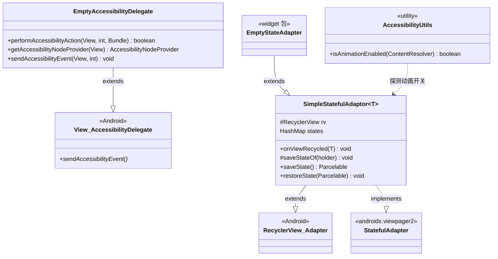
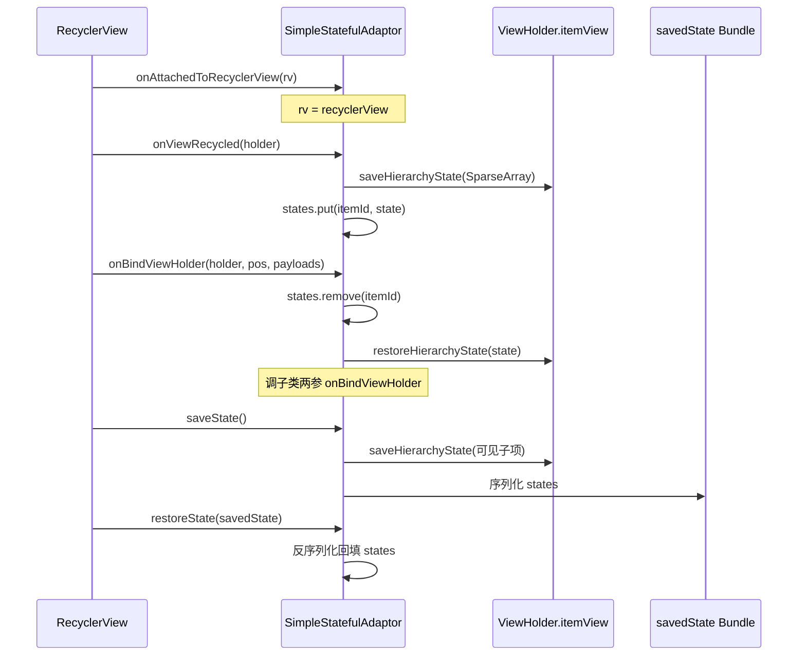
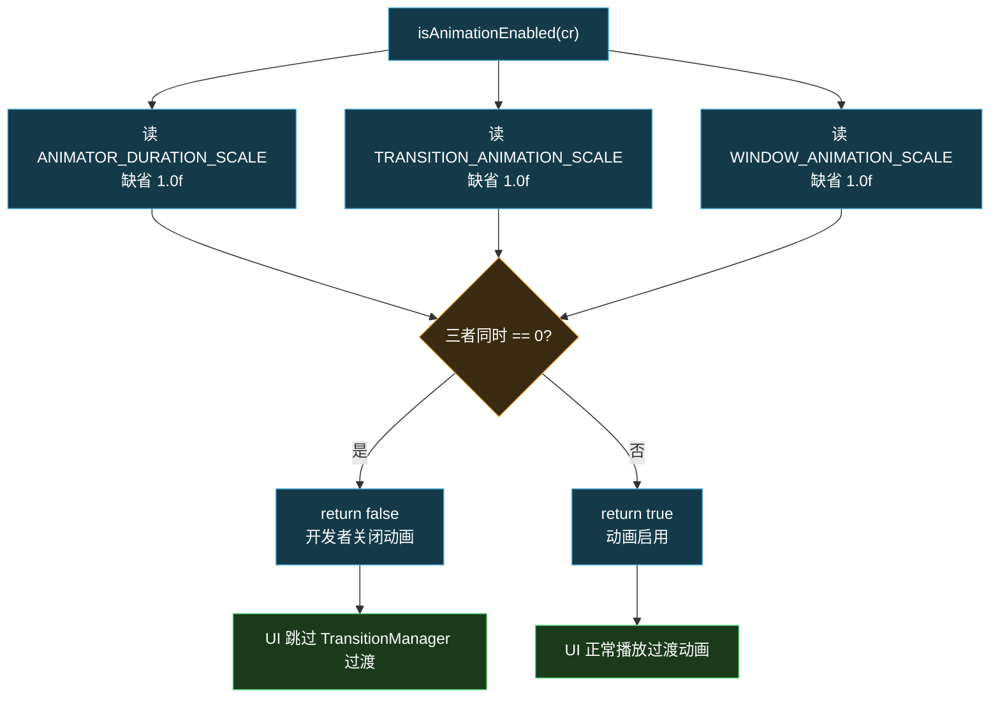
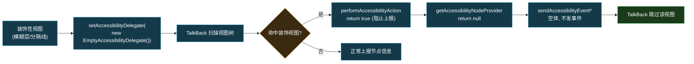

# ♿ AccessibilityUtils · 无障碍辅助

> 📂 [`app/src/main/java/org/lsposed/manager/util/`](https://github.com/android-security-engineer/Vector-skills/blob/master/app/src/main/java/org/lsposed/manager/util/)
> 🟦 app 模块 · 动画开关探测与无障碍占位委托

## 类协作

三个类都服务于 UI 无障碍/状态恢复：`AccessibilityUtils` 在动画开关探测点被调用；`EmptyAccessibilityDelegate` 经 `View.setAccessibilityDelegate` 装饰纯视觉视图；`SimpleStatefulAdaptor` 作为 RecyclerView 适配器基类，被 `EmptyStateAdapter` 等继承以保存条目状态。



`SimpleStatefulAdaptor` 的状态保存/恢复时序：



## 包职责

提供无障碍相关的小工具：检测系统动画是否被关闭（开发者选项里动画缩放为 0）、一个把无障碍事件全部吞掉的空委托、一个为 RecyclerView 适配器提供按条目状态保存的基类。

## 类清单

| 类 | 说明 |
| :--- | :--- |
| [`AccessibilityUtils`](#accessibilityutils) | 检测系统动画是否启用 |
| [`EmptyAccessibilityDelegate`](#emptyaccessibilitydelegate) | 屏蔽无障碍事件的空委托 |
| [`SimpleStatefulAdaptor`](#simplestatefuladaptor) | 按条目保存层级状态的适配器基类 |

---

## AccessibilityUtils

[`AccessibilityUtils.java`](https://github.com/android-security-engineer/Vector-skills/blob/master/app/src/main/java/org/lsposed/manager/util/AccessibilityUtils.java) —— `public class AccessibilityUtils` —— 单方法工具类。当三个动画缩放全局设置同时为 0 时认为动画被禁用，返回 false，UI 据此跳过过渡动画。

```java
public static boolean isAnimationEnabled(ContentResolver cr)
```

判定式：`!(ANIMATOR_DURATION_SCALE == 0 && TRANSITION_ANIMATION_SCALE == 0 && WINDOW_ANIMATION_SCALE == 0)`，缺省值 `1.0f`。

动画启用判定决策流程：



---

## EmptyAccessibilityDelegate

[`EmptyAccessibilityDelegate.java`](https://github.com/android-security-engineer/Vector-skills/blob/master/app/src/main/java/org/lsposed/manager/util/EmptyAccessibilityDelegate.java) —— `public class EmptyAccessibilityDelegate extends View.AccessibilityDelegate` —— 重写所有无障碍回调为空实现/返回阻断值。`performAccessibilityAction` 返回 `true`（已处理，阻止上报）、`getAccessibilityNodeProvider` 返回 `null`、其余事件回调为空体。用于装饰性视图（背景、模糊层）避免 TalkBack 噪音。

`EmptyAccessibilityDelegate` 屏蔽 TalkBack 的装饰流程：



```java
@Override public void sendAccessibilityEvent(View host, int eventType)
@Override public boolean performAccessibilityAction(View host, int action, Bundle args)
@Override public void sendAccessibilityEventUnchecked(View host, AccessibilityEvent event)
@Override public boolean dispatchPopulateAccessibilityEvent(View host, AccessibilityEvent event)
@Override public void onPopulateAccessibilityEvent(View host, AccessibilityEvent event)
@Override public void onInitializeAccessibilityEvent(View host, AccessibilityEvent event)
@Override public void onInitializeAccessibilityNodeInfo(View host, AccessibilityNodeInfo info)
@Override public void addExtraDataToAccessibilityNodeInfo(View host, AccessibilityNodeInfo info, String extraDataKey, Bundle arguments)
@Override public boolean onRequestSendAccessibilityEvent(ViewGroup host, View child, AccessibilityEvent event)
@Override public AccessibilityNodeProvider getAccessibilityNodeProvider(View host)
```

---

## SimpleStatefulAdaptor

[`SimpleStatefulAdaptor.java`](https://github.com/android-security-engineer/Vector-skills/blob/master/app/src/main/java/org/lsposed/manager/util/SimpleStatefulAdaptor.java) —— `public abstract class SimpleStatefulAdaptor<T extends RecyclerView.ViewHolder> extends RecyclerView.Adapter<T> implements StatefulAdapter` —— 为 RecyclerView 适配器提供**按 ViewHolder 保存 `itemView` 层级状态**的能力，配合 `StatefulRecyclerView` 跨配置变更恢复每个条目内控件（开关、输入）的状态。

### 关键字段

| 字段 | 类型 | 含义 |
| :--- | :--- | :--- |
| `states` | `HashMap<Long, SparseArray<Parcelable>>` | itemId → 条目层级状态 |
| `rv` | `RecyclerView` | attach 时记录宿主 |

### 方法签名

```java
public SimpleStatefulAdaptor()   // 设 PREVENT_WHEN_EMPTY 恢复策略

@Override @CallSuper
public void onAttachedToRecyclerView(@NonNull RecyclerView recyclerView)

@Override
public void onViewRecycled(@NonNull T holder)   // 回收时存状态

@CallSuper @Override
public final void onBindViewHolder(@NonNull T holder, int position, @NonNull List<Object> payloads)  // 绑定时恢复状态

@NonNull
public Parcelable saveState()   // 序列化所有条目状态

@Override
public void restoreState(@NonNull Parcelable savedState)   // 反序列化回填
```

回收时 `saveStateOf` 把 `itemView.saveHierarchyState` 存入 `states`；`onBindViewHolder`（payload 版本）取出并 `restoreHierarchyState`。`saveState` 遍历可见子项先存一遍，再把 `states` 序列化进 `Bundle`。

## 使用要点

- `EmptyAccessibilityDelegate` 通过 `View.setAccessibilityDelegate(...)` 装饰纯视觉视图（模糊层、分隔线），让 TalkBack 跳过它们；
- `SimpleStatefulAdaptor` 的 `onBindViewHolder` 被标记为 `final`，子类只需重写两参版本；`onViewRecycled` 已实现存状态，子类重写时须调 `super`；
- `PREVENT_WHEN_EMPTY` 策略：适配器在数据为空时不恢复状态，避免空列表误触发 `restoreState`；
- `AccessibilityUtils.isAnimationEnabled` 主要供过渡动画（如 `TransitionManager`）前的开关判断，开发者关闭动画时跳过可避免无意义耗时。

## 相关

- [StatefulRecyclerView · 状态保存基类](./stateful-recyclerview)（调用 `saveState`/`restoreState`）
- [app · adapters 包](../app-adapters)（`EmptyStateAdapter` 继承本类）
- [app 模块总览](../../modules/app)
