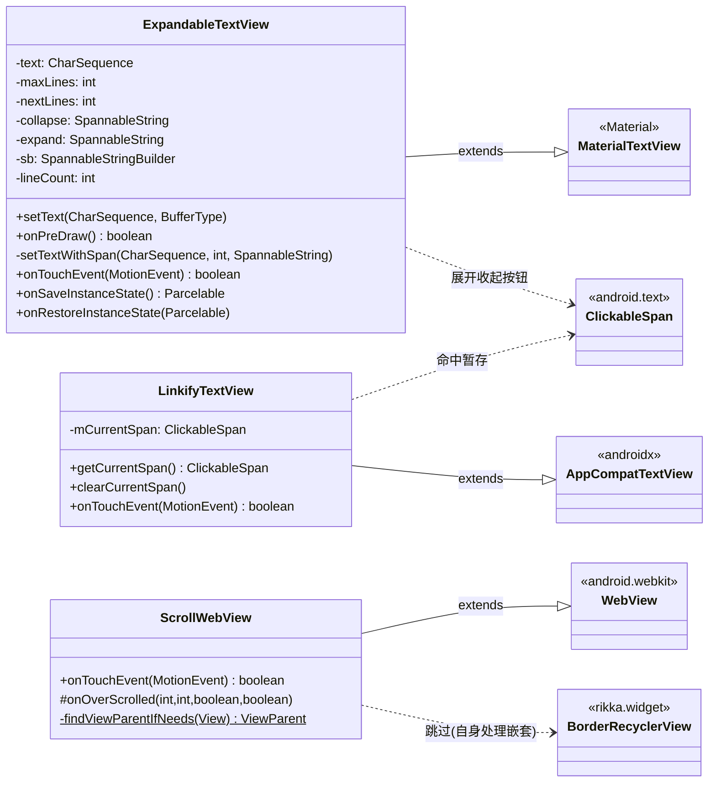
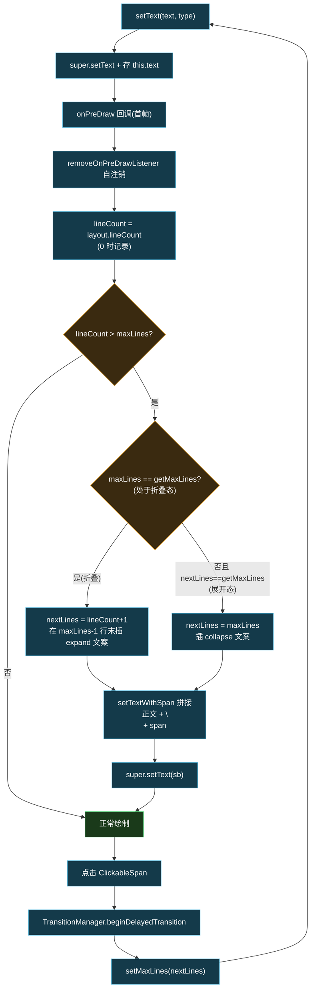
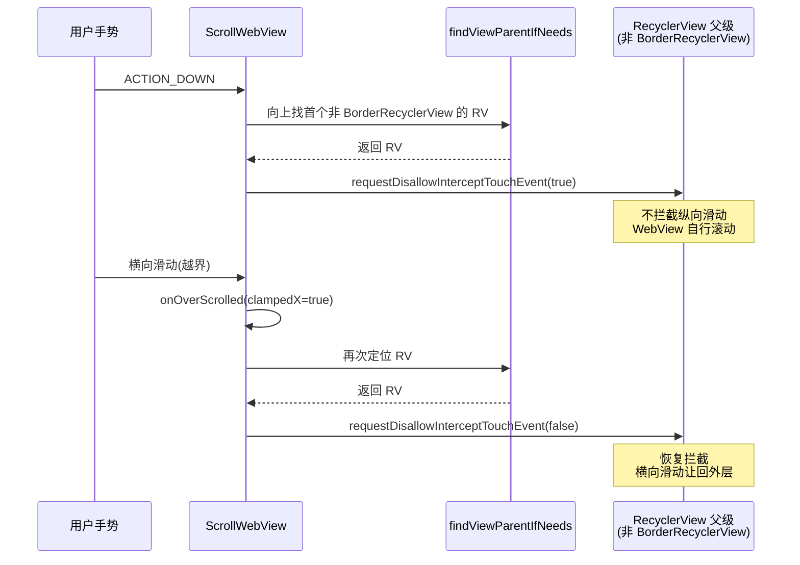

# 📝 ExpandableTextView · 文本与 WebView 控件

> 📂 [`app/src/main/java/org/lsposed/manager/ui/widget/`](https://github.com/android-security-engineer/Vector-skills/blob/master/app/src/main/java/org/lsposed/manager/ui/widget/)
> 🟦 app 模块 · 富文本展示控件集

## 包职责

为管理器提供三类文本/网页展示控件：可折叠展开的长文本、可识别链接点击的 TextView、嵌在 RecyclerView 里可独立滚动的 WebView。

## 类协作

三个控件各自继承不同基类，但都解决"父级手势/排版与子控件冲突"的细分问题：[`ExpandableTextView`](https://github.com/android-security-engineer/Vector-skills/blob/master/app/src/main/java/org/lsposed/manager/ui/widget/ExpandableTextView.java) 在首帧 `onPreDraw` 后追加展开/收起 `ClickableSpan`；[`LinkifyTextView`](https://github.com/android-security-engineer/Vector-skills/blob/master/app/src/main/java/org/lsposed/manager/ui/widget/LinkifyTextView.java) 在 `ACTION_DOWN` 时暂存命中 span 交父级处理；[`ScrollWebView`](https://github.com/android-security-engineer/Vector-skills/blob/master/app/src/main/java/org/lsposed/manager/ui/widget/ScrollWebView.java) 与父级 `RecyclerView` 协商拦截。



`ExpandableTextView` 的展开/收起切换流程：



## 类清单

| 类 | 说明 |
| :--- | :--- |
| [`ExpandableTextView`](#expandabletextview) | 超出最大行数时附"展开/收起"链接的长文本视图 |
| [`LinkifyTextView`](#linkifytextview) | 让父级接收链接点击、避免吞掉 ripple 的 TextView |
| [`ScrollWebView`](#scrollwebview) | 嵌在 RecyclerView 内、与父容器协作滚动的 WebView |

---

## ExpandableTextView

[`ExpandableTextView.java`](https://github.com/android-security-engineer/Vector-skills/blob/master/app/src/main/java/org/lsposed/manager/ui/widget/ExpandableTextView.java) —— `public class ExpandableTextView extends MaterialTextView` —— 首次 `onPreDraw` 测得真实行数后，若超过 `maxLines`，则在末行追加"展开"/"收起" `ClickableSpan`，点击通过 `TransitionManager.beginDelayedTransition` 平滑切换。

### 关键字段

| 字段 | 类型 | 含义 |
| :--- | :--- | :--- |
| `text` | `CharSequence` | 原始全文 |
| `maxLines` | `int` | 构造时快照的初始最大行数 |
| `nextLines` | `int` | 展开后的目标行数（`lineCount + 1`） |
| `collapse` / `expand` | `SpannableString` | 带 `ClickableSpan` 的"收起"/"展开"文案 |
| `sb` | `SpannableStringBuilder` | 拼接正文与提示文案的缓冲 |
| `lineCount` | `int` | 实际排版行数 |

### 方法签名

```java
public ExpandableTextView(Context context)
public ExpandableTextView(Context context, AttributeSet attrs)
public ExpandableTextView(Context context, AttributeSet attrs, int defStyle)

@Override
public void setText(CharSequence text, BufferType type)
@Override
public boolean onPreDraw()
private void setTextWithSpan(CharSequence text, int textOffsetEnd, SpannableString sbStr)
@Override
protected void onLayout(boolean changed, int left, int top, int right, int bottom)
@Override
public boolean onTouchEvent(@NonNull MotionEvent event)
@Override
public Parcelable onSaveInstanceState()
@Override
public void onRestoreInstanceState(Parcelable state)
```

`onTouchEvent` 仅在点击落到 `ClickableSpan` 时放行，避免空白区域吞掉父级手势。`onSaveInstanceState` 保存当前 `maxLines` 以跨配置变更保留展开态。

---

## LinkifyTextView

[`LinkifyTextView.java`](https://github.com/android-security-engineer/Vector-skills/blob/master/app/src/main/java/org/lsposed/manager/ui/widget/LinkifyTextView.java) —— `public class LinkifyTextView extends androidx.appcompat.widget.AppCompatTextView` —— 在 `ACTION_DOWN` 时解析命中的 `ClickableSpan` 暂存到 `mCurrentSpan`，随后 `super.onTouchEvent` 返回，让父级（ripple 容器）处理点击；避免普通 `LinkMovementMethod` 把整块区域据为己有。

```java
public ClickableSpan getCurrentSpan()
public void clearCurrentSpan()
@Override
public boolean onTouchEvent(@NonNull MotionEvent event)
```

---

## ScrollWebView

[`ScrollWebView.java`](https://github.com/android-security-engineer/Vector-skills/blob/master/app/src/main/java/org/lsposed/manager/ui/widget/ScrollWebView.java) —— `public class ScrollWebView extends WebView` —— 解决 WebView 嵌套在 RecyclerView 中时手势冲突。`ACTION_DOWN` 时向上找第一个非 `BorderRecyclerView` 的 `RecyclerView` 父级并 `requestDisallowInterceptTouchEvent(true)`；当横向滚动越界（`onOverScrolled` 的 `clampedX`）再释放拦截，把横向滑动让回外层。

```java
@Override
public boolean onTouchEvent(MotionEvent event)
@Override
protected void onOverScrolled(int scrollX, int scrollY, boolean clampedX, boolean clampedY)
private static ViewParent findViewParentIfNeeds(View v)
```

`ScrollWebView` 与父级 `RecyclerView` 的触摸事件协商时序：



## 使用要点

- `ExpandableTextView` 的 `maxLines` 在构造时从 XML 属性快照，运行时改 `setMaxLines` 不会重算提示位置；如需动态行数应重新创建实例；
- `onPreDraw` 首帧后即 `removeOnPreDrawListener` 自注销，避免每帧重入；`onLayout` 会刷新 `lineCount` 以适配换行变化；
- `LinkifyTextView` 的 `mCurrentSpan` 由父级在 `onClick` 中读取并 `clearCurrentSpan`，配合 ripple 实现"链接可点 + 卡片可点"共存；
- `ScrollWebView.findViewParentIfNeeds` 跳过 `BorderRecyclerView`（其自身已处理嵌套滚动），只对普通 `RecyclerView` 父级抢手势。

## 相关

- [StatefulRecyclerView · 状态保存基类](./stateful-recyclerview)
- [app 模块总览](../../modules/app)
