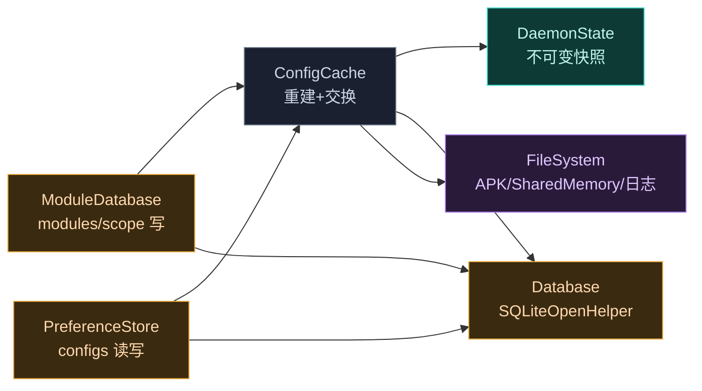

# daemon · data 包

> 📂 [`daemon/src/main/kotlin/org/matrix/vector/daemon/data/`](https://github.com/android-security-engineer/Vector-skills/blob/master/daemon/src/main/kotlin/org/matrix/vector/daemon/data/)
> 🗄️ 状态缓存·SQLite schema·偏好差分更新·模块文件系统

## 包职责

为 Daemon 提供**不可变状态快照**与**持久化层**：以 `DaemonState` 作为无锁读取的原子快照，`ConfigCache` 在后台协程重建快照并交换；`Database`/`ModuleDatabase`/`PreferenceStore` 落地到 SQLite；`FileSystem` 管理模块 APK 解析、SharedMemory 加载、日志归档与 SELinux 标签。

## 类清单

| 类 | 说明 |
| :--- | :--- |
| [`DaemonState`](#daemonstate) | 不可变状态快照容器，IPC 线程无锁读取 |
| [`ProcessScope`](#processscope) | 进程作用域键（进程名 + uid） |
| [`ConfigCache`](#configcache) | 状态缓存协调者，重建快照并原子交换 |
| [`Database`](#database) | SQLiteOpenHelper，定义 schema 与 LSPosed 迁移 |
| [`ModuleDatabase`](#moduledatabase) | 模块表写操作门面（启用/禁用/作用域） |
| [`PreferenceStore`](#preferencestore) | configs 表的偏好差分读写 |
| [`FileSystem`](#filesystem) | 路径常量、模块加载、日志导出、SELinux |



---

## DaemonState

`data class DaemonState(...)` — Daemon 全局状态的**不可变快照**。任何更新都生成新副本并原子交换 `ConfigCache.state` 引用，从而 IPC 线程可无锁读取。

### 字段

| 字段 | 类型 | 默认值 | 含义 |
| :--- | :--- | :--- | :--- |
| `isDexObfuscateEnabled` | `Boolean` | `!BuildConfig.DEBUG` | DEX 混淆开关（release 默认开） |
| `isCacheReady` | `Boolean` | `false` | 系统服务就绪后置 true |
| `managerUid` | `Int` | `-1` | 已验证管理器 UID，-1 表示未安装 |
| `miscPath` | `Path?` | `null` | 模块偏好/misc 数据根目录 |
| `modules` | `Map<String, Module>` | `emptyMap()` | 包名 → 已加载模块 |
| `scopes` | `Map<ProcessScope, List<Module>>` | `emptyMap()` | 进程作用域 → 生效模块列表 |

---

## ProcessScope

`data class ProcessScope(val processName: String, val uid: Int)` — 以进程名 + uid 唯一标识一个注入目标，作为 `scopes` 映射的键。`system_server` 固定使用 `ProcessScope("system_server", 1000)`。

---

## ConfigCache

`object ConfigCache` — 缓存协调者。持有 `@Volatile var state`，通过 `Channel<Unit>(CONFLATED)` 合并重复的更新请求，后台协程串行执行 `performCacheUpdate()` 重建快照并原子交换。

### 关键状态

```kotlin
@Volatile var state = DaemonState()   // 唯一可变引用，原子交换
val dbHelper = Database()              // 公开供 ModuleDatabase / PreferenceStore 复用
private val cacheUpdateChannel = Channel<Unit>(Channel.CONFLATED)
```

### 主要方法

```kotlin
// 触发一次合并的缓存更新（非阻塞）
fun requestCacheUpdate()

// 刷新管理器 UID；uninstalled=true 时置 -1 并跳过校验
fun updateManager(uninstalled: Boolean)

// 判断 uid 是否为已验证管理器（含注入 UID）
fun isManager(uid: Int): Boolean

// 返回某进程应加载的模块（system_server 走专用路径）
fun getModulesForProcess(processName: String, uid: Int): List<Module>

// system_server 专用：含 SELinux execmem 检查与 PackageParser 回退
fun getModulesForSystemServer(): List<Module>

// 由 uid 反查模块（appId = uid % PER_USER_RANGE）
fun getModuleByUid(uid: Int): Module?

// 查询模块的作用域应用列表
fun getModuleScope(packageName: String): MutableList<Application>?

// auto_include 标记：新装应用自动加入该模块作用域
fun getAutoInclude(packageName: String): Boolean
fun getAutoIncludeModules(): List<String>

// 判断该进程是否在 scopes 中（不在则跳过注入）
fun shouldSkipProcess(scope: ProcessScope): Boolean

// 解析某 APK 是否含 Xposed init 文件，返回首个匹配的 split 路径
fun getModuleApkPath(info: ApplicationInfo): String?

// 跨用户枚举所有已安装模块
fun getInstalledModules(): List<ApplicationInfo>

// 准备模块偏好目录，递归 chown/chmod（根目录 755，子目录 711，文件 744）
fun getPrefsPath(packageName: String, uid: Int): String
```

### 缓存重建流程

`performCacheUpdate()` 是核心私有方法，流程：

1. 查询 `modules` 表中 `enabled=1` 的行，逐包跨用户解析 `PackageInfo`
2. 复用旧快照中路径未变的模块（避免重复 `loadModule`）；否则提取 APK、`FileSystem.loadModule` 加载到 SharedMemory
3. 标记无法解析的包为 `obsoleteModules`，清理 DB
4. 查询 `scope INNER JOIN modules`，对每个作用域应用枚举其所有进程名，构建 `ProcessScope → List<Module>`；模块自身包名匹配时跨用户扩展
5. **原子交换**：`state = oldState.copy(modules = newModules, scopes = newScopes)`

`ensureCacheReady()` 在系统 binder 就绪时触发首次更新并置 `isCacheReady=true`，采用双重检查锁。

---

## Database

`class Database(context: Context? = FakeContext()) : SQLiteOpenHelper(context, FileSystem.dbPath.absolutePath, null, DB_VERSION)` — SQLite schema 定义与版本迁移。`DB_VERSION = 4`。

### PRAGMA 配置（onConfigure）

- `setForeignKeyConstraintsEnabled(true)` — 启用外键级联删除
- `enableWriteAheadLogging()` — WAL 模式
- `PRAGMA synchronous=NORMAL` — 提升写性能

### 表结构（onCreate）

| 表 | 主键 | 关键列 | 说明 |
| :--- | :--- | :--- | :--- |
| `modules` | `mid` (AUTOINCREMENT) | `module_pkg_name` UNIQUE, `apk_path`, `enabled`, `auto_include` | 模块注册表 |
| `scope` | `(mid, app_pkg_name, user_id)` | FK `mid → modules(mid) ON DELETE CASCADE` | 模块-应用作用域 |
| `configs` | `(module_pkg_name, user_id, group, key)` | `data` BLOB, FK → `modules(module_pkg_name)` | 模块偏好键值 |

创建时自动插入自身记录：`INSERT OR IGNORE INTO modules (module_pkg_name, apk_path) VALUES ('lspd', managerApkPath)`。

`configs_idx` 索引建立在 `(module_pkg_name, user_id)` 上。

### 版本迁移

- **onUpgrade**：`<2` 重建 scope/configs 表以加严格约束并迁移数据；`<3` 将 `android` 重命名为 `system`；`<4` 新增 `auto_include` 列
- **onDowngrade**：检测到 LSPosed 数据库（`oldVersion < 101` 全量重置；否则备份为 `modules_config_lsposed.db`，重命名 LSPosed 表为 `lsp_*` 避免冲突，重建 Vector schema 后迁移 modules/scope/configs 数据，最后清理临时表）

---

## ModuleDatabase

`object ModuleDatabase` — `modules` 与 `scope` 表的**写操作门面**，所有写操作成功后调用 `ConfigCache.requestCacheUpdate()`。`lspd` 自身记录受保护，所有方法对其返回 `false`。

```kotlin
fun enableModule(packageName: String): Boolean       // 不存在则插入并 enabled=1
fun disableModule(packageName: String): Boolean
fun setModuleScope(packageName: String, scope: MutableList<Application>): Boolean  // 事务内重建 scope
fun removeModuleScope(packageName: String, scopePackageName: String, userId: Int): Boolean
fun updateModuleApkPath(packageName: String, apkPath: String?, force: Boolean): Boolean
fun removeModule(packageName: String): Boolean
fun setAutoInclude(packageName: String, enabled: Boolean): Boolean
```

`setModuleScope` 在事务内先查出 `mid`，删除该模块所有 scope 行，再批量 `INSERT OR IGNORE`；`system` 作用域仅接受 `userId=0`。

---

## PreferenceStore

`object PreferenceStore` — `configs` 表的偏好读写层。值经 `SerializationUtilsX` 序列化为 BLOB 存储；反序列化失败则跳过该键。

```kotlin
// 读取某模块某 group 下全部偏好
fun getModulePrefs(packageName: String, userId: Int, group: String,
                   db: SQLiteDatabase = ConfigCache.dbHelper.readableDatabase): Map<String, Any>

// 单键更新（委托给批量）
fun updateModulePref(moduleName: String, userId: Int, group: String, key: String, value: Any?)

// 批量差分更新：Serializable 写入（CONFLICT_REPLACE），非 Serializable 视为删除
fun updateModulePrefs(moduleName: String, userId: Int, group: String, diff: Map<String, Any?>)

// 删除偏好（userId/group 可选过滤）
fun deleteModulePrefs(moduleName: String, userId: Int? = null, group: String? = null)
```

### 内置 lspd 配置快捷方法

| 方法 | 配置键 | 默认值 |
| :--- | :--- | :--- |
| `isStatusNotificationEnabled()` / `setStatusNotification()` | `enable_status_notification` | `true` |
| `isVerboseLogEnabled()` / `setVerboseLog()` | `enable_verbose_log` | `true` |
| `isScopeRequestBlocked(pkg)` | `scope_request_blocked` (Set) | `false` |

---

## FileSystem

`object FileSystem` — Daemon 的文件系统抽象：路径常量、模块 APK 解析与 SharedMemory 加载、日志归档、SELinux 上下文、文件锁。

### 路径常量

| 常量 | 路径 |
| :--- | :--- |
| `basePath` | `/data/adb/lspd` |
| `configDirPath` | `basePath/config` |
| `dbPath` | `configDirPath/modules_config.db` |
| `modulePath` | `basePath/modules` |
| `logDirPath` / `oldLogDirPath` | `basePath/log` / `basePath/log.old` |
| `socketPath` | `basePath/.cli_sock` |
| `daemonApkPath` | `java.class.path` |
| `managerApkPath` | `daemonApkPath.parent/manager.apk` |

初始化时创建 `basePath`（权限 700，SELinux `system_file:s0`）与 `configDirPath`。

### 进程单例与锁

```kotlin
fun tryLock(): Boolean   // FileLock，失败说明已有 daemon 运行
fun setupCli(): String   // 部署 CLI 脚本并返回 socket 路径
```

### 模块加载

```kotlin
// 解析 APK：读 module.prop 判定 targetApi，按优先级 MODERN(101+) > LEGACY > UNSUPPORTED(100)
// 提取 java_init.list/native_init.list，逐个 classes*.dex 读入 SharedMemory
fun loadModule(apkPath: String, obfuscate: Boolean): PreLoadedApk?

// 加载框架 lspd.dex 到 preloadDex（懒加载、@Synchronized）
fun getPreloadDex(obfuscate: Boolean): SharedMemory?
```

`readDex` 将 DEX 读入 `SharedMemory`，可选经 `ObfuscationManager.obfuscateDex` 混淆后设为 `PROT_READ`。

### SELinux 与权限

```kotlin
fun setSelinuxContextRecursive(path: Path, context: String)   // 递归设置 SELinux 标签
fun chattr0(path: Path): Boolean                              // 清除 immutable 等 special 属性
fun resolveModuleDir(packageName, dir, userId, uid): Path     // 创建模块数据目录并设置 xposed_data:s0
fun toGlobalNamespace(path: String): File                     // 经 /proc/1/root 访问全局命名空间
fun ensureModuleFilePath(path: String?)                        // 校验路径无遍历（防 ../）
```

### 日志归档

```kotlin
fun moveLogDir()                          // chattr0 + 旧目录改名备份 + 新建
fun getPropsPath(): File                  // props.txt
fun getKmsgPath(): File                   // kmsg.log
fun getNewVerboseLogPath(): File          // verbose_<timestamp>.log
fun getNewModulesLogPath(): File          // modules_<timestamp>.log
fun getLogs(zipFd: ParcelFileDescriptor)  // 汇总 tombstones/anr/crash/logcat/dmesg/模块状态/proc/maps 到 ZIP
```

`getLogs` 把调用者 pid（`Binder.getCallingPid()`）与 daemon 自身的 `maps/mountinfo/status` 一并打包，并导出当前 `scopes.txt`。

### 资源

`val resources: Resources` — 通过反射 `AssetManager.addAssetPath` 加载 daemon APK 资源，供 `FakeContext` 在无真实 Context 时访问字符串/Drawable。

## 相关

- [daemon 模块总览](../modules/daemon)
- [daemon · env 包](./daemon-env)（socket 服务、进程监控）
- [daemon · ipc 包](./daemon-ipc)（消费 ConfigCache 的 AIDL 端点）
- 并发与原子交换机制见 [架构 · daemon · 并发](../../architecture/daemon#并发与状态管理)
