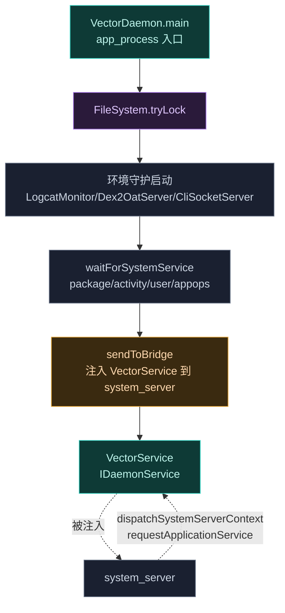

# daemon · 入口与主服务

> 📂 [`daemon/src/main/kotlin/org/matrix/vector/daemon/`](https://github.com/android-security-engineer/Vector-skills/blob/master/daemon/src/main/kotlin/org/matrix/vector/daemon/)（根目录文件）
> 🚀 进程入口·主 `IDaemonService`·CLI 客户端

## 包职责

根目录三个文件构成 Daemon 的启动与对外骨架：`VectorDaemon` 是经 `app_process` 引导的进程入口，负责初始化所有子系统并向 system_server 注入桥接 binder；`VectorService` 是注入后的主 `IDaemonService` 实现，接收 system_server 上下文、注册 OS 广播与 UID 观察者、分发各类系统事件；`Cli.kt` 是独立的 CLI 客户端进程，经本地 socket 与 daemon 通信。

## 文件清单

| 文件 | 说明 |
| :--- | :--- |
| [`VectorDaemon`](#vectordaemon) | 进程入口 object，启动子系统、注入桥接、处理 system_server 崩溃 |
| [`VectorService`](#vectorservice) | `IDaemonService` 实现，系统事件分发中枢 |
| [`Cli.kt`](#clikt) | CLI 客户端：IPC 数据模型、传输、格式化、picocli 命令 |



---

## VectorDaemon

`object VectorDaemon` — Daemon 进程入口。`@JvmStatic fun main(args)` 经 `app_process` 引导调用。

### 全局状态

```kotlin
private val exceptionHandler = CoroutineExceptionHandler { context, throwable -> ... }
val scope = CoroutineScope(Dispatchers.IO + SupervisorJob() + exceptionHandler)
val bridgeServiceName = "activity"
var isLateInject = false
var proxyServiceName = "serial"   // --late-inject 时改为 "serial_vector"
```

`Dispatchers.IO + SupervisorJob()` 确保单个后台任务失败不会拖垮整个 daemon。

### main 启动流程

```kotlin
@JvmStatic
fun main(args: Array<String>)
```

1. `FileSystem.tryLock()` 失败即 `exitProcess(0)`（已有 daemon 运行）
2. 解析参数：`--system-server-max-retry=N`（默认 1）、`--late-inject`（置 `isLateInject=true`，`proxyServiceName="serial_vector"`）
3. 设置 `Thread.setDefaultUncaughtExceptionHandler`（记日志后 `exitProcess(1)`）
4. `Process.setThreadPriority(THREAD_PRIORITY_FOREGROUND)` + `Looper.prepareMainLooper()`
5. `SystemServerService.registerProxyService(proxyServiceName)` — **立即抢占服务名**，为 Zygisk 模块在 system_server 特化时建立早期 IPC 通道
6. 启动环境守护：`LogcatMonitor.start()`；Q+ 启 `Dex2OatServer.start()`；`CliSocketServer.start()`
7. 协程预加载 `FileSystem.getPreloadDex(...)`
8. `ActivityThread.systemMain()` 在 daemon 进程内初始化系统框架；`DdmHandleAppName.setAppName("org.matrix.vector.daemon", 0)`
9. `waitForSystemService` 阻塞等待 `package` / `activity` / `USER_SERVICE` / `APP_OPS_SERVICE`
10. `applyNotificationWorkaround()`
11. `sendToBridge(VectorService.asBinder(), false, systemServerMaxRetry)` — 注入主服务
12. 非 verbose 时 `LogcatMonitor.stopVerbose()`
13. `Looper.loop()`

### waitForSystemService

```kotlin
private fun waitForSystemService(name: String) = runBlocking {
    while (ServiceManager.getService(name) == null) { delay(1000) }
}
```

### sendToBridge（注入与崩溃恢复）

```kotlin
private fun sendToBridge(binder: IBinder, isRestart: Boolean, restartRetry: Int)
```

必须在主线程执行。`Os.seteuid(0)` 提权后：

1. 轮询等待 `bridgeServiceName`（"activity"）就绪并 `pingBinder`
2. 注册 `DeathRecipient`：system_server 死亡时 → `unlinkToDeath` → `clearSystemCaches()` → `SystemServerService.binderDied()` → `ServiceManager.addService(proxyServiceName, SystemServerService)` 重新占位 → `ManagerService.guard = null` → 主线程 `Handler.post { sendToBridge(binder, true, retry-1) }`
3. 用 `BRIDGE_TRANSACTION_CODE` + `ACTION_SEND_BINDER`（=1）transact，最多重试 3 次，每次 `Thread.sleep(1000)`
4. 成功记日志；失败且 `restartRetry > 0` 则 `restartSystemServer()`
5. `Os.seteuid(1000)` 降权

### clearSystemCaches

反射清空 `ServiceManager.sServiceManager` / `sCache` 与 `ActivityManager.IActivityManager_singleton.mInstance`，确保 system_server 重启后 binder 缓存重建。

### restartSystemServer

```kotlin
fun restartSystemServer()
```

根据 `SUPPORTED_64/32_BIT_ABIS` 选择 `zygote_secondary` 或 `zygote`，`SystemProperties.set("ctl.restart", target)` 触发系统重启。

---

## VectorService

`object VectorService : IDaemonService.Stub()` — 注入到 system_server 的主服务，承担系统事件分发中枢职责。

### 状态

```kotlin
private var bootCompleted = false
private val ACTION_SECRET_CODE = ...   // Q+: TelephonyManager.ACTION_SECRET_CODE，以下 Telephony.Sms.Intents
```

### dispatchSystemServerContext

```kotlin
override fun dispatchSystemServerContext(appThread: IBinder?, activityToken: IBinder?)
```

填充 `SystemContext.appThread`（`IApplicationThread.Stub.asInterface`）与 `SystemContext.token`，随后 `registerReceivers()`。`isLateInject` 时强制 `dispatchBootCompleted()`。

### requestApplicationService

```kotlin
override fun requestApplicationService(uid, pid, processName, heartBeat): ILSPApplicationService?
```

仅接受 `callingUid == 1000`；已注册则返回 null；先尝试 `ManagerService.tryRegisterManagerProcess`，否则 `ConfigCache.shouldSkipProcess` 决定是否跳过；最终经 `ApplicationService.registerHeartBeat` 返回 `ApplicationService`。

### preStartManager

```kotlin
override fun preStartManager() = ManagerService.preStartManager()
```

### createReceiver 与 registerReceivers

`createReceiver()` 返回 `IIntentReceiver.Stub`，`performReceive` 在 `VectorDaemon.scope` 协程中按 action 分发，并对有序广播调 `finishReceiver`（U+ 用 `appThread.asBinder()`，以下用 `this`）。

分发路由：

| action | 处理 |
| :--- | :--- |
| `ACTION_LOCKED_BOOT_COMPLETED` | `dispatchBootCompleted()` |
| `ACTION_CONFIGURATION_CHANGED` | `dispatchConfigurationChanged()` |
| `NotificationManager.openManagerAction` | `ManagerService.openManager(intent.data)` |
| `ACTION_SECRET_CODE` | `ManagerService.openManager(intent.data)` |
| `NotificationManager.moduleScopeAction` | `dispatchModuleScope(intent)` |
| 其他 | `dispatchPackageChanged(intent)` |

`registerReceivers()` 注册的 IntentFilter：configuration / package（added/changed/fully_removed，dataScheme=package）/ uid_removed / locked_boot_completed（SYSTEM_HIGH_PRIORITY）/ openManager（有/无 dataScheme）/ moduleScope / **secretCode**（authority `5776733` = 拨号盘 `*#*#5776733#*#*`）。

除 secretCode 用 `RECEIVER_EXPORTED` + `CONTROL_INCALL_EXPERIENCE` 权限外，其余均 `RECEIVER_NOT_EXPORTED` + `BRICK` 权限（仅 Android 系统可发）。

UID 观察者 `IUidObserver`：`onUidActive` / `onUidCachedChanged(false)` / `onUidIdle` → `ModuleService.uidStarts`；`onUidGone` → `ModuleService.uidGone`。注册标志为 `ACTIVE|GONE|IDLE|CACHED`。

### dispatchBootCompleted / ConfigurationChanged

```kotlin
private fun dispatchBootCompleted()        // bootCompleted=true，按偏好发状态通知
private fun dispatchConfigurationChanged() // 已开机则按偏好更新状态通知
```

### dispatchPackageChanged

处理 `ACTION_PACKAGE_ADDED/CHANGED/FULLY_REMOVED` 与 `ACTION_UID_REMOVED`：

- **FULLY_REMOVED**：`deleteModulePrefs`（按 `EXTRA_REMOVED_FOR_ALL_USERS` 决定全用户/单用户），全用户移除时 `ModuleDatabase.removeModule`
- **ADDED/CHANGED**：是 Xposed 模块（`xposedminversion` meta 或含 init 文件）则 `updateModuleApkPath`；非模块但曾为作用域目标则 `requestCacheUpdate`；新装非替换应用按 `getAutoIncludeModules` 自动追加作用域
- **UID_REMOVED**：相关则 `requestCacheUpdate`
- 管理器自身变化（userId=0）→ `ConfigCache.updateManager(isRemovedAction)`
- 广播 `ACTION_MANAGER_NOTIFICATION` 通知寄生/独立管理器刷新 UI（带 `FLAG_RECEIVER_INCLUDE_BACKGROUND | FROM_SHELL`）
- 模块更新（非移除）→ `NotificationManager.notifyModuleUpdated`

### dispatchModuleScope

```kotlin
private fun dispatchModuleScope(intent: Intent)
```

解析 `module:` URI（authority `modulePkg:userId`，path `scopePkg`，query `action`）与 `extras.getBinder("callback")`，按 action 处理：

| action | 处理 |
| :--- | :--- |
| `approve` | 追加到作用域并 `setModuleScope`，`onScopeRequestApproved` |
| `deny` | `onScopeRequestFailed("Request denied by user")` |
| `delete` | `onScopeRequestFailed("Request timeout")` |
| `block` | 写入 `scope_request_blocked` Set，`onScopeRequestFailed` |

最后 `NotificationManager.cancelNotification(SCOPE_CHANNEL_ID, ...)`。

### 私有常量

```kotlin
private const val EXTRA_REMOVED_FOR_ALL_USERS = "android.intent.extra.REMOVED_FOR_ALL_USERS"
private const val EXTRA_USER_HANDLE = "android.intent.extra.user_handle"
private const val ACTION_MANAGER_NOTIFICATION = "${DEFAULT_MANAGER_PACKAGE_NAME}.NOTIFICATION"
private const val FLAG_RECEIVER_INCLUDE_BACKGROUND = 0x01000000
private const val FLAG_RECEIVER_FROM_SHELL = 0x00400000
```

---

## Cli.kt

独立的 CLI 客户端进程，必须以 root 运行。包含 IPC 数据模型、传输逻辑、输出格式化与 picocli 命令树。

### IPC 数据模型

```kotlin
data class CliRequest(command: String, action: String = "",
                      targets: List<String> = emptyList(), options: Map<String, Any> = emptyMap())

data class CliResponse(success: Boolean, data: Any? = null,
                       error: String? = null, isFdAttached: Boolean = false)
```

### VectorIPC

```kotlin
object VectorIPC {
    val gson: Gson = GsonBuilder()
        .setObjectToNumberStrategy(ToNumberPolicy.LONG_OR_DOUBLE)
        .setNumberToNumberStrategy(ToNumberPolicy.LONG_OR_DOUBLE)
        .setPrettyPrinting().create()

    fun transmit(request: CliRequest): CliResponse
    private fun streamLog(fd: FileDescriptor, follow: Boolean)
}
```

`transmit`：连接 `FileSystem.socketPath`，发送 `CLI_TOKEN_MSB/LSB` 令牌 + JSON 请求，读回 JSON 响应；`isFdAttached` 时读触发字节并经 `getAncillaryFileDescriptors()` 取 FD，调 `streamLog`。

`streamLog`：`FileInputStream(fd).use` 逐行打印；`follow=true` 时 EOF 后 `sleep 100ms` 持续轮询，`Thread.interrupted()`（shutdown hook 触发）时退出。

### OutputFormatter

```kotlin
object OutputFormatter {
    fun print(response: CliResponse, isJson: Boolean): Int
    private fun printTable(rows: List<Map<String, Any>>)
}
```

`--json` 时输出完整 JSON；否则对 `List<Map>` 渲染等宽 ASCII 表（自动算列宽、大写表头、分隔线），`Map` 渲染为 `key: value`，其他 `toString`。失败时写 stderr 返回 1。

### Cli 主命令

```kotlin
@Command(name = "vector-cli", mixinStandardHelpOptions = true,
         version = ["Vector CLI ${BuildConfig.VERSION_NAME}"],
         subcommands = [StatusCommand, ModulesCommand, ScopeCommand,
                        ConfigCommand, DatabaseCommand, LogCommand])
class Cli : Callable<Int>
```

`@Option --json`（`ScopeType.INHERIT`，子命令继承）。`main` 校验 `Process.myUid() == 0`，注册 shutdown hook 中断主线程（用于 `tail` 流式退出），`CommandLine(Cli()).execute(*args)`。

### 子命令

| 命令 | 子命令 | 说明 |
| :--- | :--- | :--- |
| `status` | — | 框架与系统健康状态 |
| `modules` | `ls` (`-e`/`-d`), `enable`, `disable` | 列出/启用/禁用模块（批量） |
| `scope` | `ls`, `add`, `set`, `rm` | 作用域管理，target 格式 `pkg/user_id` |
| `config` | `get`, `set` | `status-notification` / `verbose-log` |
| `db` | `backup`, `restore`, `reset` (`--force`) | 数据库维护，reset 需确认 |
| `log` | `cat` (`-v`), `tail` (`-v`), `clear` (`-v`) | 日志 dump / follow / 清空 |

每个子命令构造对应 `CliRequest` 经 `VectorIPC.transmit` 发送，结果交 `OutputFormatter.print`。`log cat/tail` 不格式化（直接流式输出）。

`db reset` 非 `--force` 时交互确认：`Are you sure... (y/N):`，输入非 `y` 取消。

## 相关

- [daemon 模块总览](../modules/daemon)
- [daemon · ipc 包](./daemon-ipc)（VectorService 调用的 AIDL 端点与 CliHandler）
- [daemon · env 包](./daemon-env)（启动的三个环境守护）
- [daemon · data 包](./daemon-data)（FileSystem.tryLock/socketPath 等）
- [架构 · Daemon 守护进程](../../architecture/daemon)
