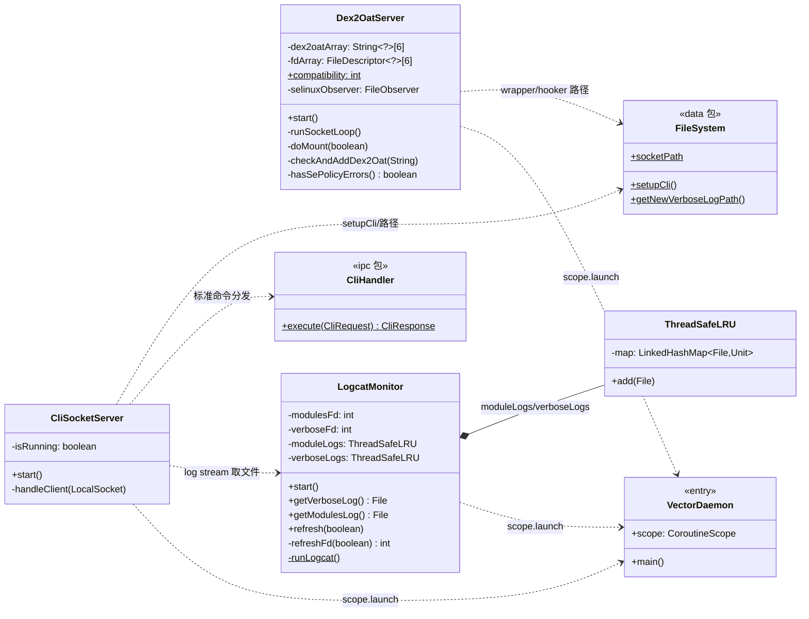
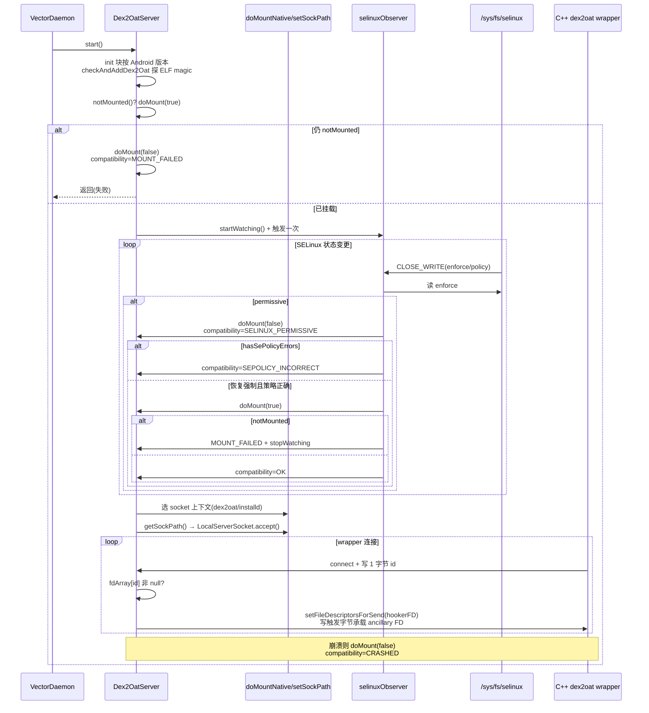
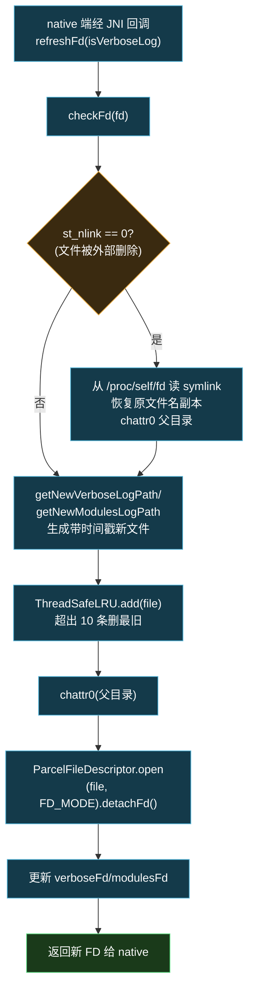

# daemon · env 包

> 📂 [`daemon/src/main/kotlin/org/matrix/vector/daemon/env/`](https://github.com/android-security-engineer/Vector-skills/blob/master/daemon/src/main/kotlin/org/matrix/vector/daemon/env/)
> 🌐 UNIX domain socket 服务·native 进程监控·dex2oat 劫持

## 包职责

为 Daemon 提供三个**独立运行的环境守护**：`CliSocketServer` 接收 CLI 的本地 socket 连接；`Dex2OatServer` 通过 bind mount 劫持系统 dex2oat 并向 wrapper 提供 hooker FD；`LogcatMonitor` 驱动 native logcat 进程，按 tag 分流到 modules/verbose 日志文件。

## 类协作

三个 `object` 均挂在 [`VectorDaemon.scope`](./daemon-entry#vectordaemon) 协程上独立运行，互不阻塞。[`CliSocketServer`](https://github.com/android-security-engineer/Vector-skills/blob/master/daemon/src/main/kotlin/org/matrix/vector/daemon/env/CliSocketServer.kt) 在日志流命令时直接调用 [`LogcatMonitor`](https://github.com/android-security-engineer/Vector-skills/blob/master/daemon/src/main/kotlin/org/matrix/vector/daemon/env/LogcatMonitor.kt) 取日志文件经 ancillary FD 回传；[`Dex2OatServer`](https://github.com/android-security-engineer/Vector-skills/blob/master/daemon/src/main/kotlin/org/matrix/vector/daemon/env/Dex2OatServer.kt) 通过 native `doMountNative`/`getSockPath` 与 C++ wrapper 交互。三者都依赖 [`FileSystem`](./daemon-data#filesystem) 提供路径与资源。



`Dex2OatServer` 的劫持与 SELinux 监听时序：



## 类清单

| 类 | 说明 |
| :--- | :--- |
| [`CliSocketServer`](#clisocketserver) | CLI 的 UNIX domain socket 服务端，校验令牌后分发命令 |
| [`Dex2OatServer`](#dex2oatserver) | dex2oat 劫持：bind mount + SELinux 监听 + wrapper socket |
| [`LogcatMonitor`](#logcatmonitor) | native logcat 驱动，FD 轮转与日志文件管理 |

---

## CliSocketServer

[`CliSocketServer.kt`](https://github.com/android-security-engineer/Vector-skills/blob/master/daemon/src/main/kotlin/org/matrix/vector/daemon/env/CliSocketServer.kt) — `object CliSocketServer` — 在 `FileSystem.socketPath`（`.cli_sock`）上监听的本地 socket 服务。低优先级后台线程 accept，每个客户端在 `VectorDaemon.scope` 协程中处理。

### 启动与协议

```kotlin
fun start()   // 幂等，已在运行则直接返回
```

连接建立后协议为：

1. 客户端发送 **安全令牌**：两个 `Long`（`CLI_TOKEN_MSB` / `CLI_TOKEN_LSB`），不匹配立即关闭
2. 客户端发送 `readUTF()` 的 JSON `CliRequest`
3. 服务端返回 `readUTF()` 的 JSON `CliResponse`

### 特殊处理：日志流

`log` + `stream` 命令在进入 `CliHandler` 前被拦截：

```kotlin
// 命中 log/stream 时，打开对应日志文件并经 ancillary FD 传回客户端
if (request.command == "log" && request.action == "stream") {
    val logFile = if (verbose) LogcatMonitor.getVerboseLog() else LogcatMonitor.getModulesLog()
    // 写回 CliResponse(isFdAttached=true) 后
    socket.setFileDescriptorsForSend(arrayOf(fd))
    output.write(1)   // 触发字节，承载 ancillary FD
}
```

其余标准命令委托 `CliHandler.execute(request)`。线程命名为 `VectorCliListener`，优先级 `MIN_PRIORITY`。

实现细节：先用 `LocalSocket().bind(FILESYSTEM)` 绑定路径，再 `Os.listen(fd, 50)` 进入监听态，最后用 `LocalServerSocket(fd)` 包装，绕开 `LocalServerSocket(String)` 的命名空间限制。socket 文件在 `finally` 中删除。

---

## Dex2OatServer

[`Dex2OatServer.kt`](https://github.com/android-security-engineer/Vector-skills/blob/master/daemon/src/main/kotlin/org/matrix/vector/daemon/env/Dex2OatServer.kt) — `object Dex2OatServer` — 劫持系统 dex2oat 编译管线。通过 bind mount 把 wrapper（`bin/dex2oat32/64`）覆盖到真实的 dex2oat 上，wrapper 通过 socket 向 daemon 请求 hooker `.so` 的 FD，从而注入 LSPlant。详见 [dex2oat 劫持](../modules/dex2oat)。

### 兼容性状态常量

| 常量 | 值 | 含义 |
| :--- | :--- | :--- |
| `DEX2OAT_OK` | `0` | 正常工作 |
| `DEX2OAT_MOUNT_FAILED` | `1` | bind mount 失败 |
| `DEX2OAT_SEPOLICY_INCORRECT` | `2` | sepolicy 缺失所需规则 |
| `DEX2OAT_SELINUX_PERMISSIVE` | `3` | SELinux 处于 permissive |
| `DEX2OAT_CRASHED` | `4` | wrapper daemon 崩溃 |

`@Volatile var compatibility` 暴露当前状态（`private set`），由 `ManagerService.getDex2OatWrapperCompatibility()` 返回给管理器。

### wrapper 与 hooker 路径常量

```kotlin
private const val WRAPPER32 = "bin/dex2oat32"
private const val WRAPPER64 = "bin/dex2oat64"
private const val HOOKER32  = "bin/liboat_hook32.so"
private const val HOOKER64  = "bin/liboat_hook64.so"
```

### native 方法

```kotlin
private external fun doMountNative(enabled: Boolean, r32: String?, d32: String?,
                                   r64: String?, d64: String?)
private external fun setSockCreateContext(context: String?): Boolean
private external fun getSockPath(): String
```

### 初始化与检测

`init` 块按 Android 版本探测真实 dex2oat 路径：

- Android 10（Q）：`/apex/com.android.runtime/bin/dex2oat{,d,64,d64}`
- Android 11+：`/apex/com.android.art/bin/dex2oat{32,d32,64,d64}`

`checkAndAddDex2Oat` 读取文件头验证 ELF magic（`0x7F 'E' 'L' 'F'`），按 `EI_CLASS`（1=32bit, 2=64bit）与是否含 `dex2oatd`（debug）分配到 `dex2oatArray` 的 0~3 槽位；同时 `Os.open` 拿到 FD 存入 `fdArray[0..3]`。`fdArray[4..5]` 固定为 zygisk 模块下的 `liboat_hook32/64.so`。

### SELinux 状态监听

`selinuxObserver` 是一个 `FileObserver`，监视 `/sys/fs/selinux/enforce` 与 `/sys/fs/selinux/policy` 的 `CLOSE_WRITE`：

- 非强制（permissive）→ 卸载 mount，状态置 `SELINUX_PERMISSIVE`
- `hasSePolicyErrors()`（untrusted_app 无法 execute dex2oat_exec）→ 状态置 `SEPOLICY_INCORRECT`
- 恢复强制且策略正确 → 重新 mount，`notMounted()` 则置 `MOUNT_FAILED` 并停止监听

`hasSePolicyErrors()` 检查 `u:r:untrusted_app:s0` 对 `u:object_r:dex2oat_exec:s0` 的 `execute` / `execute_no_trans` 访问。

### start 与 socket 循环

```kotlin
fun start()   // 幂等
```

1. 若 `notMounted()` 则尝试 `doMount(true)`，仍失败则 `doMount(false)` 并置 `MOUNT_FAILED` 返回
2. 启动 `selinuxObserver` 并触发一次初始事件
3. 在 `VectorDaemon.scope` 协程运行 `runSocketLoop()`

`runSocketLoop()` 根据 SELinux 能力选择 wrapper 与 socket 的创建上下文（`dex2oat:s0` 或 `installd:s0`），设置 hooker `.so` 为 `xposed_file:s0`，然后在 `getSockPath()` 返回的路径上 `LocalServerSocket.accept()` 阻塞等待 C++ wrapper 连接。每次连接读取一个字节 `id`，若 `fdArray[id]` 非空则经 ancillary FD 回传对应 hooker FD。

崩溃时若状态原为 `OK`，卸载 mount 并置 `CRASHED`。`notMounted()` 通过比较 apex 与 wrapper 的 `st_dev`/`st_ino` 判断是否已挂载。

---

## LogcatMonitor

[`LogcatMonitor.kt`](https://github.com/android-security-engineer/Vector-skills/blob/master/daemon/src/main/kotlin/org/matrix/vector/daemon/env/LogcatMonitor.kt) — `object LogcatMonitor` — 驱动 native `runLogcat()` 进程，管理 modules/verbose 两路日志文件的 FD 轮转。日志按 tag 分流：模块相关 tag 进 modules 流，框架/内核相关 tag 进 verbose 流。

### native 方法

```kotlin
private external fun runLogcat()   // 阻塞直到 native logcat 进程结束
```

native 库从 daemon APK 内加载：`System.load("$classPath!/lib/$abi/libdaemon.so")`。

### 初始化

`init` 块：加载 native 库、`FileSystem.moveLogDir()` 轮转日志目录、清除魅族 `persist.sys.log_reject_level`（>0 时置 0）、`dumpPropsAndDmesg()`。

`dumpPropsAndDmesg()` 在协程中：临时切到 `app_data_file:s0` 文件创建上下文，再切换线程 SELinux 上下文到 `untrusted_app:s0` 后执行 `getprop`（过滤隐私属性），输出到 `props.txt`；随后 `dmesg` 输出到 `kmsg.log`。

### 控制接口（经 logcat 自反馈）

native 端监听自身 `VectorLogcat` tag 的消息作为远程命令：

```kotlin
fun startVerbose() = Log.i(TAG, "!!start_verbose!!")
fun stopVerbose()  = Log.i(TAG, "!!stop_verbose!!")
fun refresh(isVerboseLog: Boolean)   // "!!refresh_verbose!!" / "!!refresh_modules!!"
fun checkLogFile()                    // FD 为 -1 时触发 refresh
fun start()                           // 幂等，在协程中 runLogcat()
```

### 日志文件访问

```kotlin
fun getVerboseLog(): File?   // 经 /proc/self/fd 解析 verboseFd
fun getModulesLog(): File?
```

### FD 轮转（refreshFd）

`@Suppress("unused") private fun refreshFd(isVerboseLog: Boolean): Int` — 由 native 端经 JNI 回调，返回新的 detached FD：

1. `checkFd(fd)` — 若 `st_nlink == 0`（文件被外部删除但 FD 仍打开），从 `/proc/self/fd` 读符号链接恢复原文件名副本
2. `FileSystem.getNewVerboseLogPath()` / `getNewModulesLogPath()` 生成带时间戳的新文件
3. 加入 `ThreadSafeLRU`（默认 10 条，超出删最旧）
4. `chattr0` 父目录后 `ParcelFileDescriptor.open(logFile, FD_MODE).detachFd()`
5. 更新 `verboseFd`/`modulesFd` 并返回 FD

`FD_MODE` = `WRITE_ONLY | CREATE | TRUNCATE | APPEND`。

`refreshFd` 的 FD 轮转与删除日志复活流程：



### ThreadSafeLRU

内部私有类，`LinkedHashMap`（访问顺序 false = 插入顺序）+ `@Synchronized`，超出 `maxEntries` 时删除并物理删除最旧文件。modules 与 verbose 各持一个实例。

## 相关

- [daemon 模块总览](../modules/daemon)
- [daemon · jni](./daemon-jni)（`dex2oat.cpp` / `logcat.cpp` 的 native 实现）
- [dex2oat 劫持机制](../modules/dex2oat)
- [daemon · ipc · CliHandler](./daemon-ipc#clihandler)（CLI 命令处理）
