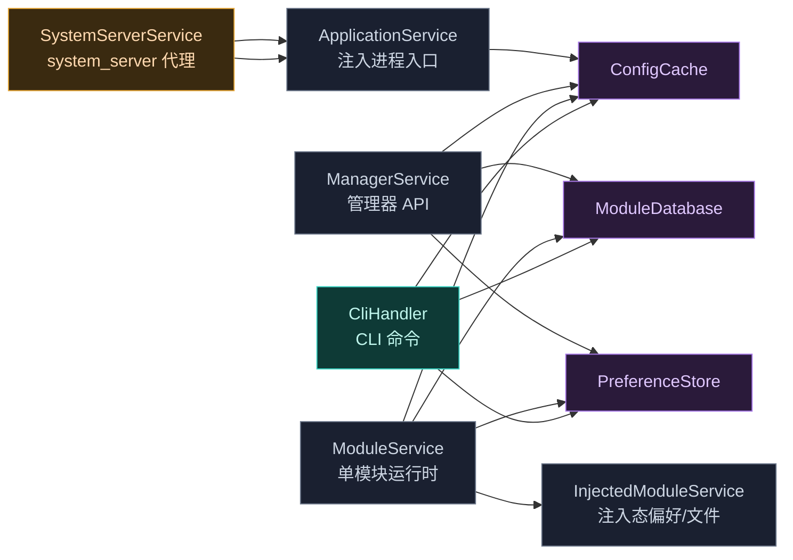

# daemon · ipc 包

> 📂 [`daemon/src/main/kotlin/org/matrix/vector/daemon/ipc/`](https://github.com/android-security-engineer/Vector-skills/blob/master/daemon/src/main/kotlin/org/matrix/vector/daemon/ipc/)
> 🔌 AIDL 端点实现·进程注册·CLI 命令分发

## 包职责

实现 Daemon 暴露给目标进程与管理器的所有 AIDL 接口：`ApplicationService` 服务注入进程，`ManagerService` 提供管理 API，`ModuleService`/`InjectedModuleService` 服务模块运行时，`SystemServerService` 在 system_server 内代理桥接，`CliHandler` 处理本地 CLI 命令。

## 类清单

| 类 | 说明 |
| :--- | :--- |
| [`ApplicationService`](#applicationservice) | `ILSPApplicationService` 实现，向注入进程交付模块列表/DEX/偏好路径 |
| [`ManagerService`](#managerservice) | `ILSPManagerService` 实现，管理器后台 API |
| [`ModuleService`](#moduleservice) | `IXposedService` 实现，单模块运行时服务 |
| [`SystemServerService`](#systemserverservice) | `ILSPSystemServerService` 实现，system_server 桥接代理 |
| [`InjectedModuleService`](#injectedmoduleservice) | `ILSPInjectedModuleService` 实现，注入态模块的偏好/文件服务 |
| [`CliHandler`](#clihandler) | CLI 命令执行器，处理 status/modules/scope/config/db/log |

### 事务码常量

```kotlin
const val BRIDGE_TRANSACTION_CODE       = '_'.shl(24) or 'V'.shl(16) or 'E'.shl(8) or 'C'  // "_VEC"
const val DEX_TRANSACTION_CODE          = '_'.shl(24) or 'D'.shl(16) or 'E'.shl(8) or 'X'  // "_DEX"
const val OBFUSCATION_MAP_TRANSACTION_CODE = '_'.shl(24) or 'O'.shl(16) or 'B'.shl(8) or 'F'  // "_OBF"
```

这些是 `BridgeService` 约定的硬编码事务码，用于在标准 AIDL 之外透传 DEX SharedMemory 与混淆映射。



---

## ApplicationService

`object ApplicationService : ILSPApplicationService.Stub()` — 注入进程通过此服务获取应加载的模块、框架 DEX、混淆映射与偏好路径。

### 进程注册

```kotlin
data class ProcessKey(val uid: Int, val pid: Int)

// 注册进程心跳；进程死亡时自动清理
fun registerHeartBeat(uid: Int, pid: Int, processName: String, heartBeat: IBinder): Boolean
fun hasRegister(uid: Int, pid: Int): Boolean
```

内部 `ProcessInfo` 实现 `IBinder.DeathRecipient`：构造时 `linkToDeath`，`binderDied()` 时 `unlinkToDeath` 并从 `ConcurrentHashMap<ProcessKey, ProcessInfo>` 移除。`ensureRegistered()` 对未注册调用抛 `RemoteException("Not registered")`。

### 自定义事务码（onTransact）

```kotlin
override fun onTransact(code: Int, data: Parcel, reply: Parcel?, flags: Int): Boolean
```

- `DEX_TRANSACTION_CODE` — 返回 `FileSystem.getPreloadDex(...)` 的 SharedMemory（写入 reply + size）
- `OBFUSCATION_MAP_TRANSACTION_CODE` — 返回混淆签名映射，混淆关闭时 value 回退为 key 本身

### AIDL 方法

```kotlin
override fun getModulesList()         // 非遗留模块
override fun getLegacyModulesList()   // 遗留模块
override fun isLogMuted(): Boolean    // = !ManagerService.isVerboseLog
override fun getPrefsPath(packageName: String): String
```

`getAllModules()` 私有方法按调用者身份分流：system_server 走 `getModulesForSystemServer()`；运行中的管理器返回空；其余走 `getModulesForProcess(processName, uid)`。

### requestInjectedManagerBinder

```kotlin
override fun requestInjectedManagerBinder(binderList: MutableList<IBinder>): ParcelFileDescriptor?
```

若是管理器进程或预启动管理器，将 `ManagerService.obtainManagerBinder(...)` 加入 `binderList`；并经 `InstallerVerifier.verifyInstallerSignature` 校验后返回 `manager.apk` 的只读 PFD。

---

## ManagerService

`object ManagerService : ILSPManagerService.Stub()` — 管理器后台 API 的完整实现。委托 `ConfigCache`/`ModuleDatabase`/`PreferenceStore` 完成实际操作。

### 管理器进程守护

```kotlin
class ManagerGuard(binder: IBinder, pid: Int, uid: Int) : IBinder.DeathRecipient

@Synchronized fun preStartManager(): Boolean                        // 标记寄生管理器待启动
@Synchronized fun tryRegisterManagerProcess(pid, uid, processName): Boolean
fun postStartManager(pid: Int): Boolean                             // pid == managerPid
fun isRunningManager(pid: Int, uid: Int): Boolean
fun obtainManagerBinder(heartbeat: IBinder, pid: Int, uid: Int): IBinder
var guard: ManagerGuard?                                            // internal set
```

`ManagerGuard` 构造时 `linkToDeath` 并 `applyXspaceWorkaround`（小米 XSpace 绑定），死亡时解绑并清空 `guard`。寄生管理器经 `preStartManager` 标记后由 `tryRegisterManagerProcess` 在 `requestApplicationService` 时注册。

`getManagerIntent()` 按 INFO → LAUNCHER → 首个同包名 Activity 的优先级解析管理器启动 Intent，附加 `LAUNCH_MANAGER` category。

`ensureWebViewPermission()` / `fixWebViewPermissions()` 递归修正寄生管理器 WebView 缓存目录的 SELinux（`xposed_file:s0`）与 chown。

### AIDL 实现（节选）

```kotlin
override fun getXposedApiVersion() = IXposedService.LIB_API
override fun getXposedVersionCode() = BuildConfig.VERSION_CODE
override fun getXposedVersionName() = BuildConfig.VERSION_NAME
override fun enabledModules() = ConfigCache.state.modules.keys.toTypedArray()
override fun enableModule(packageName) = ModuleDatabase.enableModule(packageName)
override fun disableModule(packageName) = ModuleDatabase.disableModule(packageName)
override fun setModuleScope(packageName, scope) = ModuleDatabase.setModuleScope(packageName, scope)
override fun getModuleScope(packageName) = ConfigCache.getModuleScope(packageName)
override fun isVerboseLog() = PreferenceStore.isVerboseLogEnabled() || BuildConfig.DEBUG
override fun setVerboseLog(enabled)   // 同时驱动 LogcatMonitor.start/stopVerbose
override fun getVerboseLog(): ParcelFileDescriptor?
override fun getModulesLog(): ParcelFileDescriptor?
override fun clearLogs(verbose): Boolean
override fun getPackageInfo(packageName, flags, uid)
override fun forceStopPackage(packageName, userId)
override fun reboot()
override fun uninstallPackage(packageName, userId): Boolean   // 反射构造 IntentSender
override fun isSepolicyLoaded(): Boolean
override fun getUsers(): List<UserInfo>
override fun installExistingPackageAsUser(packageName, userId): Int
override fun systemServerRequested() = SystemServerService.systemServerRequested
override fun startActivityAsUserWithFeature(intent, userId): Int   // 含跨用户切换+锁屏
override fun queryIntentActivitiesAsUser(intent, flags, userId)
override fun dex2oatFlagsLoaded(): Boolean
override fun setHiddenIcon(hide: Boolean)
override fun getLogs(zipFd)
override fun clearApplicationProfileData(packageName)
override fun enableStatusNotification() = PreferenceStore.isStatusNotificationEnabled()
override fun setEnableStatusNotification(enable)   // 切换时即时更新通知
override fun performDexOptMode(packageName)
override fun getDex2OatWrapperCompatibility() = if (SDK_INT >= Q) Dex2OatServer.compatibility else 0
override fun setAutoInclude(packageName, enabled) = ModuleDatabase.setAutoInclude(packageName, enabled)
override fun getAutoInclude(packageName) = ConfigCache.getAutoInclude(packageName)
```

`uninstallPackage` 用反射 `IntentSender(IIntentSender)` 包装自定义 `IIntentSender.Stub`，经 `CountDownLatch` 同步等待安装器回调结果；`userId == -1` 时使用 `DELETE_ALL_USERS` flag（0x2）。

---

## ModuleService

`class ModuleService(private val loadedModule: Module) : IXposedService.Stub()` — **每个已加载模块一个实例**，绑定的运行时服务。

### companion 单例驱动

```kotlin
companion object {
    private val uidSet = ConcurrentHashMap.newKeySet<Int>()
    private val serviceMap = Collections.synchronizedMap(WeakHashMap<Module, ModuleService>())

    fun uidClear()
    fun uidStarts(uid: Int)   // 新 uid 启动时，非遗留模块创建/复用 service 并 sendBinder
    fun uidGone(uid: Int)
}
```

`uidStarts` 由 `VectorService` 的 `IUidObserver` 回调驱动：uid 首次出现时查模块，非遗留则从 `serviceMap` 取或建 `ModuleService(module)`，调用 `sendBinder(uid)`。

### sendBinder（ContentProvider 注入）

```kotlin
private fun sendBinder(uid: Int)
```

绕过 `Context.bindService` 限制，伪造对模块目标包 ContentProvider（authority = `packageName + AUTHORITY_SUFFIX`）的 `call()`，把 `asBinder()` 放进 `Bundle("binder")` 传入。按 SDK 版本选择 `provider.call(...)` 的不同重载（S/R/Q/更早）。

### AIDL 方法

```kotlin
override fun getApiVersion() = ensureModule().let { IXposedService.LIB_API }
override fun getFrameworkName() = BuildConfig.FRAMEWORK_NAME
override fun getFrameworkVersion() = BuildConfig.VERSION_NAME
override fun getFrameworkVersionCode() = BuildConfig.VERSION_CODE
override fun getFrameworkProperties(): Long   // PROP_CAP_SYSTEM|REMOTE，混淆开则 |PROP_RT_API_PROTECTION
override fun getScope(): List<String>
override fun requestScope(packages, callback)   // 委托 NotificationManager.requestModuleScope
override fun removeScope(packages)
override fun requestRemotePreferences(group): Bundle
override fun updateRemotePreferences(group, diff)   // 解析 delete/put 两个 Serializable Set/Map
override fun deleteRemotePreferences(group)
override fun listRemoteFiles(): Array<String>
override fun openRemoteFile(path): ParcelFileDescriptor   // MODE_CREATE | MODE_READ_WRITE
override fun deleteRemoteFile(path): Boolean
```

`ensureModule()` 校验调用者 uid 的 appId 与 `loadedModule.appId` 一致，否则抛 `RemoteException`；返回 `userId = callingUid / PER_USER_RANGE`。`updateRemotePreferences` 解析 Bundle 中的 `delete`（Set）与 `put`（Map）合并为 diff，写库后回调 `InjectedModuleService.onUpdateRemotePreferences` 通知监听者。

---

## SystemServerService

`object SystemServerService : ILSPSystemServerService.Stub(), IBinder.DeathRecipient` — 在 system_server 内**代理桥接服务**，抢占服务名以建立早期 IPC 通道。

### 代理服务注册

```kotlin
var systemServerRequested = false

fun registerProxyService(serviceName: String)
```

Android R+：注册 `IServiceCallback` 监听同名真实服务上线，捕获后 `linkToDeath` 并把自身 `addService(serviceName, this)` 占位。真实服务出现后，后续 transact 转发给 `originService`；服务死亡时 `binderDied()` 清空引用。

### requestApplicationService

```kotlin
override fun requestApplicationService(uid, pid, processName, heartBeat): ILSPApplicationService?
```

仅接受 `uid == 1000 && processName == "system" && heartBeat != null`，置 `systemServerRequested = true`，成功注册心跳后返回 `ApplicationService` 单例。

### onTransact 转发

```kotlin
override fun onTransact(code: Int, data: Parcel, reply: Parcel?, flags: Int): Boolean
```

- `originService` 存在 → 直接转发（system_server 重启场景）
- `BRIDGE_TRANSACTION_CODE` → 解析 uid/pid/processName/heartBeat，调 `requestApplicationService`，回写 strongBinder
- `DEX_TRANSACTION_CODE` / `OBFUSCATION_MAP_TRANSACTION_CODE` → 委托 `ApplicationService.onTransact`

---

## InjectedModuleService

`class InjectedModuleService(private val packageName: String) : ILSPInjectedModuleService.Stub()` — 注入态模块（非通过 ContentProvider 而由 daemon 直接持有）的偏好与文件服务。

### 偏好回调管理

```kotlin
private val callbacks = ConcurrentHashMap<String, MutableSet<IRemotePreferenceCallback>>()
```

`requestRemotePreferences(group, callback)` 返回当前 group 全部偏好，并将 callback 注册到对应 group 的 set（`linkToDeath` 自动移除）。`onUpdateRemotePreferences(group, diff)` 由 `ModuleService` 在全局写库后调用，遍历回调 `callback.onUpdate(diff)`，失败则移除。

### AIDL 方法

```kotlin
override fun getFrameworkProperties(): Long   // 同 ModuleService 逻辑
override fun requestRemotePreferences(group, callback): Bundle
override fun openRemoteFile(path): ParcelFileDescriptor   // MODE_READ_ONLY，uid=-1
override fun getRemoteFileList(): Array<String>
```

`userId = Binder.getCallingUid() / PER_USER_RANGE`；文件操作经 `FileSystem.resolveModuleDir(packageName, "files", userId, -1)`，路径先过 `FileSystem.ensureModuleFilePath` 防遍历。

---

## CliHandler

`object CliHandler` — CLI 命令执行器，在 daemon 内存空间内处理 `CliRequest`，返回结构化 `CliResponse`。

```kotlin
fun execute(request: CliRequest): CliResponse
```

`execute` 按 `request.command` 分发到私有 handler，异常时返回 `CliResponse(success=false, error=msg)`。

### 命令矩阵

| command | action | 说明 |
| :--- | :--- | :--- |
| `status` | — | 框架版本/版本码/已启用模块数/通知开关 |
| `modules` | `ls` / `enable` / `disable` | 列出（支持 `--enabled`/`--disabled` 过滤）/ 批量启用/禁用 |
| `scope` | `ls` / `add` / `set` / `rm` | 列出/追加/覆盖/移除作用域，target 格式 `pkg/user_id` |
| `config` | `get` / `set` | `status-notification` / `verbose-log` 两个布尔键 |
| `db` | `backup` / `restore` / `reset` | `VACUUM INTO` 备份 / 覆盖恢复 / 删除重建 |
| `log` | `clear` | 清空 verbose/modules 日志（`stream` 由 socket 层拦截） |

### 数据库操作细节

- `backup`：`VACUUM INTO '$path'` 生成无锁的一致性副本
- `restore`：`close()` 后复制文件覆盖，触发 `requestCacheUpdate` 并重写 `misc_path`
- `reset`：删除 db/wal/shm 后触发 `requestCacheUpdate`，schema 由 `onCreate` 重建

`scope` 命令解析 `pkg/user_id`（缺省 user_id=0）；`add` 在现有作用域上追加（去重），`set` 整体覆盖；`rm` 逐个调用 `ModuleDatabase.removeModuleScope`。`modules ls` 合并 `ConfigCache.state.modules.keys`（已启用）与 `ConfigCache.getInstalledModules()`（系统已安装）。

## 相关

- [daemon 模块总览](../modules/daemon)
- [daemon · data 包](./daemon-data)（ConfigCache/ModuleDatabase/PreferenceStore）
- [daemon · system 包](./daemon-system)（NotificationManager/SystemBinders）
- [daemon · entry](./daemon-entry)（VectorService 调用本包的入口）
