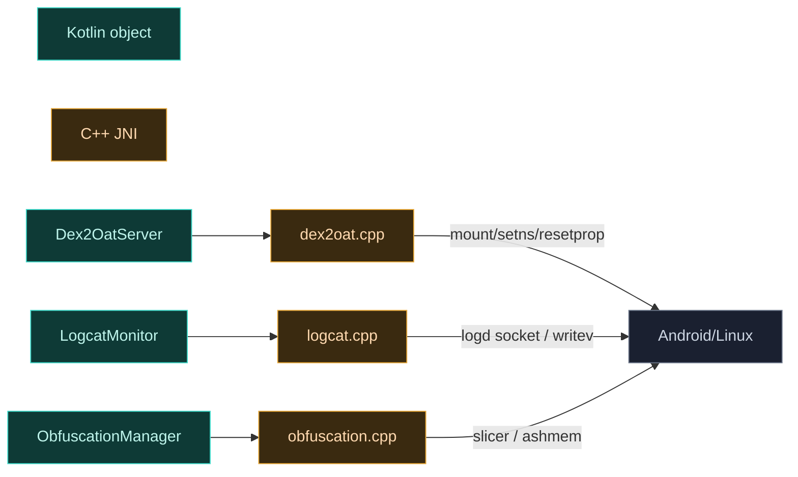

# daemon · jni

> 📂 [`daemon/src/main/jni/`](https://github.com/android-security-engineer/Vector-skills/blob/master/daemon/src/main/jni/)
> ⚙️ native C++ 子系统：dex2oat 劫持·logcat 解析·DEX 混淆

## 概览

Daemon 的 native 库 `libdaemon.so`（C++23）由 CMake 构建，链接 `lsplant_static`、`dex_builder_static`、`android`、`log`。三个源文件各自独立，分别服务于 `Dex2OatServer`、`LogcatMonitor`、`ObfuscationManager` 三个 Kotlin object 的 `external` 方法。

## 文件清单

| 文件 | 说明 |
| :--- | :--- |
| [`dex2oat.cpp`](#dex2oatcpp) | bind mount 劫持 dex2oat、socket 上下文设置、wrapper 路径 |
| [`logcat.cpp`](#logcatcpp) / [`logcat.h`](#logcath) | 直接读取 logd 缓冲，按 tag 分流并轮转日志文件 |
| [`obfuscation.cpp`](#obfuscationcpp) / [`obfuscation.h`](#obfuscationh) | 基于 slicer 的 DEX 签名混淆 |
| [`logging.h`](#loggingh) | 统一日志宏 |
| [`CMakeLists.txt`](#cmakeliststxt) | 构建配置 |



---

## dex2oat.cpp

实现 `Dex2OatServer` 的三个 native 方法，外加 SELinux `sockcreate` 上下文写入。

### UniqueFd

```cpp
struct UniqueFd {
    int fd;
    explicit UniqueFd(int fd) : fd(fd) {}
    ~UniqueFd() { if (fd >= 0) close(fd); }   // RAII 防 FD 泄漏
    operator int() const { return fd; }
};
```

### doMountNative

```cpp
extern "C" JNIEXPORT void JNICALL
Java_org_matrix_vector_daemon_env_Dex2OatServer_doMountNative(
    JNIEnv *env, jobject, jboolean enabled,
    jstring r32, jstring d32, jstring r64, jstring d64)
```

`realpath` 解析 `bin/dex2oat32/64` 后 `fork()`：

- **父进程**：`waitpid` 等待子进程，释放 JNI 字符串
- **子进程**：`setns(open("/proc/1/ns/mnt", O_RDONLY), CLONE_NEWNS)` 进入 init 命名空间
  - `enabled=true`：对每个真实 dex2oat 路径先 `mount(MS_BIND)` 再 `mount(MS_BIND|MS_REMOUNT|MS_RDONLY)`，然后 `execlp("resetprop", "--delete", "dalvik.vm.dex2oat-flags")` 清除抑制 flag
  - `enabled=false`：逐个 `umount`，然后 `execlp("resetprop", "dalvik.vm.dex2oat-flags", "--inline-max-code-units=0")` 设回抑制 flag

`execlp` 失败则 `PLOGE` + `exit(1)`。

### setSockCreateContext

```cpp
extern "C" JNIEXPORT jboolean JNICALL
Java_org_matrix_vector_daemon_env_Dex2OatServer_setSockCreateContext(JNIEnv*, jclass, jstring)
```

直接写 `/proc/self/task/<tid>/attr/sockcreate`：传入 context 字符串则设置，传 null 则写 0 字节清除。EINTR 自动重试。这是 `setsockcreatecon(3)` 的手动实现，避免依赖 libselinux。

### getSockPath

```cpp
extern "C" JNIEXPORT jstring JNICALL
Java_org_matrix_vector_daemon_env_Dex2OatServer_getSockPath(JNIEnv*, jobject)
```

返回硬编码的固定路径字符串 `"5291374ceda0aef7c5d86cd2a4f6a3ac"`（含尾部 `\0`），作为 wrapper socket 的抽象命名空间路径，与 zygisk 模块内置的 wrapper 二进制约定一致。

---

## logcat.cpp

实现 `LogcatMonitor.runLogcat()`，直接读取 logd 的 Unix socket，按 tag 分流到 modules/verbose 两路文件，并实现日志轮转与 logd 崩溃自愈。

### 常量

```cpp
constexpr size_t kMaxLogSize    = 4 * 1024 * 1024;  // 4MB 触发轮转
constexpr long     kLogBufferSize = 128 * 1024;     // 强制 logd 缓冲 128KB
```

### tag 分流表（已排序，二分查找）

| 表 | 路由 | 示例 |
| :--- | :--- | :--- |
| `kModuleTags` | modules 流 | `VectorContext`, `VectorLegacyBridge`, `VectorModuleManager`, `XSharedPreferences` |
| `kExactTags` | verbose 流（精确匹配） | `APatchD`, `Dobby`, `KernelSU`, `LSPlant`, `LSPlt`, `Magisk`, `SELinux`, `TEESimulator` |
| `kPrefixTags` | verbose 流（前缀匹配） | `LSPosed`, `Vector`, `dex2oat`, `zygisk` |

verbose 流额外条件：`pid == my_pid_` 或 is_module 或 `LOG_ID_CRASH` 或匹配 tag。

### Logcat 类

```cpp
class Logcat {
public:
    Logcat(JNIEnv* env, jobject thiz, jmethodID method)
    [[noreturn]] void Run();
private:
    void RefreshFd(bool is_verbose);
    size_t FastWrite(const AndroidLogEntry& entry, int fd);
    void LogRaw(std::string_view str);
    void OnCrash(int err);
    void ProcessBuffer(struct log_msg* buf);
    // modules_fd_ / verbose_fd_ (UniqueFd)，各自 written_ / part_ 计数
};
```

#### Run 循环

1. 初始 `RefreshFd(true)` 与 `RefreshFd(false)`
2. `android_logger_list_alloc(0, tail=0, 0)` 创建读取列表；重连后 `tail=10` 保留 10 行上下文
3. 打开 `LOG_ID_MAIN` 与 `LOG_ID_CRASH`，若缓冲 < 128KB 则 `set_log_size`
4. `android_logger_list_read` 阻塞读取，每条 `ProcessBuffer`；written 计数超 4MB 则 `RefreshFd`
5. 读取返回 ≤0（logd 异常）时 `OnCrash(errno)` 后重连

#### FastWrite（Scatter-Gather I/O）

用 `writev` 一次写入 5 段 iovec：`[ ` + 时间（`%Y-%m-%dT%H:%M:%S`）+ 元数据（毫秒/uid/pid/tid/优先级字符/tag）+ 消息 + 可选换行。固定宽度元数据由 `snprintf` 预格式化。写入失败返回 `kMaxLogSize` 强制轮转。

#### ProcessBuffer（自反馈控制）

`android_log_processLogBuffer` 解析后，零拷贝提取 tag（`string_view`，不含 null 终止）。modules 与 verbose 各自累加 `FastWrite` 返回值。

关键：**daemon 监听自身 `VectorLogcat` tag 的消息作为远程命令**：

```cpp
if (entry.pid == my_pid_ && tag == "VectorLogcat") {
    if (msg == "!!start_verbose!!")   verbose_enabled_ = true;
    else if (msg == "!!stop_verbose!!")  verbose_enabled_ = false;
    else if (msg == "!!refresh_modules!!") RefreshFd(false);
    else if (msg == "!!refresh_verbose!!") RefreshFd(true);
}
```

这正是 `LogcatMonitor.startVerbose()` 等 Kotlin 方法 `Log.i(TAG, "!!...!!")` 的接收端。

#### RefreshFd

写 `-----part N end----` 后，经 JNI 回调 Kotlin `refreshFd(boolean)` 获取新 detached FD（`UniqueFd.reset` 自动关旧 FD），part++，重置 written 计数，写 `----part N+1 start----`。

#### OnCrash

崩溃计数累加，达到阈值（初始 8，每次翻倍至 1024 后重置）时 `__system_property_set("ctl.restart", "logd")` 手动重启 logd；否则写错误信息到两路日志并 `sleep 1s` 重试。

### JNI 入口

```cpp
extern "C" JNIEXPORT void JNICALL
Java_org_matrix_vector_daemon_env_LogcatMonitor_runLogcat(JNIEnv* env, jobject thiz) {
    jmethodID method = env->GetMethodID(clazz, "refreshFd", "(Z)I");
    Logcat daemon(env, thiz, method);
    daemon.Run();
}
```

---

## logcat.h

手写的 logd 客户端头文件，避免链接整个 liblog 的 logger_list API（daemon 直接使用这些结构体）。

```c
#define NS_PER_SEC 1000000000L
#define MS_PER_NSEC 1000000
#define LOGGER_ENTRY_MAX_LEN (5 * 1024)

typedef struct AndroidLogEntry_t { time_t tv_sec; long tv_nsec; android_LogPriority priority;
    int32_t uid, pid, tid; const char *tag; size_t tagLen, messageLen; const char *message; } AndroidLogEntry;

struct logger_entry { uint16_t len, hdr_size; int32_t pid; uint32_t tid, sec, nsec, lid, uid; };
struct log_msg { union alignas(4) { unsigned char buf[...]; struct logger_entry entry; };
    log_id_t id() { return static_cast<log_id_t>(entry.lid); } };
```

声明 `android_logger_list_alloc/free/read/open`、`android_logger_get/set_log_size`、`android_log_processLogBuffer` 等 C 接口。

---

## obfuscation.cpp

实现 `ObfuscationManager` 的 `obfuscateDex` 与 `getSignatures`，基于 [slicer](https://github.com/google/slicer) 改写 DEX 字符串表中的 Xposed/Vector 类签名。

### 签名表

```cpp
std::map<std::string, std::string> signatures = {
    {"Lde/robv/android/xposed/", ""},         {"Landroid/app/AndroidApp", ""},
    {"Landroid/content/res/XRes", ""},        {"Landroid/content/res/XModule", ""},
    {"Lio/github/libxposed/api/Xposed", ""},  {"Lorg/matrix/vector/core/", ""},
    {"Lorg/matrix/vector/nativebridge/", ""}, {"Lorg/matrix/vector/service/", ""},
};
```

初始 value 为空，`ensureInitialized` 时由 `regen` lambda 为每个 key 生成**等长**的随机替代串（保持 Dex type descriptor 长度不变，避免重定位）。

### regen 签名生成

```cpp
static constexpr auto chrs = "abcdefghijklmnopqrstuvwxyzABCDEFGHIJKLMNOPQRSTUVWXYZ";
// 20% 概率插入 '/'（避免连续斜杠、首尾斜杠）
// 末字符类型与原签名一致（'/' 结尾则 '/'，否则随机字母）
```

使用 `thread_local std::mt19937`。长度不一致时 `LOGE` 报错（理论不应发生）。

### ensureInitialized

`std::call_once` 保证一次性初始化：反射缓存 `FileDescriptor.<init>(I)V` 与 `SharedMemory.<init>(FileDescriptor)` 两个构造方法（经 `lsplant::JNI_FindClass/GetMethodID/GetGlobalRef`），随后为每个签名生成随机替代。

### to_java

```cpp
static std::string to_java(const std::string &signature) {
    std::string java(signature, 1);   // 去掉前导 'L'
    std::replace(java.begin(), java.end(), '/', '.');
    return java;
}
```

将 Dex 签名（`Lcom/foo/`）转为 Java 包前缀（`com.foo.`），供 Kotlin 端字符串匹配。

### getSignatures

```cpp
extern "C" JNIEXPORT jobject JNICALL
Java_org_matrix_vector_daemon_utils_ObfuscationManager_getSignatures(JNIEnv*, jclass)
```

`std::call_once` 把签名表（经 `to_java`）转成 Java `HashMap`，返回全局 ref。Kotlin 端 `ApplicationService` 据此向注入进程下发映射；混淆关闭时 value 回退为 key。

### obfuscateDex

```cpp
extern "C" JNIEXPORT jobject JNICALL
Java_org_matrix_vector_daemon_utils_ObfuscationManager_obfuscateDex(JNIEnv*, jclass, jobject memory)
```

1. `ASharedMemory_dupFromJava` 取 fd，`ASharedMemory_getSize` 取大小
2. **必须 `MAP_SHARED`**（非 `MAP_PRIVATE`）：避免 ashmem/memfd 的 COW 零页问题，并支持 slicer IR 的原地零拷贝改写
3. `memmem` 扫描是否含任一目标签名；若无则直接包装原 fd 返回（跳过 slicer）
4. `obfuscateDexBuffer`：`dex::Reader.CreateFullIr()` → 遍历 `ir->strings` 对每个字符串 `strstr` + `memcpy` 原地替换 → `dex::Writer.CreateImage` 输出
5. `munmap` + `close` 输入，用新 fd 构造 `FileDescriptor` → `SharedMemory` 返回

`obfuscateDexBuffer` 返回 `allocator.GetFd()`，即新 ashmem 的 fd。

---

## obfuscation.h

```cpp
class DexAllocator : public dex::Writer::Allocator {
    void* Allocate(size_t size) override;   // ASharedMemory_create + mmap(MAP_SHARED)
    void Free(void* ptr) override;          // munmap + close
    int GetFd() const;
    ~DexAllocator();                        // munmap 但不 close（fd 交给 Java SharedMemory）
};
```

自定义 slicer 输出分配器：输出也用 `MAP_SHARED` 确保 slicer 写入立即反映到 fd。析构时 **不 close fd**——生命周期移交给 Java 端的 `SharedMemory`。

---

## logging.h

统一日志宏，`LOG_TAG = "VectorNativeDaemon"`：

| 宏 | 级别 | 备注 |
| :--- | :--- | :--- |
| `LOGV/LOGD` | VERBOSE/DEBUG | NDEBUG 时降级为 `0` |
| `LOGI/LOGW/LOGE/LOGF` | INFO/WARN/ERROR/FATAL | 始终生效 |
| `PLOGE(fmt, args...)` | ERROR | 附加 `errno` + `strerror` |

`LOGD` 带 `__FILE_NAME__:__LINE__#__PRETTY_FUNCTION__` 前缀。`LOG_DISABLED` 定义时全部静默。

---

## CMakeLists.txt

```cmake
cmake_minimum_required(VERSION 3.10)
project(daemon)
set(CMAKE_CXX_STANDARD 23)
add_subdirectory(${VECTOR_ROOT}/external external)

set(SOURCES dex2oat.cpp logcat.cpp obfuscation.cpp)
add_library(${PROJECT_NAME} SHARED ${SOURCES})
target_include_directories(${PROJECT_NAME} PRIVATE ${CMAKE_CURRENT_SOURCE_DIR})
target_link_libraries(${PROJECT_NAME} PRIVATE lsplant_static dex_builder_static android log)
```

`DEBUG_SYMBOLS_PATH` 定义时，POST_BUILD 阶段 `objcopy --only-keep-debug` 分离调试符号、`strip --strip-all` 剥离、`--add-gnu-debuglink` 关联，符号按 ABI 分目录存放。

## 相关

- [daemon 模块总览](../modules/daemon)
- [daemon · env 包](./daemon-env)（Dex2OatServer / LogcatMonitor 的 Kotlin 侧）
- [daemon · utils · ObfuscationManager](./daemon-utils#obfuscationmanager)（native 声明侧）
- [dex2oat 劫持机制](../modules/dex2oat)
