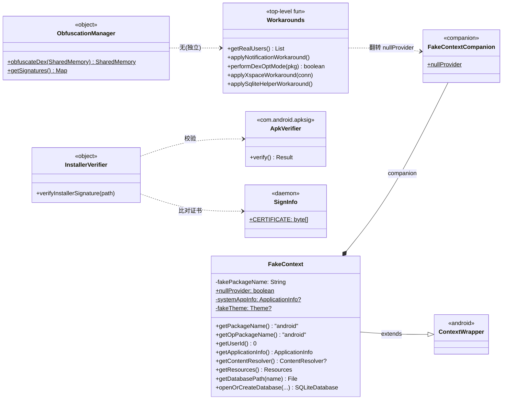
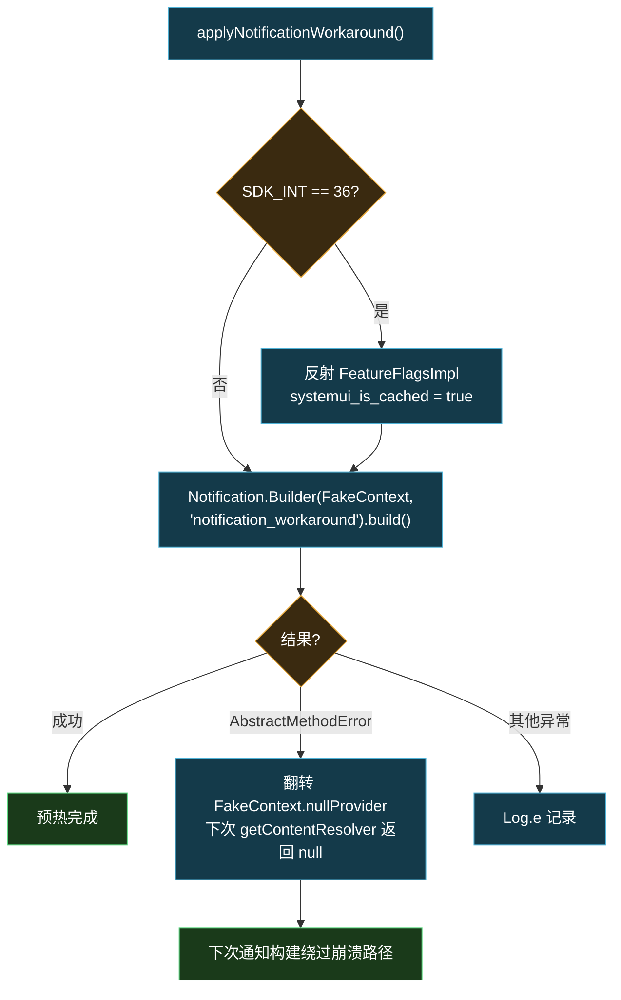

# daemon · utils 包

> 📂 [`daemon/src/main/kotlin/org/matrix/vector/daemon/utils/`](https://github.com/android-security-engineer/Vector-skills/blob/master/daemon/src/main/kotlin/org/matrix/vector/daemon/utils/)
> 🧰 上下文伪造·签名校验·DEX 混淆·设备兼容 workaround

## 包职责

为 Daemon 提供基础设施工具：`FakeContext` 在无真实 Application 上下文时伪造一个足以初始化数据库、构造 Intent 与通知的 Context；`InstallerVerifier` 校验管理器 APK 签名；`ObfuscationManager` 声明 DEX 混淆的 native 桥；`Workarounds` 收纳各厂商/各 Android 版本的兼容补丁。

## 类协作

四个工具各管一摊：[`FakeContext`](https://github.com/android-security-engineer/Vector-skills/blob/master/daemon/src/main/kotlin/org/matrix/vector/daemon/utils/FakeContext.kt) 被通知构建与数据库初始化共享，其 `nullProvider` 标志由 [`Workarounds`](https://github.com/android-security-engineer/Vector-skills/blob/master/daemon/src/main/kotlin/org/matrix/vector/daemon/utils/Workarounds.kt) 翻转；[`InstallerVerifier`](https://github.com/android-security-engineer/Vector-skills/blob/master/daemon/src/main/kotlin/org/matrix/vector/daemon/utils/InstallerVerifier.kt) 在交付/登记管理器前被 `ApplicationService`/`ConfigCache` 调用；[`ObfuscationManager`](https://github.com/android-security-engineer/Vector-skills/blob/master/daemon/src/main/kotlin/org/matrix/vector/daemon/utils/ObfuscationManager.kt) 是 native 桥声明，被 `FileSystem`/`ApplicationService` 调用。



`InstallerVerifier.verifyInstallerSignature` 的签名校验流程：

```mermaid
flowchart TD
    A["verifyInstallerSignature(path)"] --> B["ApkVerifier.Builder(File(path))<br/>.setMinCheckedPlatformVersion(27)<br/>.build()"]
    B --> C["verify()"]
    C --> D{"isVerified?"}
    D -- 否 --> E["throw IOException<br/>'APK signature not verified'"]
    D -- 是 --> F["取 signerCertificates[0]"]
    F --> G{"encoded == SignInfo.CERTIFICATE?"}
    G -- 否 --> H["throw IOException<br/>'APK signature mismatch: $dname'"]
    G -- 是 --> I["校验通过"]
    J["调用方"] --> A
    K["ApplicationService<br/>.requestInjectedManagerBinder"] --> A
    L["ConfigCache<br/>.updateManager"] --> A

    classDef default fill:#143a4a,color:#fff,stroke:#4fb3d8
    classDef cond fill:#3a2a10,color:#fff,stroke:#e8a838
    classDef leaf fill:#1a3a1a,color:#fff,stroke:#5cd980
    classD,G cond
    class E,H,I leaf
```

## 类清单

| 类/文件 | 说明 |
| :--- | :--- |
| [`FakeContext`](#fakecontext) | 无 Application 的桩 Context，供数据库/Intent/通知使用 |
| [`InstallerVerifier`](#installerverifier) | 管理 APK 签名校验（apksig） |
| [`ObfuscationManager`](#obfuscationmanager) | DEX 混淆的 native 方法声明 |
| [`Workarounds.kt`](#workaroundskt) | 厂商/版本兼容补丁集合 |

---

## FakeContext

[`FakeContext.kt`](https://github.com/android-security-engineer/Vector-skills/blob/master/daemon/src/main/kotlin/org/matrix/vector/daemon/utils/FakeContext.kt) — `class FakeContext(private val fakePackageName: String = "android") : ContextWrapper(null)` — Daemon 没有 `Application`，此桩 Context 让数据库初始化、Intent 构造、通知构建等需要 `Context` 的 API 正常工作。

### companion 状态

```kotlin
companion object {
    @Volatile var nullProvider = false   // 通知 workaround 反复 toggle
    private var systemAppInfo: ApplicationInfo?
    private var fakeTheme: Resources.Theme?
}
```

`nullProvider` 由 `applyNotificationWorkaround` 在 `AbstractMethodError` 时翻转：当 `getContentResolver()` 返回 null 可绕过某些通知构建路径上的崩溃。

### 重写方法

```kotlin
override fun getPackageName(): String = fakePackageName      // 默认 "android"
override fun getOpPackageName(): String = "android"
fun getUserId(): Int = 0
fun getUser(): UserHandle = HiddenApiBridge.UserHandle(0)
override fun getApplicationInfo(): ApplicationInfo           // 懒加载 "android" 包的 ApplicationInfo
override fun getContentResolver(): ContentResolver?          // nullProvider=true 时返回 null
override fun getTheme(): Resources.Theme                     // 复用 FileSystem.resources 的 Theme
override fun getResources(): Resources = FileSystem.resources
override fun getAttributionTag(): String? = null             // Android 12+ 必需
override fun getDatabasePath(name: String): File             // 直接返回 name 当绝对路径
override fun openOrCreateDatabase(...)                       // 委托 SQLiteDatabase.openOrCreateDatabase
```

`getApplicationInfo` 按 Tiramisu+ 用 Long flags、以下用 Int flags 查询 `android` 包，失败回退空 `ApplicationInfo`。`getResources` 直接返回 `FileSystem.resources`（反射 `addAssetPath` 加载的 daemon APK 资源）。

---

## InstallerVerifier

[`InstallerVerifier.kt`](https://github.com/android-security-engineer/Vector-skills/blob/master/daemon/src/main/kotlin/org/matrix/vector/daemon/utils/InstallerVerifier.kt) — `object InstallerVerifier` — 校验管理器 APK 签名，防止冒充。基于 `com.android.apksig` 的 `ApkVerifier`。

```kotlin
@Throws(IOException::class)
fun verifyInstallerSignature(path: String)
```

流程：`ApkVerifier.Builder(File(path)).setMinCheckedPlatformVersion(27).build().verify()`，要求 `isVerified` 且首个签名证书的 `encoded` 与 `SignInfo.CERTIFICATE` 字节一致；否则抛 `IOException("APK signature not verified")` / `IOException("APK signature mismatch: $dname")`。

被 `ApplicationService.requestInjectedManagerBinder` 与 `ConfigCache.updateManager` 在交付/登记管理器前调用。

---

## ObfuscationManager

[`ObfuscationManager.kt`](https://github.com/android-security-engineer/Vector-skills/blob/master/daemon/src/main/kotlin/org/matrix/vector/daemon/utils/ObfuscationManager.kt) — `object ObfuscationManager` — DEX 混淆的 native 桥声明，实现见 [daemon · jni · obfuscation](./daemon-jni#obfuscationcpp)。

```kotlin
@JvmStatic external fun obfuscateDex(memory: SharedMemory): SharedMemory
@JvmStatic external fun getSignatures(): Map<String, String>
```

- `obfuscateDex` — 接收原始 DEX 的 SharedMemory，返回混淆后的新 SharedMemory（基于 slicer 原地改写签名串）
- `getSignatures` — 返回 Dex 签名前缀 → 混淆后签名的映射（已转 Java 格式，斜杠转点）

被 `FileSystem.readDex`/`loadModule` 与 `ApplicationService.onTransact(OBFUSCATION_MAP_TRANSACTION_CODE)` 调用。

---

## Workarounds.kt

[`Workarounds.kt`](https://github.com/android-security-engineer/Vector-skills/blob/master/daemon/src/main/kotlin/org/matrix/vector/daemon/utils/Workarounds.kt) — 各厂商与 Android 版本的兼容补丁。`private const val TAG = "VectorWorkarounds"`；`isLenovo` / `isXiaomi` 按 `Build.MANUFACTURER` 判定。

### getRealUsers

```kotlin
fun IUserManager.getRealUsers(): List<UserInfo>
```

兼容多重载：先试 `getUsers(true, true, true)`，`NoSuchMethodError` 时回退 `getUsers(true)`，全失败返回空表。Lenovo 设备额外枚举 uid 900~909 的应用分身用户（`getUserInfo` 容错）。

### applyNotificationWorkaround

```kotlin
fun applyNotificationWorkaround()
```

- Android 16 DP1（`SDK_INT == 36`）：反射置 `android.app.FeatureFlagsImpl.systemui_is_cached = true`，绕过 SystemUI FeatureFlag
- 构造一条 `notification_workaround` 通道的空通知预热 Notification.Builder；若抛 `AbstractMethodError` 则翻转 `FakeContext.nullProvider` 重试，其余异常记日志

由 `VectorDaemon.main` 在等待系统服务后调用。

通知 workaround 的翻转重试流程：



### performDexOptMode

```kotlin
fun performDexOptMode(packageName: String): Boolean
```

- UpsideDownCake（Android 14+）：执行 shell `cmd package compile -m speed-profile -f $packageName`，检查 exit code 与输出含 "Success"
- 更早版本：反射/IPC `IPackageManager.performDexOptMode(pkg, false, "speed-profile", true, true, null)`

由 `ManagerService.performDexOptMode` 调用。

### applyXspaceWorkaround

```kotlin
fun applyXspaceWorkaround(connection: IServiceConnection)
```

仅 Xiaomi：绑定 `com.miui.securitycore/com.miui.xspace.service.XSpaceService`，U+ 用 `Long` servicedId 重载、以下用 `Int` 重载。由 `ManagerService.ManagerGuard` 构造时调用，确保管理器寄生进 XSpace 时 binder 连接不被阻断。

### applySqliteHelperWorkaround

```kotlin
fun applySqliteHelperWorkaround()
```

两处反射补丁，由 `ConfigCache.init` 调用，确保 daemon 的 SQLite 初始化不被厂商定制阻断：

1. **OnePlus**：反射置 `SQLiteGlobal.sDefaultSyncMode = "NORMAL"`，阻止其通过对比 `BenchAppList` 决定同步模式（会调用 `getPkgs()`）
2. **AOSP Settings.Global 依赖**（API 28+）：置 `SQLiteCompatibilityWalFlags.sInitialized = true` 与 `sCallingGlobalSettings = true`，使 `initIfNeeded()` 立即返回，避免 daemon 无 Settings.Global 时 WAL 初始化卡死

## 相关

- [daemon 模块总览](../modules/daemon)
- [daemon · data · FileSystem](./daemon-data#filesystem)（依赖 FakeContext 与 ObfuscationManager）
- [daemon · jni · obfuscation](./daemon-jni#obfuscationcpp)（ObfuscationManager 的 native 实现）
- [daemon · system](./daemon-system)（FakeContext 用于通知构建）
