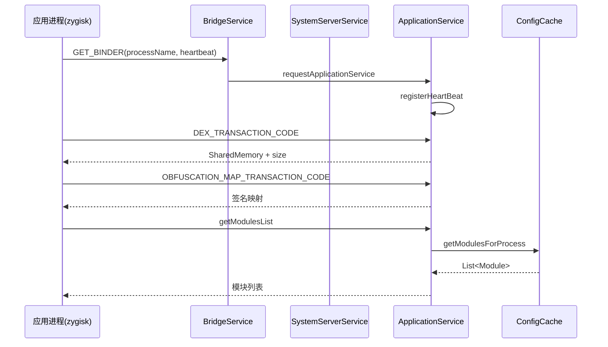

# 📱 ApplicationService

> 📂 [`daemon/src/main/kotlin/org/matrix/vector/daemon/ipc/ApplicationService.kt`](https://github.com/android-security-engineer/Vector-skills/blob/master/daemon/src/main/kotlin/org/matrix/vector/daemon/ipc/ApplicationService.kt)
> 🟦 daemon 模块 · `ILSPApplicationService` 实现

## 类职责

`object ApplicationService : ILSPApplicationService.Stub()` 是 daemon 暴露给**被注入应用进程**的服务端点。每个 fork 出来的应用进程通过 zygisk 端的 `BridgeService` 拿到本服务的 binder 句柄，进而：注册心跳、拉取模块列表、获取偏好路径、获取框架 DEX 共享内存、获取混淆签名映射、请求寄生管理器 binder 与 APK。

它还定义了三个跨进程事务码常量，供 `BridgeService`/`SystemServerService` 转发。

## 事务码常量

```kotlin
const val BRIDGE_TRANSACTION_CODE = ('_'.code shl 24) or ('V'.code shl 16) or ('E'.code shl 8) or 'C'.code
const val DEX_TRANSACTION_CODE     = ('_'.code shl 24) or ('D'.code shl 16) or ('E'.code shl 8) or 'X'.code
const val OBFUSCATION_MAP_TRANSACTION_CODE = ('_'.code shl 24) or ('O'.code shl 16) or ('B'.code shl 8) or 'F'.code
```

即 `0x5F564543` / `0x5F444558` / `0x5F4F4246`，ASCII 分别为 `_VEC` / `_DEX` / `_OBF`。

## 进程注册与心跳

```kotlin
data class ProcessKey(val uid: Int, val pid: Int)

private class ProcessInfo(
    val key: ProcessKey, val processName: String, val heartBeat: IBinder
) : IBinder.DeathRecipient

fun registerHeartBeat(uid: Int, pid: Int, processName: String, heartBeat: IBinder): Boolean
fun hasRegister(uid: Int, pid: Int): Boolean
```

`ProcessInfo` 在构造时 `heartBeat.linkToDeath(this, 0)` 并把自己塞入 `processes` map；进程退出时 `binderDied` 解链并移除条目。`processes` 为 `ConcurrentHashMap`，`ensureRegistered()` 用 `getCallingUid()/getCallingPid()` 查表，未注册抛 `RemoteException("Not registered")`。

## 自定义事务

```kotlin
override fun onTransact(code: Int, data: Parcel, reply: Parcel?, flags: Int): Boolean
```

- `DEX_TRANSACTION_CODE`：从 `FileSystem.getPreloadDex(isDexObfuscateEnabled)` 取共享内存，`writeNoException` 后 `writeToParcel` 并 `writeLong(size)`；
- `OBFUSCATION_MAP_TRANSACTION_CODE`：取 `ObfuscationManager.getSignatures()`，`writeInt(signatures.size * 2)`，逐对 `writeString(key)` + `writeString(if (obfuscation) value else key)`（关闭混淆时回写原始 key，保证映射始终有效）。

## 模块列表

```kotlin
override fun getModulesList() = getAllModules().filter { !it.file.legacy }
override fun getLegacyModulesList() = getAllModules().filter { it.file.legacy }
override fun isLogMuted(): Boolean = !ManagerService.isVerboseLog
override fun getPrefsPath(packageName: String): String
```

`getAllModules()` 分三类返回：

- `uid == SYSTEM_UID && processName == "system"` → `ConfigCache.getModulesForSystemServer()`；
- `ManagerService.isRunningManager(...)` → 空（管理器进程不加载模块）；
- 其余 → `ConfigCache.getModulesForProcess(processName, uid)`。

`getPrefsPath` 经 `ensureRegistered` 后委托 `ConfigCache.getPrefsPath(packageName, uid)`，确保目录权限就绪。

## 寄生管理器 binder 与 APK

```kotlin
override fun requestInjectedManagerBinder(binderList: MutableList<IBinder>): ParcelFileDescriptor?
```

`postStartManager(pid)` 或 `isManager(uid)` 命中时，把 `ManagerService.obtainManagerBinder(...)` 加入 `binderList`。随后 `InstallerVerifier.verifyInstallerSignature(managerApkPath)` 校验签名，返回只读 `ParcelFileDescriptor` 指向管理器 APK。失败返回 `null`。

## 服务获取流程



## 相关

- [VectorService · requestApplicationService 分发](./vector-service)
- [SystemServerService · 代理与转发](./system-server-service)
- [ConfigCache · 模块查询](./config-cache)
- [ManagerService · 寄生管理器](./manager-service)
- zygisk 侧见 [bridge-service](../zygisk/bridge-service)
