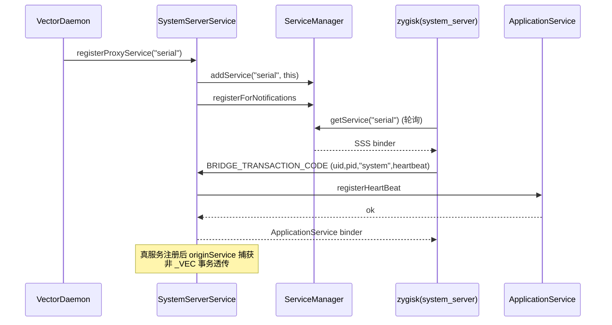

# 🏛️ SystemServerService

> 📂 [`daemon/src/main/kotlin/org/matrix/vector/daemon/ipc/SystemServerService.kt`](https://github.com/android-security-engineer/Vector-skills/blob/master/daemon/src/main/kotlin/org/matrix/vector/daemon/ipc/SystemServerService.kt)
> 🟦 daemon 模块 · system_server 侧代理与 binder 转发

## 类职责

`object SystemServerService : ILSPSystemServerService.Stub(), IBinder.DeathRecipient` 是 daemon 在 `system_server` 特化阶段扮演的**代理服务**。它在 daemon 启动时抢先以 `serial`/`serial_vector` 名注册到 `ServiceManager`，让 zygisk 的 system_server 特化能立刻找到早期 IPC 通道；待真正的同名系统服务注册时捕获其引用并停止拦截，之后把非 Vector 事务透传给原服务。

## 代理服务抢占

```kotlin
fun registerProxyService(serviceName: String)
```

Android R+ 走 `IServiceCallback` 注册通知：

```kotlin
override fun onRegistration(name: String, binder: IBinder?) {
    if (name == serviceName && binder != null && binder !== this@SystemServerService) {
        originService = binder
        runCatching { binder.linkToDeath(this@SystemServerService, 0) }
    }
}
```

随后 `ServiceManager.addService(serviceName, this)` 把自己注册为该名字。当真正的系统服务注册时，回调捕获 `originService` 并 `linkToDeath`；之后到来的事务会走 `originService.transact` 透传。`proxyServiceName` 记录当前代理名，`systemServerRequested` 标记 system_server 是否已请求过 ApplicationService。

## ILSPSystemServerService 实现

```kotlin
override fun requestApplicationService(
    uid: Int, pid: Int, processName: String, heartBeat: IBinder?
): ILSPApplicationService?
```

仅当 `uid == 1000 && heartBeat != null && processName == "system"` 时放行：置 `systemServerRequested = true`，调 `ApplicationService.registerHeartBeat` 成功则返回 `ApplicationService` 单例，否则 `null`。

## onTransact · 双模转发

```kotlin
override fun onTransact(code: Int, data: Parcel, reply: Parcel?, flags: Int): Boolean
```

- 若 `originService != null`（已被真服务取代，多见于 system_server 重启场景），透传 `it.transact(code, data, reply, flags)`；
- 否则按自有 code 处理：
  - `BRIDGE_TRANSACTION_CODE`：读 `uid`/`pid`/`processName`/`heartBeat`，调 `requestApplicationService`，成功则 `writeNoException` + `writeStrongBinder`；
  - `DEX_TRANSACTION_CODE` / `OBFUSCATION_MAP_TRANSACTION_CODE`：直接委托 `ApplicationService.onTransact(code, data, reply, flags)` 复用 DEX 共享内存与混淆映射逻辑；
  - 其余走 `super.onTransact`。

## 死亡回收

```kotlin
override fun binderDied()
```

`originService` 死亡时 `unlinkToDeath` 并置空，让后续事务回到自有处理路径。`VectorDaemon` 的 system_server 死亡监听里也会调 `SystemServerService.binderDied()` 清理旧引用，再 `addService(proxyServiceName, this)` 重新抢占。

## 与 zygisk 的握手

system_server 特化时，zygisk 端 `IPCBridge::RequestSystemServerBinder` 轮询 `ServiceManager.getService("serial"|"serial_vector")` 最多 10 秒拿到本代理 binder，再用 `RequestManagerBinderFromSystemServer` 通过 `BRIDGE_TRANSACTION_CODE` + `kActionGetBinder(=2)` 取得管理器 binder（或退回直接用代理 binder）。daemon 与 system_server 并行启动，轮询保证慢设备上也能命中。



## 与真服务共存的语义

`originService` 捕获后，所有非 `_VEC` 事务透传给真服务。这保证 Vector 的代理不会破坏系统原有的 `serial`/`serial_vector` 服务调用方。仅当 system_server 重启（`binderDied` 清空 `originService`）时，代理会短暂回到自有处理路径，直到新真服务再次注册触发 `onRegistration`。`VectorDaemon` 的死亡监听里会先 `SystemServerService.binderDied()` 再 `addService(proxyServiceName, this)` 重占名字，确保重启窗口内 zygisk 仍能命中代理。

## 与 ApplicationService 的复用

`DEX_TRANSACTION_CODE`/`OBFUSCATION_MAP_TRANSACTION_CODE` 直接委托 `ApplicationService.onTransact`，意味着 system_server 进程经代理也能拉取预加载 DEX 与混淆映射——这与普通应用进程经 `ILSPApplicationService` 拿到的内容完全一致，统一了 DEX/混淆分发的实现路径。

## systemServerRequested 标志

`var systemServerRequested = false` 在 `requestApplicationService` 成功放行后置 `true`，供 `ManagerService.systemServerRequested()` 暴露给管理器 UI，用于判断 system_server 是否已被 Vector 注入。该标志一旦置位不会复位（除非进程重启），因此 UI 拿到 `true` 即可确认注入已生效。

## 相关

- [VectorDaemon · registerProxyService 调用](./vector-daemon)
- [ApplicationService · 事务码与 DEX/OBF](./application-service)
- [VectorService · system_server 上下文派发](./vector-service)
- zygisk 侧握手见 [ipc-bridge](../zygisk/ipc-bridge)
